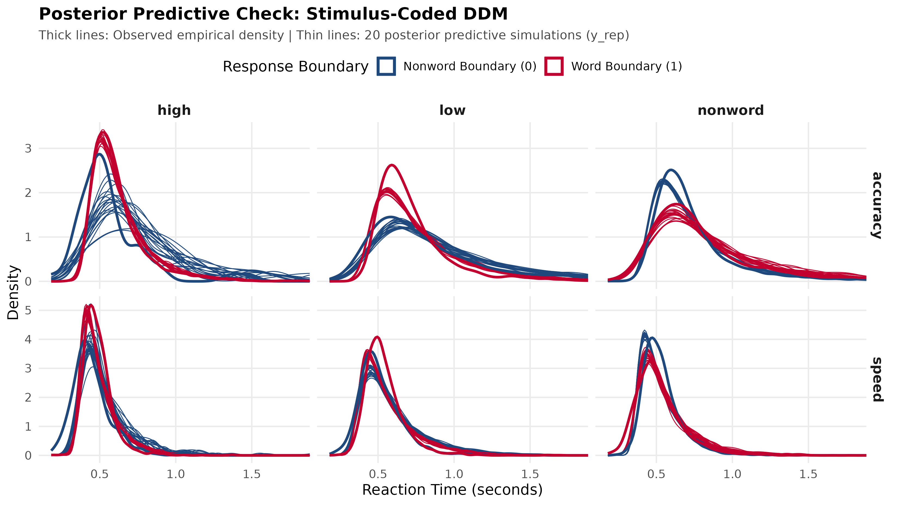

## Session overview (30 minutes) {.dark-bg background-color="#FFFFFF"}

::: {style="background: linear-gradient(135deg, #1F497D, #C2002F); color: white; padding: 20px; border-radius: 10px; text-align: center; margin-bottom: 25px; font-weight: bold; font-size: 1.15em;"}
  Drift Diffusion Modeling in R with brms & cogmod
:::

### What we will cover:
1. **The data and packages:** Lexical decisions in `rtdists` and getting `cogmod`
2. **Variables and design:** Response coding or error coding?
3. **Model architecture:** Setting up fixed and crossed random effects
4. **Code walkthrough:** Step-by-step through `fit_ddm_stimulus_coding.R`
5. **Model results:** Reading parameters, posterior distributions, and credible intervals
6. **Model validation:** Posterior predictive checks (PPC) and comparison with @wagenmakers2008diffusion

---

## The dataset: Wagenmakers et al. (2008) {.dark-bg background-color="#1F497D"}

- We model Experiment 1 from **@wagenmakers2008diffusion** (Lexical Decision Task). This data set was also analyzed in @heathcote2012linear and the brms tutorial by Henrik Singmann [@singmann2017wiener].
- **The task:**
  - On each trial, participants decide as quickly and accurately as possible whether a letter string is an English **word** (e.g., *TABLE*) or a **nonword** (e.g., *FLORP*).
- **Participants and scope:**
  - **17 participants** tested across multiple sessions.
  - **4,780 unique items** (words and nonwords).
  - Over **31,000 total observations** analyzed simultaneously.
- **Experimental manipulations:**
  1. **Instruction:** Speed vs. Accuracy blocks (within-subjects).
  2. **Stimulus type:** Nonwords vs. Words varying in lexical frequency (High, Low, Very Low).

---

## Where to find the data and packages

::: {.columns}
::: {.column width="50%"}
### The dataset (`rtdists`)
- The raw and censored data are bundled directly inside the **`rtdists`** R package [@singmann2017wiener]:
  ```r
  install.packages("rtdists")
  data(speed_acc, package = "rtdists")
  ```
- Accessible as a ready-to-use data frame `speed_acc`.
:::

::: {.column width="50%"}
### The `cogmod` package
- `cogmod` [@makowski2025cogmod] provides custom Stan families and helpers for `brms`.
- **Where to get it:**
  - GitHub: [github.com/DominiqueMakowski/cogmod](https://github.com/DominiqueMakowski/cogmod)
  - Install via `pak` or `remotes`:
  ```r
  pak::pkg_install("DominiqueMakowski/cogmod")
  # or: remotes::install_github("DominiqueMakowski/cogmod")
  ```
:::
:::

---

## Data loading and cleaning: The `censor` flag

The `speed_acc` dataset includes a built-in boolean variable called **`censor`**:

```r
library(rtdists)
library(dplyr)

data(speed_acc, package = "rtdists")
df <- speed_acc[!speed_acc$censor, ] %>% droplevels()
```

::: {.columns}
::: {.column width="50%"}
### Why trials are censored
- @wagenmakers2008diffusion and @heathcote2012linear flagged **171 trials (0.5%)**:
  - **Accidental button presses:** Keys outside designated set.
  - **Fast anticipations ($RT < 180$ ms):** Sub-physiological reaction times.
  - **Attentional lapses ($RT > 3.0$ s):** Distraction / mind-wandering.
:::

::: {.column width="50%"}
### Impact on DDM fitting
- Unfiltered anticipations artificially compress the estimate of non-decision time ($t_0$).
- Extreme lapses artificially inflate boundary separation ($a$).
- Filtering `!censor` yields **31,351 clean observations** across all 17 participants.
:::
:::

---

## Dependent variables: RT and response choice

::: {.columns}
::: {.column width="50%"}
### 1. Reaction time (`rt`)
- Reaction time is measured strictly in **seconds** ($0.18 \le RT \le 3.0$ s).
- **Don't use milliseconds:**
  - `cogmod` assumes seconds -- using milliseconds will cause it to fail.
:::

::: {.column width="50%"}
### 2. Choice (`response_choice`)
- Coded as a binary response key:
  - **$0$ (Lower boundary):** "Nonword" key press
  - **$1$ (Upper boundary):** "Word" key press
  ```r
  df$response_choice <- 
    ifelse(df$response == "word", 1L, 0L)
  ```
:::
:::

---

## Why response coding instead of error coding?

::: {.columns}
::: {.column width="50%"}
### Accuracy / error coding
- Lower (0) = Correct, Upper (1) = Error.
- **Data sparsity:** Accuracy in lexical decisions is ~95%.
- **95% of trials end at Boundary 0**; only 5% end at Boundary 1!
- Leads to poor estimation of boundary separation ($a$) and non-decision time ($t_0$).
:::

::: {.column width="50%"}
### Response / stimulus coding
- Lower (0) = Nonword key, Upper (1) = Word key.
- **Even split:** ~50/50 distribution of observations.
- **Meaningful drift rate:**
  - Words accumulate evidence toward 1 ($\mu > 0$).
  - Nonwords accumulate toward 0 ($\mu < 0$).
- **True bias ($z$):** Measures physical preference for the "word" key.
:::
:::

---

## Empirical distributions: Balanced boundaries

```{r}
#| label: empirical-stim-plot
#| echo: false
#| eval: true
#| fig-width: 10
#| fig-height: 4.6
#| fig-align: center

library(ggplot2)
library(dplyr)
data(speed_acc, package = "rtdists")

df_sub <- speed_acc[!speed_acc$censor, ] %>%
  filter(id %in% c("1", "2", "3")) %>%
  droplevels()

df_sub$response_choice <- ifelse(df_sub$response == "word", 1L, 0L)
df_sub$stimulus_type <- factor(
  ifelse(df_sub$stim_cat == "nonword", "nonword",
  ifelse(df_sub$frequency %in% c("low", "very_low"), "low", "high")),
  levels = c("high", "low", "nonword")
)
df_sub$Condition <- factor(
  unname(c(accuracy = "Accuracy", speed = "Speed")[as.character(df_sub$condition)]),
  levels = c("Accuracy", "Speed")
)

ggplot(df_sub, aes(x = rt, fill = factor(response_choice, labels = c("Nonword (0)", "Word (1)")))) +
  geom_histogram(bins = 70, alpha = 0.7, position = "identity") +
  facet_grid(Condition ~ stimulus_type) +
  scale_fill_manual(values = c("Nonword (0)" = "#1F497D", "Word (1)" = "#C2002F")) +
  theme_minimal(base_size = 12) +
  labs(
    title = "Empirical RT Distributions Across Stimulus Types and Instructions",
    subtitle = "Abundant responses at both boundaries across all experimental conditions",
    x = "Reaction Time (seconds)",
    y = "Trial Count",
    fill = "Boundary Reached"
  ) +
  theme(legend.position = "top")
```

---

## Independent variables and factor levels

Our experimental design incorporates two categorical predictors:

1. **Instruction condition (`Condition`):**
   - 2 levels: **`accuracy`** vs. **`speed`** (blocked instructions).

2. **Stimulus type (`stimulus_type`):**
   - Raw categories: `high`, `low`, `very_low`, and `nonword`.
   - We collapse them into a single level: **`low`**.
   - This may be questionable, but lowers model complexity.
   - Homework: Fit a model with all four levels!
   - Resulting 3 levels:
     - **`nonword`** (pseudowords)
     - **`low`** (low and very low frequency words)
     - **`high`** (high frequency words)

---

## Contrast coding: Orthogonal Helmert and sum contrasts

Default dummy coding (`contr.treatment`) distorts the drift intercept and tests arbitrary pairwise comparisons. We apply planned orthogonal contrasts [@schad2020how]:

::: {.columns}
::: {.column width="50%"}
### Stimulus type: Helmert contrasts
- **Contrast 1 (`Nonword_vs_Word`):**
  - Nonword ($+2$) vs. Words (High = $-1$, Low = $-1$).
  - Directly measures **lexical discrimination**!
- **Contrast 2 (`Low_vs_High`):**
  - Low ($+1$) vs. High ($-1$) frequency words.
  - Measures **word frequency sensitivity**!
:::

::: {.column width="50%"}
### Condition: Sum contrast
- Accuracy ($+1$) vs. Speed ($-1$).
- Both factor levels sum to zero:
  $$(+1) + (-1) = 0$$
- The intercept reflects the **unweighted grand mean** across both instruction blocks.
:::
:::

---

## Why these fixed and random effects?

```r
f_ddm <- bf(
  rt | dec(response_choice) ~ stimulus_type * Condition + (1 | Participant) + (1 | Item),
  boundary ~ Condition,
  ndt ~ Condition,
  bias ~ 1,
  sigmadrift = 0,
  sigmabias = 0,
  sigmandt = 0,
  family = cogmod_ddm()
)
```

::: {.columns}
::: {.column width="50%"}
### Fixed effects rationales
- **Drift rate ($\mu$):** Accumulation slope depends on stimulus recognizability, modulated by instructions.
- **Boundary ($a$):** Speed-accuracy tradeoff regulates caution threshold.
- **NDT ($t_0$):** Detects sensory/motor execution differences.
- **Bias ($z$):** Tests baseline key preference.
:::

::: {.column width="50%"}
### Crossed random intercepts
- **`(1 | Participant)`:** Individual differences in cognitive processing speed.
- **`(1 | Item)`:** Unique word/nonword difficulty across all 4,780 items.
- Avoids aggregate $F_1 \times F_2$ ANOVA pitfalls!
:::
:::

---

## Parameter link functions in `cogmod`

`cogmod_ddm()` handles parameter bounding via specialized link functions:

| Parameter | Link Function | Formula | Rationale |
| :--- | :---: | :---: | :--- |
| **Drift Rate ($\mu$)** | `identity` | $\mu = \eta$ | Unbounded accumulation ($-\infty, +\infty$) |
| **Boundary ($a$)** | **`softplus`** | $a = \log(1 + e^{\eta})$ | **Smooth positive gradient!** Avoids log explosions |
| **Non-decision ($t_0$)** | `log` | $t_0 = e^{\eta}$ | Strictly positive latency ($t_0 > 0$) |
| **Bias ($z/a$)** | `logit` | $z = \frac{1}{1 + e^{-\eta}}$ | Strictly bounded in $(0, 1)$ ($0.5 = \text{unbiased}$) |

::: {style="background: #E8F4F8; border-left: 5px solid #1F497D; padding: 10px; margin-top: 15px; font-size: 0.9em;"}
  <strong>Why softplus for boundary?</strong> If $\eta > 3$, a log link causes $a = \exp(\eta)$ to explode exponentially. `softplus` behaves linearly for positive values and smoothly approaches zero, ensuring stable HMC sampling!
:::

---

## Code walkthrough: Libraries and data preparation

```r
library(cogmod)
library(brms)
library(cmdstanr)
library(dplyr)
library(qs2)
library(here)

n_cores <- parallel::detectCores()
sampling_cores <- min(4, max(1, n_cores - 1))

data(speed_acc, package = "rtdists")
data_clean <- speed_acc[!speed_acc$censor, ]
df <- data_clean %>% droplevels()
```

### Explanation:
- We load `cogmod` for custom DDM likelihoods, `brms` for modeling, and `cmdstanr` as the backend.
- We allocate CPU cores dynamically for parallel MCMC chains.
- We load the dataset and immediately drop censored trials (`!speed_acc$censor`).

---

## Code walkthrough: Variables and contrast matrices

```r
df$response_choice <- ifelse(df$response == "word", 1L, 0L)

df$Participant <- factor(df$id)
df$Item <- factor(df$stim)

df$Condition <- factor(df$condition, levels = c("accuracy", "speed"))
contrasts(df$Condition) <- contr.sum(2)
colnames(contrasts(df$Condition)) <- c("Acc_vs_Speed")

df$stimulus_type <- with(df, ifelse(stim_cat == "nonword", "nonword",
                             ifelse(frequency %in% c("low", "very_low"), "low",
                             ifelse(frequency == "high", "high", NA))))
df$stimulus_type <- factor(df$stimulus_type, levels = c("high", "low", "nonword"))

helmert_mat <- contr.helmert(3)[, c(2, 1)]
colnames(helmert_mat) <- c("Nonword_vs_Word", "Low_vs_High")
contrasts(df$stimulus_type) <- helmert_mat
```

### Explanation:
- Codes the binary choice (0 = nonword, 1 = word) and sets random grouping factors.
- Applies sum contrast to `Condition` and orthogonal Helmert contrasts to `stimulus_type`.

---

## Code walkthrough: Model formula specification

```r
f_ddm <- bf(
  rt | dec(response_choice) ~ stimulus_type * Condition + (1 | Participant) + (1 | Item),
  boundary ~ Condition,
  ndt ~ Condition,
  bias ~ 1,
  sigmadrift = 0,
  sigmabias = 0,
  sigmandt = 0,
  family = cogmod_ddm()
)
```

### Explanation:
- `rt | dec(response_choice)` tells `brms` and `cogmod` which column is RT and which is choice.
- Sets linear sub-models for drift rate, boundary separation, non-decision time, and starting bias.
- Trial-to-trial variabilities (`sigmadrift`, `sigmabias`, `sigmandt`) are fixed to 0 to estimate the standard 4-parameter DDM.

---

## Code walkthrough: The triad of automation helpers

```r
prior_ddm <- cogmod_priors(f_ddm, df)
init_ddm  <- cogmod_inits(f_ddm, df)
sv_ddm    <- cogmod_stanvars(f_ddm)
```

::: {.columns}
::: {.column width="33%"}
#### `cogmod_priors()`
Generates weakly informative priors properly scaled to each parameter's link function (e.g., normal priors on logit bias and softplus boundary).
:::

::: {.column width="33%"}
#### `cogmod_inits()`
Inspects empirical RT minimums and generates jittered inits satisfying $t_0 < \min(RT)$, eliminating initial value rejection crashes.
:::

::: {.column width="33%"}
#### `cogmod_stanvars()`
Injects custom C++ Stan functions (`cogmod_ddm_lpdf`) into Stan's `functions {}` block for automatic differentiation.
:::
:::

---

## Code walkthrough: MCMC sampling and serialization

```r
model_ddm <- brm(
  formula    = f_ddm,
  data       = df,
  prior      = prior_ddm,
  init       = init_ddm,
  stanvars   = sv_ddm,
  chains     = 4,
  cores      = sampling_cores,
  threads    = threading(2),
  iter       = 1000,
  warmup     = 500,
  backend    = "cmdstanr",
  control    = list(adapt_delta = 0.95, max_treedepth = 12),
  file_refit = "always"
)

qs2::qs_save(model_ddm, here::here("models", "ddm_cogmod_stimulus_coding_model.qs"))
```

### Explanation:
- **`threads = threading(2)`:** Multi-threading within each chain cuts wall-clock sampling time in half.
- **`adapt_delta = 0.95`:** Smaller step size eliminates Neal's Funnel divergences in hierarchical random variances.
- **`qs2::qs_save()`:** Fast, lossless binary serialization to disk.

---

## Reading and interpreting model results

::: {style="font-size: 0.58em;"}
```{r}
#| label: load-production-summary-table
#| echo: false
#| eval: true

library(qs2)
library(dplyr)
library(knitr)
library(here)

summary_data <- qs2::qs_read(here::here("models", "ddm_cogmod_stimulus_coding_summary.qs"))
fe <- summary_data$fixed_effects

table_df <- data.frame(
  Parameter = c(
    "Intercept (Grand Mean Drift)",
    "Boundary Separation (Intercept)",
    "Starting Point Bias (Intercept)",
    "Non-Decision Time (Intercept)",
    "stimulus_type: Nonword vs Word",
    "stimulus_type: Low vs High Word",
    "Condition: Acc vs Speed",
    "Nonword_vs_Word : Acc_vs_Speed",
    "Low_vs_High : Acc_vs_Speed",
    "Boundary Separation: Acc vs Speed",
    "Non-Decision Time: Acc vs Speed"
  ),
  Estimate = sprintf("%.3f", fe$Estimate),
  EstError = sprintf("%.3f", fe$Est.Error),
  `95% CrI` = sprintf("[%.2f, %.2f]", fe$`l-95% CI`, fe$`u-95% CI`),
  Rhat = fe$Rhat,
  Bulk_ESS = fe$Bulk_ESS,
  Interpretation = c(
    "Unweighted mean drift (positive due to 2:1 category imbalance)",
    "Baseline boundary: softplus(1.11) ≈ 1.40 evidence units",
    "Starting bias: plogis(0.025) ≈ 0.506 (unbiased)",
    "Baseline NDT: exp(-1.10) ≈ 332 ms latency",
    "Lexical discrimination: Nonwords drift down (-), Words up (+)",
    "Frequency effect: Low-frequency slower uptake than high",
    "Slight overall drift modulation across instructions",
    "Modulation of lexical discrimination by speed/acc",
    "Modulation of frequency sensitivity by speed/acc",
    "Accuracy widens boundaries: a_Acc (1.73) > a_Spd (1.09)!",
    "NDT difference between conditions is tiny (~17 ms)"
  ),
  check.names = FALSE
)

knitr::kable(table_df, align = c("l", "r", "r", "c", "c", "r", "l"))
```
:::

- **Diagnostic health:** 0 divergences, all $\hat{R} = 1.00$, Bulk ESS $\ge 1,798$ (superb convergence!).

---

## Posterior boundary separation: Caution shift

::: {.columns}
::: {.column width="45%"}
### Decisive shift in caution ($a$)
- **Accuracy instructions:**
  $$\text{softplus}(1.112 + 0.426) \approx \mathbf{1.73}$$
- **Speed instructions:**
  $$\text{softplus}(1.112 - 0.426) \approx \mathbf{1.09}$$
- **Key finding:**
  - Boundaries are **$58\%$ wider** under accuracy instructions ($95\%$ CrI: $[0.41, 0.44]$).
  - Participants adjust the decision threshold distance to trade speed for accuracy.
:::

::: {.column width="55%"}
{width=100% fig-align="center"}
:::
:::

---

## Posterior drift rates: Evidence accumulation

::: {.columns}
::: {.column width="45%"}
### Deconstructing drift rates ($\mu$)
1. **Helmert C1 (`Nonword_vs_Word` = $-1.44$):**
   - $95\%$ CrI: $[-1.46, -1.42]$. Nonwords accumulate toward 0, words toward 1!
2. **Helmert C2 (`Low_vs_High` = $-0.68$):**
   - $95\%$ CrI: $[-0.73, -0.63]$. High-frequency words accumulate evidence faster than low-frequency words.
3. **Grand intercept ($\beta_0 = +0.79$):**
   - Positive due to 2:1 category ratio ($\frac{2}{3}\bar{\mu}_{\text{word}} + \frac{1}{3}\mu_{\text{nonword}}$).
:::

::: {.column width="55%"}
{width=100% fig-align="center"}
:::
:::

---

## Latency, bias, and crossed random effects

::: {.columns}
::: {.column width="45%"}
### NDT ($t_0$) and bias ($z$)
- **Baseline NDT:** $332$ ms ($95\%$ CrI: $[331, 334]$ ms).
- **Speed vs. Accuracy:** Only a $17$ ms difference!
- **Starting point bias:** $0.506$ (no motor key preference).

### Crossed variances
- **Item SD ($\sigma_{\text{Item}} = 0.69$):** Pronounced variation in difficulty across words/nonwords.
- **Participant SD ($\sigma_{\text{Part}} = 0.09$):** Consistent speeds across subjects.
:::

::: {.column width="55%"}
{width=100% fig-align="center"}
:::
:::

---

## Model validation: Posterior predictive check (PPC)

::: {.columns}
::: {.column width="40%"}
### How PPC validates the DDM
- We simulate 50 replicate datasets ($y^{\text{rep}}$) using the posterior draws.
- **Thick line:** Empirical observed data.
- **Thin lines:** 20 posterior simulations.
- **Fit quality:**
  - Accurately captures both boundary peaks, skewness, and tails across all 6 experimental cells!
- Generated via standalone script:
  `workshop_sepex/run_posterior_predictive_check.R`
:::

::: {.column width="60%"}
{width=100% fig-align="center"}
:::
:::

---

## Do our results match Wagenmakers et al. (2008)?

| Theoretical Dimension | Wagenmakers et al. (2008) Finding | Our Hierarchical DDM Result | Match? |
| :--- | :--- | :--- | :---: |
| **Speed vs. Accuracy** | Driven by boundary separation ($a$) | $a$ increases by **$58\%$** under accuracy instructions ($1.09 \to 1.73$) | **Yes** |
| **Word Frequency** | Selectively drives drift rate ($\mu$) | High frequency speeds drift ($\beta = -0.68, p < .001$); boundary unaffected | **Yes** |
| **Non-Decision Time** | Minor shift across instructions | Baseline NDT $= 332$ ms; instruction difference is tiny ($17$ ms) | **Yes** |
| **Key Bias** | Neutral starting point | $z = 0.506$ ($95\%$ CrI: $[0.502, 0.511]$) | **Yes** |

::: {style="background: #E8F5E9; border-left: 5px solid #2E7D32; padding: 12px; border-radius: 6px; font-size: 0.9em; margin-top: 15px;"}
  <strong>Conclusion:</strong> Our Bayesian hierarchical model fully reproduces the classic findings while improving upon traditional EZ-diffusion or individual-by-individual fitting by estimating crossed item and participant random effects simultaneously!
:::

---

## Key takeaways for DDM in practice

::: {style="background: #F4F6F9; border-left: 5px solid #1F497D; padding: 18px; border-radius: 6px; font-size: 0.95em;"}
  **1. Choice coding:** Use response coding ($0 = \text{Nonword}, 1 = \text{Word}$) in 2AFC tasks to ensure balanced boundaries.<br><br>
  **2. Units matter:** Always fit reaction times in **seconds** to prevent Stan numerical failure.<br><br>
  **3. Leverage `cogmod`:** Avoid NaN gradients and min-RT cliffs using `cogmod_ddm()`, `cogmod_priors()`, and `cogmod_inits()`.<br><br>
  **4. Orthogonal contrasts:** Use Helmert contrasts to map drift parameters directly to cognitive hypotheses (discrimination vs. frequency).<br><br>
  **5. Separate fitting from presentation:** Keep heavy sampling in standalone R scripts and load lightweight summary objects in Quarto.
:::

---

## References

::: {#refs}
:::

