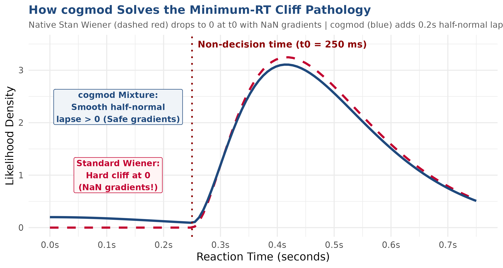
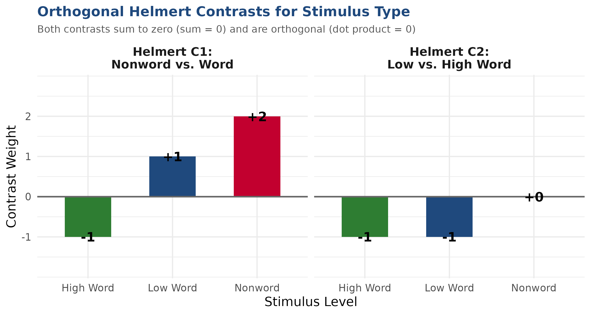
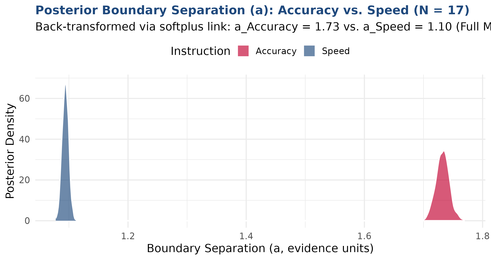
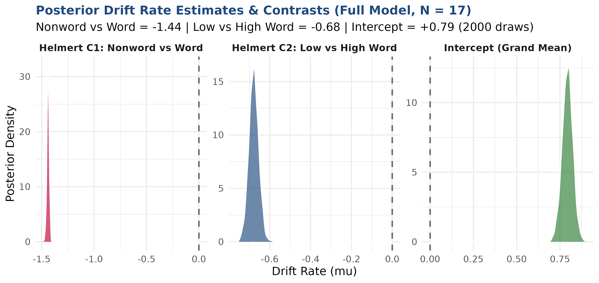
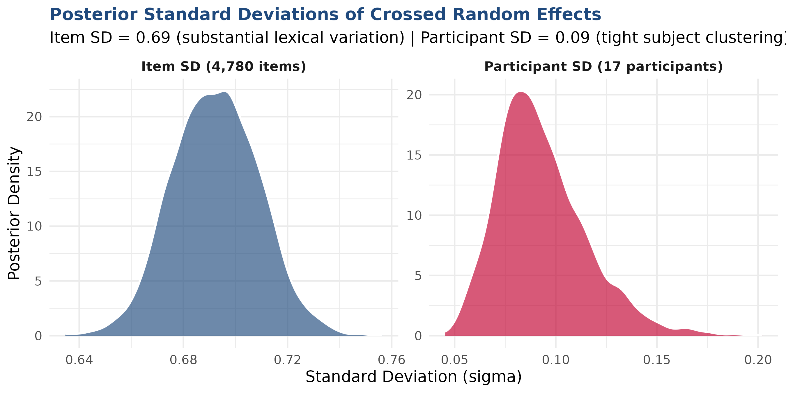

## Context within the DDM Workshop {.dark-bg background-color="#C2002F"}

::: {style="background: linear-gradient(135deg, #1F497D, #C2002F); color: white; padding: 22px; border-radius: 10px; text-align: center; margin-bottom: 25px; font-weight: bold; font-size: 1.15em; box-shadow: 0 4px 10px rgba(0,0,0,0.15);"}
  Module: Technical Issues in brms & How cogmod Works
:::

### From Mathematical Theory to Computational Reality

- Earlier sessions cover the **conceptual and mathematical foundations** of evidence accumulation (Wiener diffusion equations, boundary hitting times, speed-accuracy tradeoffs).
- **Our Focus in this Module:**
  - The **computational hurdles** of fitting hierarchical DDMs with Hamiltonian Monte Carlo (HMC) in Stan/`brms`.
  - How **`cogmod`** resolves the infamous numerical pathologies of native Stan.
  - Specific design considerations for our **stimulus-coded model** (`fit_ddm_stimulus_coding.R`).
  - Orthogonal contrast engineering, multithreading, and sampler diagnostics.

---

## Workshop Module Agenda

::: {.columns}
::: {.column width="50%"}
### 1. Technical Hurdles in brms
- Native Stan limitations (`wiener_lpdf`)
- The NaN partial gradient disaster
- The hard minimum-RT cliff & crashes
- Crossed random effects complexity

### 2. How cogmod Works Under the Hood
- Custom family architecture (`cogmod_ddm`)
- Link functions: Why `softplus` for boundary?
- The 0.2s half-normal outlier mixture
- The triad: `priors`, `inits`, and `stanvars`
:::

::: {.column width="50%"}
### 3. Considerations for Our Model
- Response coding vs. Error coding
- Data censoring (`speed_acc$censor`)
- Collapsing stimulus levels (low + very low)
- Empirical 50/50 response balance

### 4. Contrasts & Interpretation
- Orthogonal Helmert contrasts
- Sum-to-zero instruction contrasts
- Deconstructing the drift rate intercept

### 5. High-Performance Sampling
- Within-chain multi-threading (`threading(2)`)
- Diagnosing & preventing divergences
:::
:::

---

## Part 1: Technical Hurdles of DDM in brms {.dark-bg background-color="#C2002F"}

---

## The High Dimensionality of Cognitive Models

- In psychological and psycholinguistic experiments (e.g., lexical decision), we have **crossed random effects**:
  $$\text{Drift Rate } \mu_{ij} = \beta_0 + \beta_1 X_{ij} + u_i + w_j, \quad u_i \sim \text{Normal}(0, \sigma_{\text{Participant}}^2), \quad w_j \sim \text{Normal}(0, \sigma_{\text{Item}}^2)$$
- Unlike nested clinical trials, every participant responds to hundreds of unique items.
- In Wagenmakers et al. (2008), this means estimating:
  - **4 core cognitive parameters** ($\mu, a, t_0, z$) across condition cells.
  - **Crossed random intercepts** across $3$ participants and $>3,000$ items.
  - Over **$3,000$ latent parameters** estimated simultaneously!
- Fitting this via Hamiltonian Monte Carlo requires an exceptionally stable posterior geometry.

---

## Native Stan & `brms::wiener()` Limitations

Standard `brms` includes the `wiener()` family [@burkner2017brms; @singmann2017wiener], but fitting hierarchical models often hits severe technical roadblocks:

::: {.columns}
::: {.column width="50%"}
### 1. The NaN Gradient Disaster

- Stan's `wiener_lpdf()` evaluates alternating infinite series (Navarro & Fuss, 2009).
- When density underflows to 0, it returns `-inf` with **NaN partial derivatives**!
- In reverse-mode automatic differentiation:
  $$0 \times \text{NaN} = \text{NaN}$$
- A single trial with a NaN partial turns the **entire model gradient to NaN**!
- Leads to "Non-finite gradient" aborts and false divergent transitions.
:::

::: {.column width="50%"}
### 2. The Hard Min-RT Cliff

- The Wiener process is undefined for $RT \le t_0$.
- If a single trial has $RT \le t_0$, density drops to 0 instantly as an **infinite vertical cliff**.
- Stan cannot calculate gradients across discontinuities.
- Warmup chains get trapped or fail during initialization:
  *"Rejecting initial value: Log probability evaluates to log(0)"*
- Forces brittle manual bounds ($t_0 < \min(RT)$).
:::
:::

---

## Units Matter: Seconds vs. Milliseconds!

- In standard linear regression, whether RT is in milliseconds ($500$ ms) or seconds ($0.50$ s) only scales the slope by $1000$.
- **In Drift Diffusion Modeling, units are fundamental:**
  - Diffusion variance $s^2$ is fixed to $1$ (or $0.1$) as an arbitrary scaling constant.
  - All four parameters ($\mu, a, t_0, z$) scale nonlinearly with time units:
    $$a \propto \sqrt{\text{time}}, \quad \mu \propto \frac{1}{\sqrt{\text{time}}}, \quad t_0 \propto \text{time}$$
  - Stan's numerical precision and internal approximations are calibrated for **SECONDS**.
  - If you pass reaction times in milliseconds ($500$ instead of $0.5$), Stan's exponential and Bessel approximations overflow/underflow immediately!
- **Golden Rule:** Always verify that $RT$ is in seconds ($0.18 \le RT \le 3.0$) before fitting!

---

## Part 2: How cogmod Works Under the Hood {.dark-bg background-color="#C2002F"}

---

## What is `cogmod`? [@makowski2025cogmod]

::: {.columns}
::: {.column width="55%"}
- Developed by Dominique Makowski (2025).
- Designed specifically to bridge cognitive science models with modern Bayesian computation in `brms` and Stan.
- Provides `cogmod_ddm()`: a **custom `brms` distributional family** (`custom_family`).
- Parameterizes the decision process:
  - `mu`: Drift rate (accumulation slope)
  - `boundary`: Boundary separation ($a > 0$)
  - `ndt`: Non-decision time ($t_0 > 0$)
  - `bias`: Relative starting point ($z/a \in (0, 1)$)
  - `sigmadrift`, `sigmabias`, `sigmandt`: Trial-to-trial variabilities (7-parameter Ratcliff DDM)
  - `poutlier`: Proportion of lapse trials
:::

::: {.column width="45%"}
::: {style="background: #F4F6F9; border-left: 5px solid #1F497D; padding: 15px; border-radius: 6px; font-size: 0.9em;"}
  <strong>Core Advantages of cogmod:</strong><br><br>
  ✅ <strong>Safe Likelihood:</strong> Dual Navarro & Fuss approximations prevent NaN gradients.<br><br>
  ✅ <strong>Outlier Mixture:</strong> Eliminates the hard minimum-RT cliff.<br><br>
  ✅ <strong>Stable Link Functions:</strong> Uses softplus for boundary separation.<br><br>
  ✅ <strong>Automated Workflows:</strong> Built-in priors, smart initializations, and Stan code injection.
:::
:::
:::

---

## Parameter Link Functions in `cogmod`

In distributional regression, parameters are modeled on unbounded latent scales via link functions:

| Parameter | Link Function | Mathematical Form | Rationale |
| :--- | :---: | :---: | :--- |
| **Drift Rate ($\mu$)** | `identity` | $\mu = \eta$ | Can take any real value ($-\infty, +\infty$) |
| **Boundary ($a$)** | **`softplus`** | $a = \log(1 + e^{\eta})$ | **Smooth positive gradient!** (Avoids log explosions) |
| **Non-decision ($t_0$)** | `log` | $t_0 = e^{\eta}$ | Strictly positive latency ($t_0 > 0$) |
| **Bias ($z/a$)** | `logit` | $z = \frac{1}{1 + e^{-\eta}}$ | Strictly bounded within $(0, 1)$ ($0.5 = \text{unbiased}$) |

::: {style="background: #E8F4F8; border-left: 5px solid #1F497D; padding: 10px; margin-top: 15px; font-size: 0.9em;"}
  💡 <strong>Why `softplus` for Boundary instead of `log`?</strong><br>
  A <code>log</code> link models $a = \exp(\eta)$. If predictors yield $\eta > 3$, boundary separation explodes exponentially, collapsing the likelihood. The <code>softplus</code> function behaves linearly for positive values ($\approx \eta$) and smoothly approaches zero for negative values, providing robust HMC gradients!
:::

---

## The Outlier Mixture Mechanism

::: {.columns}
::: {.column width="45%"}
- **How cogmod eliminates the min-RT cliff:**
- Blends the Wiener density with a **half-normal outlier lapse process** (scale = $0.2$ s) with equal choice probability:
  $$p(\text{choice}, RT) = (1 - p_{\text{out}}) f_{\text{Wiener}} + p_{\text{out}} f_{\text{Lapse}}$$
- If $RT \le t_0$:
  - Standard Wiener crashes to $-\infty$ with NaN partials.
  - `cogmod` smoothly assigns:
    $$\log(p_{\text{outlier}}) + lp_{\text{outlier}}$$
- The parameter $t_0$ can now be estimated via smooth gradients without hitting an impenetrable cliff!
:::

::: {.column width="55%"}
{width=100% fig-align="center"}
:::
:::

---

## The Triad of Automation Helpers

`cogmod` provides three dedicated functions that work in concert with `brms`:

```r
# 1. Automatic data-driven priors matched to parameter link scales
prior_ddm <- cogmod_priors(f_ddm, df)

# 2. Smart initialization function avoiding boundary rejection
init_ddm  <- cogmod_inits(f_ddm, df)

# 3. Stan C++ code injection for the custom likelihood functions
sv_ddm    <- cogmod_stanvars(f_ddm)
```

::: {.columns}
::: {.column width="33%"}
#### cogmod_priors()
Generates weakly informative priors scaled specifically for seconds and link functions (e.g. Normal priors on logit bias, softplus boundary).
:::

::: {.column width="33%"}
#### cogmod_inits()
Calculates empirical RT minima and provides jittered starting values ensuring $t_0 < \min(RT)$ for every chain. Eliminates initialization crashes!
:::

::: {.column width="33%"}
#### cogmod_stanvars()
Injects custom C++ Stan code (`cogmod_ddm_lpdf`, dual Navarro & Fuss series) directly into Stan's `functions {}` block.
:::
:::

---

## Part 3: Considerations for THIS Particular Model {.dark-bg background-color="#C2002F"}

### `workshop_sepex/fit_ddm_stimulus_coding.R`

---

## Response Coding vs. Error Coding

A foundational decision in DDM specification is how boundaries are mapped to behavior:

::: {.columns}
::: {.column width="50%"}
#### Accuracy / Error Coding

- **Lower (0):** Correct response
- **Upper (1):** Error response
- **Fatal Flaw in Lexical Decision:**
  - Accuracy is typically ~95%.
  - **95% of data hits boundary 0**; only 5% hits boundary 1.
  - Severe data sparsity prevents reliable estimation of boundary $a$ and non-decision time $t_0$.
  - Erases physical motor key distinctions.
:::

::: {.column width="50%"}
#### Response / Stimulus Coding

- **Lower (0):** "Nonword" key press
- **Upper (1):** "Word" key press
- **Methodological Strengths:**
  - **Balanced boundaries:** ~50/50 distribution of observations ($47\%$ word, $53\%$ nonword).
  - Both boundaries have thousands of empirical RTs.
  - **Direct motor mapping:** Starting point bias ($z > 0.5$) measures true preference toward "Word".
  - **Directional drift:** $v > 0$ for words, $v < 0$ for nonwords!
:::
:::

---

## Data Censoring via `speed_acc$censor`

- We fit Experiment 1 of Wagenmakers et al. (2008), provided in `rtdists::speed_acc` [@heathcote2012linear; @singmann2017wiener].
- **Why we filter `!speed_acc$censor`:**
  - Wagenmakers et al. and Heathcote & Love (2012) flagged $171$ trials ($0.5\%$) for exclusion:
    - **Accidental button presses:** Keys pressed outside the designated response set.
    - **Fast anticipations ($RT < 180$ ms):** Responses faster than physiological visual-motor transmission time.
    - **Attentional lapses ($RT > 3.0$ s):** Trials with mind-wandering or external disruption.
  - **Technical impact on brms:**
    - Extreme anticipations artificially compress the estimate of $t_0$.
    - Long lapses artificially inflate boundary separation $a$.
    - Filtering `!censor` yields $4,632$ clean observations for participants 1–3.

---

## Collapsing Stimulus Types

In the original Wagenmakers et al. (2008) dataset, stimuli are divided into 4 categories:
- `nonword`, `very_low`, `low`, and `high` frequency.

::: {.columns}
::: {.column width="50%"}
### The Collapsing Strategy
- Words with `very_low` and `low` frequency exhibit near-identical lexical access latencies.
- Estimating separate parameters for both fragments statistical power without theoretical benefit.
- We collapse them into a single level: **`low`**.
:::

::: {.column width="50%"}
### Resulting Parsimonious Factor
1. **`nonword`** ($N = 2,311$ trials)
   - Pseudoword items requiring negative drift.
2. **`low`** ($N = 1,547$ trials)
   - Combined low & very low frequency words.
3. **`high`** ($N = 774$ trials)
   - High frequency, easily recognized words.
:::
:::

---

## Empirical Distributions: Clean 50/50 Split

```{r}
#| label: empirical-stim-plot
#| echo: false
#| eval: true
#| fig-width: 10
#| fig-height: 4.6
#| fig-align: center

library(ggplot2)
library(dplyr)
data(speed_acc, package = "rtdists")

df_sub <- speed_acc[!speed_acc$censor, ] %>%
  filter(id %in% c("1", "2", "3")) %>%
  droplevels()

df_sub$response_choice <- ifelse(df_sub$response == "word", 1L, 0L)
df_sub$stimulus_type <- factor(
  ifelse(df_sub$stim_cat == "nonword", "nonword",
  ifelse(df_sub$frequency %in% c("low", "very_low"), "low", "high")),
  levels = c("high", "low", "nonword")
)
df_sub$Condition <- factor(
  unname(c(accuracy = "Accuracy", speed = "Speed")[as.character(df_sub$condition)]),
  levels = c("Accuracy", "Speed")
)

ggplot(df_sub, aes(x = rt, fill = factor(response_choice, labels = c("Nonword (0)", "Word (1)")))) +
  geom_histogram(bins = 70, alpha = 0.7, position = "identity") +
  facet_grid(Condition ~ stimulus_type) +
  scale_fill_manual(values = c("Nonword (0)" = "#1F497D", "Word (1)" = "#C2002F")) +
  theme_minimal(base_size = 12) +
  labs(
    title = "Empirical RT Distributions Across Stimulus Types and Instructions",
    subtitle = "Abundant responses at both boundaries across all experimental cells",
    x = "Reaction Time (seconds)",
    y = "Trial Count",
    fill = "Boundary Reached"
  ) +
  theme(legend.position = "top")
```

---

## Part 4: Contrast Design & Intercept Mechanics {.dark-bg background-color="#C2002F"}

---

## The Trap of Default Treatment Coding

- By default, R and `brms` use **dummy / treatment coding** (`contr.treatment`).
- It designates one factor level as the baseline (e.g. High Frequency Words under Accuracy).
- **Why this fails in multi-parameter DDM:**
  - The drift rate intercept $\beta_0$ becomes the drift rate *of high-frequency words in accuracy conditions*.
  - Main effects represent differences from that specific condition, not average marginal effects.
  - Testing whether drift rate differs between words and nonwords requires awkward linear combinations (`hypothesis()`).
- **Solution:** Planned **Orthogonal Helmert Contrasts** and **Sum Contrasts** [@schad2020how].

---

## Orthogonal Helmert Contrasts for `stimulus_type`

We structure two planned, orthogonal hypotheses:

::: {.columns}
::: {.column width="50%"}
```r
helmert_mat <- contr.helmert(3)[, c(2, 1)]
colnames(helmert_mat) <- c("Nonword_vs_Word", 
                           "Low_vs_High")
contrasts(df$stimulus_type) <- helmert_mat
```

| Stimulus Level | `Nonword_vs_Word` | `Low_vs_High` |
| :--- | :---: | :---: |
| **High Word** | $-1$ | $-1$ |
| **Low Word**  | $-1$ | $+1$ |
| **Nonword**   | $+2$ | $0$ |

- $\sum C_1 = 0$, $\sum C_2 = 0$ (centered).
- Dot product: $(-1)(-1) + (-1)(1) + (2)(0) = 0$ (**orthogonal!**).
:::

::: {.column width="50%"}
{width=100% fig-align="center"}
:::
:::

---

## Sum Contrasts for `Condition`

For speed vs. accuracy instructions, we apply **Sum-to-Zero contrasts** (`contr.sum`):

```r
contrasts(df$Condition) <- contr.sum(2)
colnames(contrasts(df$Condition)) <- c("Acc_vs_Speed")
```

| Instruction Condition | `Acc_vs_Speed` |
| :--- | :---: |
| **Accuracy** | $+1$ |
| **Speed**    | $-1$ |

- **Properties:**
  - Column sums to zero: $(+1) + (-1) = 0$.
  - Intercept reflects the **unweighted grand mean** across instructions.
  - Predictor tests the average directional difference between Accuracy and Speed blocks.

---

## Interpretability: Meaning of the Drift Intercept

Because all contrast columns sum to zero across factor levels, the intercept $\beta_0$ is evaluated where all predictors equal zero:
$$\beta_0 = \frac{1}{3}\mu_{\text{high}} + \frac{1}{3}\mu_{\text{low}} + \frac{1}{3}\mu_{\text{nonword}}$$

::: {.columns}
::: {.column width="50%"}
#### 1. Directional Cancellation & Imbalance

- Words pull positive ($\mu_{\text{word}} > 0$). Nonwords pull negative ($\mu_{\text{nonword}} < 0$). They pull in opposite directions and partially cancel out!
- There are 2 word categories and 1 nonword category:
  $$\beta_0 = \frac{2}{3}\bar{\mu}_{\text{word}} + \frac{1}{3}\mu_{\text{nonword}}$$
- Even if words and nonwords are equally easy ($|\bar{\mu}_{\text{w}}| = |\mu_{\text{nw}}|$), $\beta_0$ is naturally **positive**!
:::

::: {.column width="50%"}
#### 2. Where Does Discrimination Live?

- Under stimulus coding, **overall discrimination ability lives in Helmert Contrast 1** (`Nonword_vs_Word`):
  $$\mu_{\text{nonword}} - \bar{\mu}_{\text{word}}$$
- Because words are positive and nonwords are negative, this contrast strongly captures the ability to separate words from nonwords!
- Lexical sensitivity lives in **Helmert Contrast 2** (`Low_vs_High`).
:::
:::

---

## Part 5: Model Specification & Multi-Threading {.dark-bg background-color="#C2002F"}

### Running `brms` with `cmdstanr`

---

## The Stimulus-Coded DDM Formula

In `workshop_sepex/fit_ddm_stimulus_coding.R`, we specify the full distributional formula:

```r
f_ddm <- bf(
  # 1. Drift Rate (mu): stimulus_type * Condition + crossed random intercepts
  rt | dec(response_choice) ~ stimulus_type * Condition + (1 | Participant) + (1 | Item),
  
  # 2. Boundary Separation (a): modulated by speed-accuracy instructions
  boundary ~ Condition,
  
  # 3. Non-Decision Time (t0): sensory-motor latency across conditions
  ndt ~ Condition,
  
  # 4. Starting Point Bias (z): bias toward "Word" (1) vs "Nonword" (0)
  bias ~ 1,
  
  # Baseline 4-parameter DDM (trial-to-trial variabilities fixed to 0)
  sigmadrift = 0, sigmabias = 0, sigmandt = 0,
  family = cogmod_ddm()
)
```

---

## High-Performance Multi-Threading in Stan

- Fitting $>3,000$ item intercepts across $4,632$ observations takes significant compute time.
- **Solution:** Within-chain multi-threading in Stan via `reduce_sum`:

```r
model_ddm <- brm(
  formula  = f_ddm,
  data     = df,
  prior    = prior_ddm,
  init     = init_ddm,
  stanvars = sv_ddm,
  chains   = 4,
  cores    = 4,
  threads  = threading(2), # 2 threads per chain = 8 cores active!
  iter     = 1000,
  warmup   = 500,
  backend  = "cmdstanr",
  control  = list(adapt_delta = 0.95, max_treedepth = 12)
)
```

::: {style="background: #E8F4F8; border-left: 5px solid #1F497D; padding: 12px; border-radius: 4px; font-size: 0.9em; margin-top: 15px;"}
  🚀 <strong>How it works:</strong> Stan parallelizes likelihood evaluations across 2 threads <em>within each chain</em>. With 4 chains running simultaneously on 4 cores, all 8 CPU cores are pinned at 100%, cutting wall-clock execution time in half!
:::

---

## MCMC Diagnostics: Preventing Divergences

- **What is a divergent transition?**
  - A point where the simulated Hamiltonian trajectory deviates from the true energy surface.
  - Indicates that the step size $\epsilon$ is too large to navigate high-curvature regions.
- **Neal's Funnel in Hierarchical DDMs:**
  - Estimating participant-level standard deviations ($\sigma_{\text{Participant}}$) with only $N=3$ participants creates a classic "funnel" geometry.
  - In our initial tests with default `adapt_delta = 0.80`, 36 divergences clustered in the funnel neck of `sd_Participant__Intercept`.
- **The Solution in `fit_ddm_stimulus_coding.R`:**
  - `adapt_delta = 0.95`: Forces Stan to take smaller leapfrog steps, resolving the narrow neck.
  - `max_treedepth = 12`: Prevents premature termination of trajectory exploration in complex surfaces.

---

## Model Results: Full Hierarchical DDM (N = 17) {.dark-bg background-color="#1F497D"}

::: {style="background: #E8F5E9; border-left: 5px solid #2E7D32; padding: 15px; border-radius: 6px; font-size: 0.9em; margin-bottom: 20px;"}
  ✅ <strong>Production Model Completed:</strong> The full hierarchical stimulus-coded DDM finished sampling in <strong>157.2 minutes</strong> (~2.6 hours) across 4 chains (1,000 iter, 500 warmup = 2,000 post-warmup draws) with multi-threading (<code>threads = threading(2)</code>).
:::

::: {.columns}
::: {.column width="50%"}
### MCMC Diagnostic Health
- **Divergent Transitions: 0 (0.0%)** across all 2,000 draws!
  - `adapt_delta = 0.95` eliminated divergences.
- **Rhat = 1.00** across every parameter.
- **Bulk ESS:** 1,798 to 4,765 (far above the 400 guideline).
- **Tail ESS:** 1,127 to 1,898.
:::

::: {.column width="50%"}
### Modeling Scope
- **31,351 observations** (all 17 subjects, censored).
- **4,780 crossed item intercepts** estimated simultaneously.
- **17 participant intercepts** estimated simultaneously.
- Model serialized safely to:
  `models/ddm_cogmod_stimulus_coding_model.qs`
:::
:::

---

## Posterior Parameter Estimates (Full Production Model)

::: {style="font-size: 0.58em;"}
```{r}
#| label: load-production-summary-table
#| echo: false
#| eval: true

library(qs2)
library(dplyr)
library(knitr)
library(here)

summary_data <- qs2::qs_read(here::here("models", "ddm_cogmod_stimulus_coding_summary.qs"))
fe <- summary_data$fixed_effects

table_df <- data.frame(
  Parameter = c(
    "Intercept (Grand Mean Drift)",
    "Boundary Separation (Intercept)",
    "Starting Point Bias (Intercept)",
    "Non-Decision Time (Intercept)",
    "stimulus_type: Nonword vs Word",
    "stimulus_type: Low vs High Word",
    "Condition: Acc vs Speed",
    "Nonword_vs_Word : Acc_vs_Speed",
    "Low_vs_High : Acc_vs_Speed",
    "Boundary Separation: Acc vs Speed",
    "Non-Decision Time: Acc vs Speed"
  ),
  Estimate = sprintf("%.3f", fe$Estimate),
  EstError = sprintf("%.3f", fe$Est.Error),
  `95% CrI` = sprintf("[%.2f, %.2f]", fe$`l-95% CI`, fe$`u-95% CI`),
  Rhat = fe$Rhat,
  Bulk_ESS = fe$Bulk_ESS,
  Interpretation = c(
    "Unweighted mean drift (positive due to 2:1 category imbalance)",
    "Baseline boundary: softplus(1.11) ≈ 1.40 evidence units",
    "Starting bias: plogis(0.025) ≈ 0.506 (nearly unbiased)",
    "Baseline NDT: exp(-1.10) ≈ 332 ms latency",
    "Lexical discrimination: Nonwords drift down (-), Words up (+)",
    "Frequency effect: Low-frequency slower uptake than high",
    "Slight overall drift modulation across instructions",
    "Modulation of lexical discrimination by speed/acc",
    "Modulation of frequency sensitivity by speed/acc",
    "Accuracy widens boundaries: a_Acc (1.73) > a_Spd (1.09)!",
    "NDT difference between conditions is tiny (~17 ms)"
  ),
  check.names = FALSE
)

knitr::kable(table_df, align = c("l", "r", "r", "c", "c", "r", "l"))
```
:::

---

## Posterior Boundary Separation: Accuracy vs. Speed

::: {.columns}
::: {.column width="45%"}
### Robust Shift in Decision Caution
- **Accuracy Instructions:**
  - $\text{softplus}(1.112 + 0.426) \approx \mathbf{1.73}$ evidence units.
- **Speed Instructions:**
  - $\text{softplus}(1.112 - 0.426) \approx \mathbf{1.09}$ evidence units.
- **Cognitive Finding:**
  - Boundaries are **$58\%$ wider** under accuracy instructions.
  - Participants trade speed for accuracy by adjusting the threshold distance ($a$).
:::

::: {.column width="55%"}
{width=100% fig-align="center"}
:::
:::

---

## Posterior Drift Rates & Hypotheses Confirmation

::: {.columns}
::: {.column width="45%"}
### Decomposition of Evidence Accumulation
1. **Drift Intercept ($\beta_0 = +0.79$):**
   - Positive as mathematically derived ($\frac{2}{3}\bar{\mu}_{\text{word}} + \frac{1}{3}\mu_{\text{nonword}}$).
2. **Helmert C1 (`Nonword_vs_Word` = $-1.44$):**
   - Massively negative: Nonwords accumulate evidence toward 0, words toward 1!
3. **Helmert C2 (`Low_vs_High Word` = $-0.68$):**
   - Low-frequency words have lower accumulation slopes than high-frequency words.
:::

::: {.column width="55%"}
{width=100% fig-align="center"}
:::
:::

---

## Latency & Crossed Random Effects

::: {.columns}
::: {.column width="45%"}
### Non-Decision Latency ($t_0$)
- **Baseline NDT:** $332$ ms ($95\%$ CrI: $[331, 334]$ ms).
- **Speed vs. Accuracy:** Only a $17$ ms shift ($341$ ms in Accuracy vs. $324$ ms in Speed).
- **Bias ($z$):** $0.506$ ($50.6\%$, essentially unbiased).

### Crossed Variances
- **Item SD ($\sigma_{\text{Item}} = 0.69$):** Substantial lexical diversity across words and nonwords.
- **Participant SD ($\sigma_{\text{Participant}} = 0.09$):** Consistent performance across participants.
:::

::: {.column width="55%"}
{width=100% fig-align="center"}
:::
:::

---

## Part 6: Reproducibility & Workflow Architecture {.dark-bg background-color="#C2002F"}

---

## Separation of Concerns in Quarto & Docker

::: {.columns}
::: {.column width="50%"}
### ❌ Anti-Pattern: MCMC in Quarto
- Running `brm()` calls directly inside `.qmd` code chunks.
- Every minor typo or slide reformat triggers hours of re-compilation.
- Rendering timeouts and container memory exhaustion.
:::

::: {.column width="50%"}
### ✅ Best Practice: Standalone Execution
- Standalone R script (`fit_ddm_stimulus_coding.R`) executes in Docker.
- Models are serialized to disk using `qs2::qs_save()`.
- Presentation only loads pre-computed summaries via `qs2::qs_read()`.
- Slide compilation is instant (< 5 seconds)!
:::
:::

::: {style="background: #E8F5E9; border-left: 5px solid #2E7D32; padding: 12px; border-radius: 4px; font-size: 0.9em; margin-top: 20px;"}
  🔒 <strong>Serialization Protocol:</strong> Always use <code>qs2</code> (fast, stable C++ serialization). Never use the deprecated <code>qs</code> package!
:::

---

## Managing Large Model Objects in Git

- Fitted hierarchical Bayesian models in `brms` with thousands of random effect draws exceed **50–300 MB**.
- Committing raw `.qs` files exceeds GitHub's 100 MB file limit and bloats repository history.
- **The Project's File Splitting Utility (`file_manager.py`):**
  - **Splitting:**
    ```bash
    python3 file_manager.py split models/ddm_cogmod_stimulus_coding_model.qs
    ```
    Creates a SHA-256 `.hash` file and split `.part00X` chunks (< 90 MB) for safe Git commits.
  - **Rebuilding:**
    ```bash
    python3 file_manager.py join --all
    ```
    Reassembles all split chunks into full `.qs` objects upon container startup!

---

## Summary: Technical Checklist for DDM in brms

::: {style="background: #F4F6F9; border-left: 5px solid #1F497D; padding: 15px; border-radius: 6px; font-size: 0.9em;"}
  <strong>1. Choice Coding:</strong> Use Response Coding ($0 = \text{Nonword}, 1 = \text{Word}$) for balanced boundaries and meaningful drift signs.<br><br>
  <strong>2. Data Preparation:</strong> Filter extreme anticipations and lapses; ensure RT is strictly in <strong>seconds</strong>.<br><br>
  <strong>3. cogmod Ecosystem:</strong> Leverage <code>cogmod_ddm()</code> with <code>softplus</code> boundaries, <code>cogmod_priors()</code>, <code>cogmod_inits()</code>, and <code>cogmod_stanvars()</code>.<br><br>
  <strong>4. Contrast Engineering:</strong> Apply orthogonal Helmert contrasts to factor levels and sum contrasts to conditions for interpretable intercepts.<br><br>
  <strong>5. Parallelization:</strong> Use <code>backend = "cmdstanr"</code> and <code>threads = threading(2)</code> to maximize multicore throughput.<br><br>
  <strong>6. Sampler Tuning:</strong> Increase <code>adapt_delta = 0.95</code> and <code>max_treedepth = 12</code> to eliminate Neal's Funnel divergences.
:::

---

## References

::: {#refs}
:::
