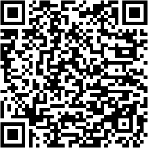

## Slides {.dark-bg background-color="#C2002F"}

Scan the QR code or visit the URL to open the interactive slides on your device:

::: {layout-ncol=2}
{width="280" height="280" style="background: white; padding: 10px; border-radius: 8px; border: 3px solid #1F497D;"}

<div style="font-size: 0.85em; display: flex; flex-direction: column; justify-content: center; height: 280px; text-align: left; padding-left: 20px;">
<p>**Interactive Features:**</p>
<ul style="margin-top: 5px; margin-bottom: 20px;">
  <li>Live NHST Visualizer</li>
  <li>Interactive PPV & FDR Calculator</li>
  <li>Theoretical & Simulated Power Curves</li>
</ul>

<p>**Direct Link:**</p>
<a href="https://bernhardangele.github.io/nebrija-statistical-power-workshop/presentations/session-1-power-fundamentals.html" target="_blank" style="color: #EEECE1; font-weight: bold; text-decoration: underline; font-size: 0.9em; word-break: break-all;">https://bernhardangele.github.io/nebrija-statistical-power-workshop/presentations/session-1-power-fundamentals.html</a>
</div>
:::


## Seminar information

<div style="background: linear-gradient(135deg, #1F497D, #C2002F); color: white; padding: 30px; border-radius: 10px; text-align: center; margin-bottom: 20px; font-weight: bold; font-size: 1.2em; box-shadow: 0 4px 10px rgba(0,0,0,0.15);">
  Doctoral Program in Applied Linguistics for Language Teaching
</div>

**Doctoral Training Seminars 2026**

### Seminar: statistical power and sample size planning

**Lecturer:** Dr. Bernhard Angele

**Dates:**

- Friday, June 26, 2026 (11:00 AM to 2:00 PM) - Session 1
- Friday, July 10, 2026 (3:00 PM to 6:00 PM) - Session 2

**Modality:** Campus Virtual (Online Collaborate Ultra)

## Seminar plan

- **Session 1 (today)**
  - Theoretical and practical foundations of open science
  - Emphasis on preregistration and registered reports
  - Introduction to statistical power and sample size planning
- **Session 2 (July 10th)**
  - In depth-look power analysis for various designs (*t*-tests, ANOVA, regression, mixed models)
  - Detailed walkthrough of the OSF preregistration form
  - Drafting a preregistration

## Teaching methodology and evaluation

* **Teaching methodology:** Theoretical-practical.
* **Evaluation:**
    * Attendance and participation (synchronous and asynchronous).
    * Assignment: Preparation of a **complete preregistration draft** for a future research project (using the OSF form), which will be submitted for detailed feedback.
        * *The preregistration must include responses to all fields of the form, including a detailed justification of the sample size.*

## Part 1: Open science and the replication crisis {.dark-bg background-color="#C2002F"}

## What is the "replication crisis"?

* Difficulty in **reproducing the results** of published scientific studies.
* Initially observed in social psychology (e.g., @openscience2015estimating), but with implications for many disciplines, including psycholinguistics and applied linguistics.
* Does not necessarily imply fraud, but can arise from questionable research practices (QRPs).


*Key reference: @openscience2015estimating*

## Contributing factors to the crisis

* **Publication bias:** Preference for publishing positive, novel, and statistically significant results. Null results or failed replications often go unpublished ("file drawer problem").
* **P-hacking (Data dredging):** Practices that increase the likelihood of obtaining a statistically significant result without a real increase in evidence.
    * Examples: Deciding whether to collect more data after seeing the results, testing multiple dependent variables but reporting only the significant ones, excluding participants post-hoc to achieve significance.
    * *Reference: @simmons2011false*
* **HARKing (Hypothesizing After the Results are Known):** Presenting a post-hoc generated hypothesis as if it had been predicted a priori.
* **Low statistical power:** Studies with small samples are less likely to detect true effects.
* **Lack of transparency:** Methods, data, and analysis codes not publicly available.

## Why does it matter to us?

### Applied linguistics and psycholinguistics

* **Reliability of findings:** Can we trust the conclusions of our studies and those of others?
* **Building cumulative knowledge:** Science advances by building on previous work. If the foundation is unstable, progress is hindered.
* **Research efficiency:** Avoid wasting resources on lines of research based on non-robust findings.
* **Credibility of the field:** Maintain public trust and that of other scientists in our disciplines.
* **Practical applications:** Decisions about language teaching, interventions, etc., should be based on solid evidence.

## Towards a solution – open science

A global movement to make scientific research, its data, and its dissemination:

* **Transparent:** Methods, analyses, and data clearly documented and available.
* **Accessible:** Results and data available to all (Open Access, Open Data).
* **Reproducible and Replicable:** Other researchers can verify and build upon findings.
* **Collaborative:** Fostering teamwork and knowledge sharing.

*Key reference: @munafo2017manifesto*

## Pillars of open science

* **Preregistration:** Specifying the research plan *before* data collection or analysis.
* **Registered Reports:** Publication format where the decision to accept is based on the quality of the question and method (preregistered), not the results.
* **Open Data, Open Materials, Open Code:** Sharing data, materials (e.g., stimuli, questionnaires), and analysis scripts.
* **Open Access Publishing:** Publications freely available to readers.
* **Replication Studies:** Encouraging and valuing replication studies.

## Part 2: Preregistration & registered reports {.dark-bg background-color="#C2002F"}

## Preregistration – what is it?

### Definition:

Preregistration involves creating a **time-stamped, read-only version of your research plan** in a public repository (like OSF) *before* collecting or analyzing data.

* It establishes a clear distinction between:
    * **Confirmatory Research:** Testing specific, pre-stated hypotheses.
    * **Exploratory Research:** Generating hypotheses from the data (must be transparent).

*Key reference: @nosek2018preregistration*

## Why preregister? Benefits (I)

**For Science:**

* **Improves credibility and interpretability of results:** Reduces suspicion of p-hacking or HARKing.
* **Distinguishes prediction from postdiction (confirmatory vs. exploratory):** Both are valuable but should be transparent.
* **Helps combat publication bias:** A preregistration is a record of the study, even if the results are not traditionally "publishable."
* **Encourages more rigorous study planning.**

*Reference: @psychologicalscience101*

## Why preregister? Benefits (II)

**For the Researcher:**

* **Clarifies thinking and research plan:** "Preregistration helps you see the future (of your analyses)." (see @datacolada64)
    * Forces methodological and analytical decisions *before* seeing the data.
* **Protects against the researcher's own confirmation bias.**
* **Increases confidence in one's own results:** If the plan is followed, findings are more robust.
* **Can help convince reviewers and editors:** A manuscript reporting preregistered studies is often viewed as more credible
* **Registered Reports:** Get an in-principle acceptance for publication based on the quality of the research question and methodology, not the results.
* **Demonstrates methodological rigor and transparency.**
* **Preregistration benefits you!** It is a tool to help you conduct better research.

*Reference: @soderberg2024preregistration*

## An illustrative example

### The "feeling the future" case

* **@bem2011feeling: Feeling the future: Experimental evidence for anomalous retroactive influences on cognition and affect.**
    * Published in a high-impact journal.
    * Nine experiments, eight with *p* < .05 supporting "precognition."
    * Methodology with much flexibility (e.g., different DVs, data transformations not specified a priori).
    * Generated huge controversy and subsequent replication failures (e.g., @ritchie2012failing; @galak2012correcting).

* **How could preregistration have helped?**
    * Required specifying *a priori*: exact hypotheses, primary dependent variables, sample sizes, stopping rules, analysis plan.
    * Limited undisclosed flexibility in data analysis.
    * Adherence to a preregistered plan would have increased credibility or revealed the exploratory nature of the analyses.

## Researcher degrees of freedom

* In their article on "False-positive Psychology", @simmons2011false show how undisclosed flexibility in data collection and analysis can invalidate the statistical procedures used to test hypotheses.

* @simmons2011false show how researcher degrees of freedom can lead to a false positive rate of up to 61% (at a nominal 5% $\alpha$ level) when researchers have flexibility in:
    * Deciding when to stop data collection.
    * Choosing which variables to analyze and to include as predictors.
    * Selecting which participants to include/exclude.
    * Deciding which statistical tests to run.
    * Transforming or coding data post-hoc.

## How to preregister? Key elements

A detailed preregistration typically includes (adapted from @van2016pre and @osfguides):

1.  **Study Information:** Title, authors, affiliations, abstract/summary.
2.  **Research Questions and Hypotheses:** Clear, specific, directional (if applicable).
3.  **Study Design:** Type of study, variables (IVs, DVs, covariates), conditions, manipulations.
4.  **Sampling Plan:** Target population, procedure, **target sample size and justification (power analysis)**, stopping rules.
5.  **Variables Measured:** Instruments, scales, tasks.
6.  **Statistical Analysis Plan:** Statistical models for each hypothesis, data handling (outliers, missing data, transformations), secondary/exploratory analyses.
7.  **Criteria for Conclusions:** Interpretation in relation to hypotheses.

*Reference: @van2016pre*

## Multiple comparisons

* **Multiple comparisons problem:** When multiple hypotheses are tested, the chance of obtaining at least one false positive increases. For example, testing 20 independent hypotheses at $\alpha = 0.05$ leads to a 64% chance of at least one false positive.
* Every time you make a change to your analysis plan after seeing the data, this is another comparison and adds to the risk of false positives.
* How can we address this?
    - **Pre-registration:** Specify hypotheses and analyses *before* data collection.
    - **Adjust significance thresholds:** (e.g., Bonferroni correction) for multiple comparisons.
    - Clearly distinguish between **confirmatory** and **exploratory** analyses in reporting. Do not make theoretical or practical claims based on exploratory analyses without conducting an independent confirmatory replication.


## Platforms for preregistration

* **Open Science Framework (OSF.io):**
    * Most widely used and versatile. Offers detailed templates.
    * Allows embargoing (keeping private) the preregistration until a certain date or publication.
    * Integrates project management, data, materials.
    * Established by Brian Nosek and the Center for Open Science (COS).
    * **This is what we will use in this seminar.**
* **AsPredicted.org:**
    * Simpler, direct question format. Quicker to complete.
    * Approach: A minimal preregistration is better than none [@simmons2021preregistration].
    * Established by Uri Simonsohn, Leif Nelson, and Joseph Simmons (authors of @simmons2011false).

## Preregistration vs. registered reports

::: {layout-nw="[50, 50]"}
::: {#standard-prereg}
### Standard preregistration
1. Researcher deposits study plan.
2. Conducts the study.
3. Writes paper & submits.
4. Peer review occurs **after** results are known.
:::

::: {#registered-reports}
### Registered reports
1. **Stage 1 (Protocol Review):** Methods & analysis plan submitted **before** data collection. Peer reviewed. Journal grants **In-Principle Acceptance (IPA)**.
2. **Stage 2 (Full Review):** Study is conducted following protocol. Results & discussion added. Review focuses on protocol adherence.
3. **Publication guaranteed** regardless of outcome!
:::
:::

*Reference: @chambers2019what*

## The OSF preregistration form

### Overview of main sections

1.  **Study Information:** Title, Authors, Description, Hypotheses.
2.  **Design Plan:** Study type, Blinding, Variables (IVs, DVs), Design structure.
3.  **Sampling Plan:** Existing/new data, procedures, **sample size & justification (power analysis)**, stopping rule.
4.  **Variables:** Manipulated and measured variables.
5.  **Analysis Plan:** Statistical models, data handling (outliers, missing data), inference criteria.
6.  **Other:** Additional relevant info.

*Reference: @osfguides*

## Part 3: Statistical power fundamentals {.dark-bg background-color="#C2002F"}

## The most difficult field on the OSF preregistration form

* **Sample Size Justification**: What do you write here?
    - "We will collect 30 participants because that is what previous studies have used" is not a valid justification.
    - You need to provide a **quantitative justification** for your sample size, typically based on a **power analysis**.

* In the rest of this seminar (and the next one), we will focus on how to estimate **statistical power** and how to **plan your sample size**.

## Null hypothesis significance testing (NHST)

Before we discuss statistical power, we must understand the framework of **Null Hypothesis Significance Testing (NHST)**:

1. **Formulate Hypotheses**:
   - **Null Hypothesis ($H_0$)**: No real difference or effect exists (e.g., $\mu_{\text{LF}} - \mu_{\text{HF}} = 0$).
   - **Alternative Hypothesis ($H_1$)**: A real difference exists (e.g., $\mu_{\text{LF}} - \mu_{\text{HF}} \neq 0$).
2. **Collect Data & Calculate Test Statistic**:
   - Compute a test statistic (e.g., a $t$-value representing the signal-to-noise ratio).
3. **Determine Probability ($p$-value)**:
   - The probability of obtaining a test statistic at least as extreme as ours, *assuming the null hypothesis is true*.
4. **Make Decision**:
   - If $p < \alpha$ (usually $0.05$), we reject $H_0$. Otherwise, we fail to reject $H_0$.

## Example: lexical decision task

Suppose we compare response times (RTs) to **High-Frequency (HF)** and **Low-Frequency (LF)** words.
Since each participant sees both word types, we run a **paired-samples *t*-test**.

- **$H_0$**: $\mu_{\text{LF}} - \mu_{\text{HF}} = 0$ ms (frequency does not affect RT).
- **$H_1$**: $\mu_{\text{LF}} - \mu_{\text{HF}} \neq 0$ ms (frequency affects RT).
- The standard deviation of the differences ($s_d$) is set to 80 ms, and the sample size ($N$) is adjustable.

## Interactive NHST: visualizing the *t*-test

Adjust the sliders to see the $t$-statistic move, the critical boundaries shift, and the $p$-value area update:

```{=html}
<div id="nhst-widget-container" style="background: rgba(31, 73, 125, 0.95); color: white; padding: 15px 25px; border-radius: 12px; font-family: 'Arial', sans-serif; box-shadow: 0 8px 32px rgba(0,0,0,0.3); font-size: 0.85em; line-height: 1.3em; display: flex; flex-direction: row; justify-content: space-between; gap: 20px; align-items: center; max-width: 900px; margin: 0 auto;">
  <!-- Left column: Controls and Live Stats -->
  <div style="flex: 1; min-width: 200px; display: flex; flex-direction: column; gap: 10px;">
    
    <!-- Control: Mean Difference -->
    <div style="display: flex; flex-direction: column; gap: 2px;">
      <div style="display: flex; justify-content: space-between; font-weight: bold; color: #EEECE1;">
        <span>Mean Difference (LF - HF):</span>
        <span id="nhst-label-diff" style="color: #FFFFFF; font-weight: bold; background: rgba(255, 255, 255, 0.15); padding: 1px 6px; border-radius: 4px; font-size: 0.9em; width: 60px; text-align: center; display: inline-block; box-sizing: border-box;">30 ms</span>
      </div>
      <input type="range" id="nhst-slider-diff" min="0" max="100" step="1" value="30" style="width: 100%; accent-color: #C2002F; cursor: pointer;">
    </div>

    <!-- Control: Sample Size -->
    <div style="display: flex; flex-direction: column; gap: 2px;">
      <div style="display: flex; justify-content: space-between; font-weight: bold; color: #EEECE1;">
        <span>Sample Size (N):</span>
        <span id="nhst-label-n" style="color: #FFFFFF; font-weight: bold; background: rgba(255, 255, 255, 0.15); padding: 1px 6px; border-radius: 4px; font-size: 0.9em; width: 35px; text-align: center; display: inline-block; box-sizing: border-box;">30</span>
      </div>
      <input type="range" id="nhst-slider-n" min="10" max="80" step="1" value="30" style="width: 100%; accent-color: #C2002F; cursor: pointer;">
    </div>

    <!-- Control: Standard Deviation -->
    <div style="display: flex; flex-direction: column; gap: 2px;">
      <div style="display: flex; justify-content: space-between; font-weight: bold; color: #EEECE1;">
        <span>Standard Deviation (sd):</span>
        <span id="nhst-label-sd" style="color: #FFFFFF; font-weight: bold; background: rgba(255, 255, 255, 0.15); padding: 1px 6px; border-radius: 4px; font-size: 0.9em; width: 60px; text-align: center; display: inline-block; box-sizing: border-box;">80 ms</span>
      </div>
      <input type="range" id="nhst-slider-sd" min="40" max="150" step="1" value="80" style="width: 100%; accent-color: #C2002F; cursor: pointer;">
    </div>

    <!-- Live Statistics Panel -->
    <div style="background: rgba(238, 236, 225, 0.1); border-radius: 8px; padding: 10px; display: flex; flex-direction: column; gap: 4px; border: 1px solid rgba(238, 236, 225, 0.2); font-size: 0.95em;">
      <div style="display: flex; justify-content: space-between;">
        <span>Mean Difference (d̄):</span>
        <strong id="nhst-val-diff" style="color: white;">30.0 ms</strong>
      </div>
      <div style="display: flex; justify-content: space-between;">
        <span>Standard Error (SE):</span>
        <strong id="nhst-val-se" style="color: white;">14.6 ms</strong>
      </div>
      <div style="display: flex; justify-content: space-between;">
        <span>Degrees of Freedom (df):</span>
        <strong id="nhst-val-df" style="color: white;">29</strong>
      </div>
      <div style="display: flex; justify-content: space-between;">
        <span>t-statistic:</span>
        <strong id="nhst-val-t" style="color: white;">2.054</strong>
      </div>
      <div style="display: flex; justify-content: space-between; border-top: 1px solid rgba(255,255,255,0.15); padding-top: 4px; margin-top: 2px;">
        <span>p-value (two-tailed):</span>
        <strong id="nhst-val-p" style="color: #FF8095; font-weight: bold; font-size: 1.1em;">0.0492</strong>
      </div>
      <div style="display: flex; align-items: center; justify-content: center; text-align: center; margin-top: 6px; padding: 4px; border-radius: 4px; font-weight: bold; height: 32px; border: 1px solid transparent; box-sizing: border-box;" id="nhst-val-decision">
        Reject H₀
      </div>
    </div>
  </div>

  <!-- Right column: SVG Chart -->
  <div style="flex: 1.3; display: flex; align-items: center; justify-content: center; background: rgba(0, 0, 0, 0.25); border-radius: 8px; padding: 10px; border: 1px solid rgba(255,255,255,0.05);">
    <svg id="nhst-svg" width="100%" height="270" viewBox="0 0 500 270" style="overflow: visible;">
      <!-- Baseline axis -->
      <line x1="30" y1="210" x2="470" y2="210" stroke="#EEECE1" stroke-width="1.5" />
      
      <!-- X-axis Ticks and Labels -->
      <text x="250" y="230" fill="#EEECE1" font-size="10" text-anchor="middle">0 (H₀)</text>
      <text x="145" y="230" fill="#EEECE1" font-size="10" text-anchor="middle">-2</text>
      <text x="355" y="230" fill="#EEECE1" font-size="10" text-anchor="middle">+2</text>
      <text x="40" y="230" fill="#EEECE1" font-size="10" text-anchor="middle">-4</text>
      <text x="460" y="230" fill="#EEECE1" font-size="10" text-anchor="middle">+4</text>
      <text x="250" y="255" fill="#EEECE1" font-size="11" text-anchor="middle" font-weight="bold">t-statistic scale</text>
      
      <!-- Grid tick marks -->
      <line x1="250" y1="210" x2="250" y2="215" stroke="#EEECE1" stroke-width="1" />
      <line x1="145" y1="210" x2="145" y2="215" stroke="#EEECE1" stroke-width="1" />
      <line x1="355" y1="210" x2="355" y2="215" stroke="#EEECE1" stroke-width="1" />
      <line x1="40" y1="210" x2="40" y2="215" stroke="#EEECE1" stroke-width="1" />
      <line x1="460" y1="210" x2="460" y2="215" stroke="#EEECE1" stroke-width="1" />

      <!-- Shaded Tails (Red) -->
      <path id="nhst-left-tail" fill="rgba(194, 0, 47, 0.5)" />
      <path id="nhst-right-tail" fill="rgba(194, 0, 47, 0.5)" />
      
      <!-- Central t-distribution Curve -->
      <path id="nhst-curve-path" fill="none" stroke="#EEECE1" stroke-width="2.5" />
      
      <!-- Critical Value Lines (Dashed Beige) -->
      <line id="nhst-crit-line-l" x1="0" y1="30" x2="0" y2="210" stroke="#EEECE1" stroke-width="1.2" stroke-dasharray="4,4" />
      <line id="nhst-crit-line-r" x1="0" y1="30" x2="0" y2="210" stroke="#EEECE1" stroke-width="1.2" stroke-dasharray="4,4" />
      
      <!-- Critical Value Labels -->
      <text id="nhst-crit-text-l" x="0" y="25" fill="#EEECE1" font-size="9" text-anchor="middle">-t_crit</text>
      <text id="nhst-crit-text-r" x="0" y="25" fill="#EEECE1" font-size="9" text-anchor="middle">+t_crit</text>
      <text x="250" y="15" fill="#EEECE1" font-size="9" text-anchor="middle" font-style="italic">Dashed lines = critical boundaries (α = 0.05)</text>
      
      <!-- Observed Value Line (Solid Red) -->
      <line id="nhst-obs-line" x1="0" y1="30" x2="0" y2="210" stroke="#C2002F" stroke-width="2.5" />
      <text id="nhst-obs-text" x="0" y="45" fill="#C2002F" font-size="11" font-weight="bold" text-anchor="start">t_obs</text>
    </svg>
  </div>
</div>

<script>
(function() {
  function init() {
    var sliderDiff = document.getElementById("nhst-slider-diff");
    var sliderN = document.getElementById("nhst-slider-n");
    var sliderSD = document.getElementById("nhst-slider-sd");
    
    // Safe DOM check: if elements do not exist in the DOM tree yet, try again in 100ms
    if (!sliderDiff || !sliderN || !sliderSD) {
      setTimeout(init, 100);
      return;
    }
    
    var labelDiff = document.getElementById("nhst-label-diff");
    var labelN = document.getElementById("nhst-label-n");
    var labelSD = document.getElementById("nhst-label-sd");
    
    var valDiff = document.getElementById("nhst-val-diff");
    var valSE = document.getElementById("nhst-val-se");
    var valDF = document.getElementById("nhst-val-df");
    var valT = document.getElementById("nhst-val-t");
    var valP = document.getElementById("nhst-val-p");
    var valDecision = document.getElementById("nhst-val-decision");
    
    var curvePath = document.getElementById("nhst-curve-path");
    var leftTail = document.getElementById("nhst-left-tail");
    var rightTail = document.getElementById("nhst-right-tail");
    var obsLine = document.getElementById("nhst-obs-line");
    var obsText = document.getElementById("nhst-obs-text");
    
    var critLineL = document.getElementById("nhst-crit-line-l");
    var critLineR = document.getElementById("nhst-crit-line-r");
    var critTextL = document.getElementById("nhst-crit-text-l");
    var critTextR = document.getElementById("nhst-crit-text-r");

    function getTCrit(df) {
      return 1.96 + 2.38 / df + 3.0 / (df * df);
    }

    function normalCDF(x) {
      var a1 =  0.254829592; var a2 = -0.284496736; var a3 =  1.421413741;
      var a4 = -1.453152027; var a5 =  1.061405429; var p  =  0.3275911;
      var sign = (x < 0) ? -1 : 1;
      x = Math.abs(x) / Math.sqrt(2.0);
      var t = 1.0 / (1.0 + p * x);
      var y = 1.0 - (((((a5 * t + a4) * t) + a3) * t + a2) * t + a1) * t * Math.exp(-x * x);
      return 0.5 * (1.0 + sign * y);
    }

    // Convert t to z using Wallace (1959) approximation for accurate t-distribution CDF
    function getPValue(t, df) {
      var a = 1 - 1 / (4 * df);
      var b = Math.sqrt(1 + (t * t) / (2 * df));
      var z = (t * a) / b;
      return 2 * (1 - normalCDF(Math.abs(z)));
    }

    function getPathD(df) {
      var points = [];
      for (var t = -4; t <= 4; t += 0.05) {
        var x = 250 + t * 52.5;
        var density = Math.pow(1 + (t * t) / df, -(df + 1) / 2);
        var y = 210 - 150 * density;
        points.push(x.toFixed(1) + "," + y.toFixed(1));
      }
      return "M " + points.join(" L ");
    }

    function getTailPathD(startT, endT, df) {
      var points = [];
      var startX = 250 + startT * 52.5;
      points.push(startX.toFixed(1) + ",210");
      for (var t = startT; t <= endT; t += 0.02) {
        var x = 250 + t * 52.5;
        var density = Math.pow(1 + (t * t) / df, -(df + 1) / 2);
        var y = 210 - 150 * density;
        points.push(x.toFixed(1) + "," + y.toFixed(1));
      }
      var endX = 250 + endT * 52.5;
      points.push(endX.toFixed(1) + ",210");
      return "M " + points.join(" L ") + " Z";
    }

    function update() {
      var diff = parseFloat(sliderDiff.value);
      var n = parseInt(sliderN.value);
      var sd = parseFloat(sliderSD.value);
      var df = n - 1;
      var se = sd / Math.sqrt(n);
      var t = diff / se;
      var t_abs = Math.abs(t);
      var t_crit = getTCrit(df);
      var p = getPValue(t, df);

      labelDiff.textContent = diff + " ms";
      labelN.textContent = n;
      labelSD.textContent = sd + " ms";

      valDiff.textContent = diff.toFixed(1) + " ms";
      valSE.textContent = se.toFixed(1) + " ms";
      valDF.textContent = df;
      valT.textContent = t.toFixed(3);
      
      if (p < 0.0001) {
        valP.textContent = "< 0.0001";
      } else {
        valP.textContent = p.toFixed(4);
      }

      if (p < 0.05) {
        valDecision.textContent = "Reject H₀ (Significant)";
        valDecision.style.background = "rgba(194, 0, 47, 0.3)";
        valDecision.style.color = "#FF8095";
        valDecision.style.borderColor = "rgba(194, 0, 47, 0.6)";
        valP.style.color = "#FF8095";
      } else {
        valDecision.textContent = "Fail to Reject H₀";
        valDecision.style.background = "rgba(238, 236, 225, 0.1)";
        valDecision.style.color = "#EEECE1";
        valDecision.style.borderColor = "rgba(238, 236, 225, 0.2)";
        valP.style.color = "#EEECE1";
      }

      // SVG updates
      curvePath.setAttribute("d", getPathD(df));

      if (t_abs >= 4) {
        leftTail.setAttribute("d", "");
        rightTail.setAttribute("d", "");
      } else {
        leftTail.setAttribute("d", getTailPathD(-4, -t_abs, df));
        rightTail.setAttribute("d", getTailPathD(t_abs, 4, df));
      }

      var obsX = 250 + t * 52.5;
      if (obsX >= 30 && obsX <= 470) {
        obsLine.setAttribute("x1", obsX);
        obsLine.setAttribute("x2", obsX);
        obsLine.style.display = "inline";
        obsText.setAttribute("x", obsX);
        obsText.textContent = "t_obs = " + t.toFixed(2);
        obsText.setAttribute("text-anchor", t >= 0 ? "start" : "end");
        obsText.setAttribute("dx", t >= 0 ? "5" : "-5");
        obsText.style.display = "inline";
      } else {
        obsLine.style.display = "none";
        obsText.style.display = "none";
      }

      var critXL = 250 - t_crit * 52.5;
      var critXR = 250 + t_crit * 52.5;
      critLineL.setAttribute("x1", critXL);
      critLineL.setAttribute("x2", critXL);
      critLineR.setAttribute("x1", critXR);
      critLineR.setAttribute("x2", critXR);
      critTextL.setAttribute("x", critXL);
      critTextL.textContent = "-" + t_crit.toFixed(2);
      critTextR.setAttribute("x", critXR);
      critTextR.textContent = "+" + t_crit.toFixed(2);
    }

    sliderDiff.addEventListener("input", update);
    sliderN.addEventListener("input", update);
    sliderSD.addEventListener("input", update);

    update();
  }

  // Safe startup wrapper
  if (document.readyState === "loading") {
    document.addEventListener("DOMContentLoaded", init);
  } else {
    init();
  }
})();
</script>
```

## Introduction to statistical power analysis

The **probability that a statistical test will detect an effect if that effect truly exists** in the population.

* Power = $1 - \beta$ (where $\beta$ is the probability of a Type II error).
* **Type II Error (False Negative)**: Failing to reject the null hypothesis ($H_0$) when it is false (i.e., not finding an effect that does exist).
* Conventionally, a power of at least **.80 (80%)** is sought.

*Key reference: @cohen1992power*

## Error types

| Decision | H₀ True (No Effect) | H₀ False (Effect Exists) |
|---|---|---|
| **Reject $H_0$** | Type I error ($\alpha$) | Correct decision (Power: $1-\beta$) |
| **Fail to reject $H_0$** | Correct decision | Type II error ($\beta$) |

## *p*-values vs. false discovery rate

* What is the probability that a significant result ($p < .05$) indicates a **true effect**?
* This **Positive Predictive Value (PPV)** depends on three factors [@schonbrodt2015probability; @colquhoun2014investigation]:
  1. **Prior Probability (Prevalence)**: How likely the hypothesis is true a priori.
  2. **Statistical Power ($1 - \beta$)**: The probability of detecting a true effect.
  3. **Alpha Level ($\alpha$)**: The false positive rate under the null hypothesis.

## Interactive PPV & FDR calculator

```{=html}
<div style="display: flex; gap: 15px; align-items: stretch; height: 440px; margin-top: 5px; box-sizing: border-box;">
  <!-- Sidebar with inputs -->
  <div style="flex: 1.1; display: flex; flex-direction: column; justify-content: space-between; background: #1F497D; color: white; padding: 10px 12px; border-radius: 8px; box-shadow: 0 4px 10px rgba(0,0,0,0.15); font-size: 0.65em; font-family: Arial, sans-serif; box-sizing: border-box;">
    <h3 style="color: white; margin: 0 0 5px 0; border-bottom: 2px solid #C2002F; padding-bottom: 3px; font-size: 1.1em; font-weight: bold; font-family: Arial, sans-serif; text-align: left;">Parameters</h3>
    
    <!-- Input 1: Prior Probability -->
    <div style="margin-bottom: 8px; text-align: left;">
      <div style="display: flex; justify-content: space-between; font-weight: bold; margin-bottom: 2px;">
        <span>Prior Probability:</span>
        <span id="ppv-slider-val-prior">30%</span>
      </div>
      <input type="range" id="ppv-slider-prior" min="0" max="100" value="30" style="width: 100%; accent-color: #C2002F; cursor: pointer; height: 4px;" />
      <span style="font-size: 0.8em; color: #EEECE1; display: block; line-height: 1.1;">% of tested hypotheses that are true.</span>
    </div>
    
    <!-- Input 2: Power -->
    <div style="margin-bottom: 8px; text-align: left;">
      <div style="display: flex; justify-content: space-between; font-weight: bold; margin-bottom: 2px;">
        <span>Power (1 - β):</span>
        <span id="ppv-slider-val-power">35%</span>
      </div>
      <input type="range" id="ppv-slider-power" min="5" max="99" value="35" style="width: 100%; accent-color: #C2002F; cursor: pointer; height: 4px;" />
      <span style="font-size: 0.8em; color: #EEECE1; display: block; line-height: 1.1;">Probability of detecting a true effect.</span>
    </div>
    
    <!-- Input 3: Alpha Level -->
    <div style="margin-bottom: 8px; text-align: left;">
      <div style="display: flex; justify-content: space-between; font-weight: bold; margin-bottom: 2px;">
        <span>Alpha Level (α):</span>
        <span id="ppv-slider-val-alpha">5.0%</span>
      </div>
      <input type="range" id="ppv-slider-alpha" min="5" max="100" value="50" step="5" style="width: 100%; accent-color: #C2002F; cursor: pointer; height: 4px;" />
      <span style="font-size: 0.8em; color: #EEECE1; display: block; line-height: 1.1;">Type I error rate (significance threshold).</span>
    </div>

    <!-- Input 4: Bias / P-hacking -->
    <div style="margin-bottom: 8px; text-align: left;">
      <div style="display: flex; justify-content: space-between; font-weight: bold; margin-bottom: 2px;">
        <span>Bias / P-hacking (u):</span>
        <span id="ppv-slider-val-bias">10%</span>
      </div>
      <input type="range" id="ppv-slider-bias" min="0" max="100" value="10" style="width: 100%; accent-color: #C2002F; cursor: pointer; height: 4px;" />
      <span style="font-size: 0.8em; color: #EEECE1; display: block; line-height: 1.1;">% of nulls/misses pushed to significance.</span>
    </div>
  </div>
  
  <!-- Main content area -->
  <div style="flex: 2.2; display: flex; flex-direction: column; justify-content: space-between; gap: 5px; box-sizing: border-box;">
    <!-- Legend -->
    <div style="display: flex; justify-content: center; gap: 15px; font-size: 0.58em; font-family: Arial, sans-serif; background: #EEECE1; border-radius: 4px; padding: 4px 10px; box-sizing: border-box;">
      <div style="display: flex; align-items: center; gap: 4px;">
        <div style="width: 7px; height: 7px; border-radius: 50%; background: #2ECC71;"></div>
        <span>True Positive</span>
      </div>
      <div style="display: flex; align-items: center; gap: 4px;">
        <div style="width: 7px; height: 7px; border-radius: 50%; background: #E74C3C;"></div>
        <span>False Positive</span>
      </div>
      <div style="display: flex; align-items: center; gap: 4px;">
        <div style="width: 7px; height: 7px; border-radius: 50%; background: #F39C12;"></div>
        <span>True Negative</span>
      </div>
      <div style="display: flex; align-items: center; gap: 4px;">
        <div style="width: 7px; height: 7px; border-radius: 50%; background: #1F497D;"></div>
        <span>False Negative</span>
      </div>
    </div>

    <!-- Canvases Container -->
    <div style="display: flex; gap: 10px; justify-content: space-around; width: 100%; box-sizing: border-box;">
      <div style="text-align: center;">
        <span style="font-size: 0.58em; font-weight: bold; color: #1F497D; display: block; margin-bottom: 2px; font-family: Arial, sans-serif;">All Findings (each dot is one study)</span>
        <canvas id="ppv-canvas-all" width="240" height="190" style="border: 1.5px solid #EEECE1; border-radius: 6px; background: white; box-shadow: 0 2px 5px rgba(0,0,0,0.05);"></canvas>
      </div>
      <div style="text-align: center;">
        <span style="font-size: 0.58em; font-weight: bold; color: #1F497D; display: block; margin-bottom: 2px; font-family: Arial, sans-serif;">Only Significant (what gets published)</span>
        <canvas id="ppv-canvas-sig" width="240" height="190" style="border: 1.5px solid #EEECE1; border-radius: 6px; background: white; box-shadow: 0 2px 5px rgba(0,0,0,0.05);"></canvas>
      </div>
    </div>
    
    <!-- Calculations box -->
    <div style="background: #EEECE1; border: 1.5px solid #1F497D; border-radius: 8px; padding: 8px 10px; display: flex; justify-content: space-around; align-items: center; box-shadow: 0 4px 6px rgba(0,0,0,0.05); font-size: 0.65em; min-height: 98px; font-family: Arial, sans-serif; box-sizing: border-box;">
      <div style="text-align: center; flex: 1;">
        <span style="font-weight: bold; color: #1F497D; display: block; margin-bottom: 2px; font-size: 0.85em; line-height: 1.2;">Significant Findings</span>
        <span id="ppv-calc-total-sig" style="font-size: 1.3em; font-weight: bold; color: #C2002F; display: block;">140 / 500</span>
        <span id="ppv-calc-ratio-text" style="display: block; font-size: 0.8em; color: #555; margin-top: 2px; line-height: 1.2;">(105 True, 35 False)</span>
      </div>
      <div style="width: 2px; height: 55px; background: #1F497D; opacity: 0.3;"></div>
      <div style="text-align: center; flex: 1.3; padding: 0 4px;">
        <span style="font-weight: bold; color: #1F497D; display: block; margin-bottom: 2px; font-size: 0.85em; line-height: 1.2;">Positive Predictive Value (PPV)</span>
        <span id="ppv-calc-ppv" style="font-size: 1.3em; font-weight: bold; color: #C2002F; display: block;">75.0%</span>
        <span style="display: block; font-size: 0.8em; color: #555; margin-top: 2px; line-height: 1.2;">% of claimed findings that are true</span>
      </div>
      <div style="width: 2px; height: 55px; background: #1F497D; opacity: 0.3;"></div>
      <div style="text-align: center; flex: 1.3; padding: 0 4px;">
        <span style="font-weight: bold; color: #1F497D; display: block; margin-bottom: 2px; font-size: 0.85em; line-height: 1.2;">False Discovery Rate (FDR)</span>
        <span id="ppv-calc-fdr" style="font-size: 1.3em; font-weight: bold; color: #C2002F; display: block;">25.0%</span>
        <span style="display: block; font-size: 0.8em; color: #555; margin-top: 2px; line-height: 1.2;">% of claimed findings that are false</span>
      </div>
    </div>
  </div>
</div>

<div style="text-align: center; margin-top: 12px; font-size: 0.58em; font-family: Arial, sans-serif; color: #555;">
  Original Shiny App: <a href="https://shiny.ieis.tue.nl/PPV/" target="_blank" style="color: #C2002F; text-decoration: underline; font-weight: bold;">https://shiny.ieis.tue.nl/PPV/</a>
</div>

<script>
(function() {
  function init() {
    var sliderPrior = document.getElementById("ppv-slider-prior");
    var sliderPower = document.getElementById("ppv-slider-power");
    var sliderAlpha = document.getElementById("ppv-slider-alpha");
    var sliderBias = document.getElementById("ppv-slider-bias");
    
    var canvasAll = document.getElementById("ppv-canvas-all");
    var canvasSig = document.getElementById("ppv-canvas-sig");
    
    if (!sliderPrior || !sliderPower || !sliderAlpha || !sliderBias || !canvasAll || !canvasSig) {
      setTimeout(init, 100);
      return;
    }
    
    var valPrior = document.getElementById("ppv-slider-val-prior");
    var valPower = document.getElementById("ppv-slider-val-power");
    var valAlpha = document.getElementById("ppv-slider-val-alpha");
    var valBias = document.getElementById("ppv-slider-val-bias");
    
    var calcTotalSig = document.getElementById("ppv-calc-total-sig");
    var calcRatioText = document.getElementById("ppv-calc-ratio-text");
    var calcPPV = document.getElementById("ppv-calc-ppv");
    var calcFDR = document.getElementById("ppv-calc-fdr");
    
    function getDotType(idx, h0, falsealarm, hit, miss) {
      if (idx < h0) {
        if (idx < falsealarm) {
          return "false positive";
        } else {
          return "true negative";
        }
      } else {
        var j = idx - h0;
        if (j < hit) {
          return "true positive";
        } else {
          return "false negative";
        }
      }
    }
    
    function getColorForType(type, onlySignificant) {
      if (onlySignificant) {
        if (type === "true positive") {
          return "#2ECC71";
        } else if (type === "false positive") {
          return "#E74C3C";
        } else {
          return "#F3F4F6"; // Faint suppressed grey for non-significant
        }
      } else {
        if (type === "true positive") {
          return "#2ECC71";
        } else if (type === "false positive") {
          return "#E74C3C";
        } else if (type === "true negative") {
          return "#F39C12";
        } else if (type === "false negative") {
          return "#1F497D";
        }
      }
    }
    
    function update() {
      var priorPct = parseInt(sliderPrior.value);
      var powerPct = parseInt(sliderPower.value);
      var alphaVal = parseInt(sliderAlpha.value);
      var biasPct = parseInt(sliderBias.value);
      
      var prior = priorPct / 100.0;
      var power = powerPct / 100.0;
      var alpha = alphaVal / 1000.0;
      var u = biasPct / 100.0;
      
      valPrior.textContent = priorPct + "%";
      valPower.textContent = powerPct + "%";
      valAlpha.textContent = (alpha * 100.0).toFixed(1) + "%";
      valBias.textContent = biasPct + "%";
      
      // Calculate h1 and h0 out of 500 studies
      var h1 = Math.round(500.0 * prior);
      var h0 = 500 - h1;
      
      // Compute hit, false alarm, miss, and true rejection
      var rawHit = h1 * power + u * h1 * (1.0 - power);
      var hit = Math.min(h1, Math.round(rawHit));
      var miss = h1 - hit;
      
      var rawFA = h0 * alpha + u * h0 * (1.0 - alpha);
      var falsealarm = Math.min(h0, Math.round(rawFA));
      var truerejection = h0 - falsealarm;
      
      var totalSig = hit + falsealarm;
      var ppv = totalSig > 0 ? (hit / totalSig) : 0.0;
      var fdr = 1.0 - ppv;
      
      // Update canvas renderings
      var ctxAll = canvasAll.getContext("2d");
      var ctxSig = canvasSig.getContext("2d");
      
      ctxAll.clearRect(0, 0, canvasAll.width, canvasAll.height);
      ctxSig.clearRect(0, 0, canvasSig.width, canvasSig.height);
      
      var idx = 0;
      for (var col = 0; col < 25; col++) {
        for (var row = 0; row < 20; row++) {
          var type = getDotType(idx, h0, falsealarm, hit, miss);
          var colorAll = getColorForType(type, false);
          var colorSig = getColorForType(type, true);
          
          var x = 12 + col * 9;
          var y = 12 + row * 9;
          
          // Draw All canvas
          ctxAll.beginPath();
          ctxAll.arc(x, y, 2.5, 0, 2 * Math.PI);
          ctxAll.fillStyle = colorAll;
          ctxAll.fill();
          
          // Draw Sig canvas
          ctxSig.beginPath();
          ctxSig.arc(x, y, 2.5, 0, 2 * Math.PI);
          ctxSig.fillStyle = colorSig;
          ctxSig.fill();
          
          idx++;
        }
      }
      
      calcTotalSig.textContent = totalSig + " / 500";
      calcRatioText.textContent = "(" + hit + " True, " + falsealarm + " False)";
      
      if (totalSig > 0) {
        calcPPV.textContent = (ppv * 100.0).toFixed(1) + "%";
        calcFDR.textContent = (fdr * 100.0).toFixed(1) + "%";
      } else {
        calcPPV.textContent = "-";
        calcFDR.textContent = "-";
      }
    }
    
    sliderPrior.addEventListener("input", update);
    sliderPower.addEventListener("input", update);
    sliderAlpha.addEventListener("input", update);
    sliderBias.addEventListener("input", update);
    
    update();
  }
  
  if (document.readyState === "loading") {
    document.addEventListener("DOMContentLoaded", init);
  } else {
    init();
  }
})();
</script>
```

## Why is power important?

- Reviewers ask for power analyses!
- Power determines whether a study can produce meaningful results.
- Low power increases the risk of false negatives
- But it also affects the reliability of significant findings (Type M and Type S errors).
  - Type M error: Magnitude of effect size is exaggerated
  - Type S error: Sign of effect is incorrect
- With low power, only the largest, most extreme observed effects cross the significance threshold.

::: {.accent-box .fragment}
### Consequences of low power
In a field full of underpowered studies, null effects are uninterpretable, we will have a lot of unpublished false negative effects, published effects will be overestimated, and we occasionally get effects that make no sense (wrong sign). This is the current state of affairs in psycholinguistics and many other fields.
:::

## Consequences of not considering power

- **Underpowered studies** waste resources and may miss real effects
- **Overpowered studies** waste resources (though less problematic)
- Ethical considerations: participant time and effort
- Funding agencies increasingly require power analyses
- Helps with study planning and resource allocation

## Why is power analysis crucial?

* **Underpowered studies:**
    * Have a high probability of **missing true effects** (many false negatives).
    * If they find a significant effect, the **effect size is more likely to be overestimated**.
    * Contribute to the **replication crisis**: "surprising" results from underpowered studies can be hard to replicate.
    * Are a **misuse of resources** (time, money, participants).
* An *a priori* power analysis helps determine the **necessary sample size** to have a reasonable chance of detecting an effect of an expected size.

## How to estimate power

- Let's think about the implications of the alternative hypothesis $H_1$ being true.
    - This means the true effect size (in the population) is not zero.
- NHST tries to avoid us having to make assumptions about the true effect size, but power analysis requires us to specify it.
- If the true effect size is not zero, this does not necessarily imply that the sample mean will be far away from zero. Let's simulate the sample mean at different values of $H_1$ to see what happens.

## Simulation: if $H_1$ is true

```{=html}
<style>
  .power-btn {
    background: #C2002F;
    color: white;
    border: none;
    padding: 6px 12px;
    border-radius: 4px;
    font-weight: bold;
    cursor: pointer;
    transition: background 0.2s, transform 0.1s;
    font-size: 0.95em;
  }
  .power-btn:hover {
    background: #e60036;
  }
  .power-btn:active {
    transform: scale(0.95);
  }
  .power-btn-secondary {
    background: rgba(238, 236, 225, 0.2);
    color: white;
    border: 1px solid rgba(238, 236, 225, 0.3);
    padding: 6px 12px;
    border-radius: 4px;
    font-weight: bold;
    cursor: pointer;
    transition: background 0.2s, transform 0.1s;
    font-size: 0.95em;
  }
  .power-btn-secondary:hover {
    background: rgba(238, 236, 225, 0.3);
  }
  .power-btn-secondary:active {
    transform: scale(0.95);
  }
  .power-slider {
    width: 100%;
    accent-color: #C2002F;
    cursor: pointer;
  }
</style>

<div id="power-sim-widget-container" style="background: rgba(31, 73, 125, 0.95); color: white; padding: 15px 25px; border-radius: 12px; font-family: 'Arial', sans-serif; box-shadow: 0 8px 32px rgba(0,0,0,0.3); font-size: 0.85em; line-height: 1.3em; display: flex; flex-direction: row; justify-content: space-between; gap: 20px; align-items: center; max-width: 900px; margin: 0 auto;">
  <!-- Left column: Controls, Playback, and Live Stats -->
  <div style="flex: 1; min-width: 250px; display: flex; flex-direction: column; gap: 8px;">
    
    <!-- Control: True Effect Size -->
    <div style="display: flex; flex-direction: column; gap: 2px;">
      <div style="display: flex; justify-content: space-between; font-weight: bold; color: #EEECE1;">
        <span>True Effect Size (μ_d):</span>
        <span id="power-sim-label-diff" style="color: #FFFFFF; font-weight: bold; background: rgba(255, 255, 255, 0.15); padding: 1px 6px; border-radius: 4px; font-size: 0.9em; width: 60px; text-align: center; display: inline-block; box-sizing: border-box;">30 ms</span>
      </div>
      <input type="range" id="power-sim-slider-diff" class="power-slider" min="0" max="100" step="1" value="30">
    </div>

    <!-- Control: Sample Size -->
    <div style="display: flex; flex-direction: column; gap: 2px;">
      <div style="display: flex; justify-content: space-between; font-weight: bold; color: #EEECE1;">
        <span>Sample Size (N):</span>
        <span id="power-sim-label-n" style="color: #FFFFFF; font-weight: bold; background: rgba(255, 255, 255, 0.15); padding: 1px 6px; border-radius: 4px; font-size: 0.9em; width: 35px; text-align: center; display: inline-block; box-sizing: border-box;">30</span>
      </div>
      <input type="range" id="power-sim-slider-n" class="power-slider" min="10" max="80" step="1" value="30">
    </div>

    <!-- Control: Standard Deviation -->
    <div style="display: flex; flex-direction: column; gap: 2px;">
      <div style="display: flex; justify-content: space-between; font-weight: bold; color: #EEECE1;">
        <span>Standard Deviation (sd):</span>
        <span id="power-sim-label-sd" style="color: #FFFFFF; font-weight: bold; background: rgba(255, 255, 255, 0.15); padding: 1px 6px; border-radius: 4px; font-size: 0.9em; width: 60px; text-align: center; display: inline-block; box-sizing: border-box;">80 ms</span>
      </div>
      <input type="range" id="power-sim-slider-sd" class="power-slider" min="40" max="150" step="1" value="80">
    </div>

    <!-- Control: Speed -->
    <div style="display: flex; flex-direction: column; gap: 2px;">
      <div style="display: flex; justify-content: space-between; font-weight: bold; color: #EEECE1;">
        <span>Sim Speed:</span>
        <span id="power-sim-label-speed" style="color: #FFFFFF; font-weight: bold; background: rgba(255, 255, 255, 0.15); padding: 1px 6px; border-radius: 4px; font-size: 0.9em; width: 90px; text-align: center; display: inline-block; box-sizing: border-box;">Medium</span>
      </div>
      <input type="range" id="power-sim-slider-speed" class="power-slider" min="1" max="5" step="1" value="3">
    </div>

    <!-- Simulation Controls Buttons -->
    <div style="display: flex; gap: 6px; margin-top: 2px;">
      <button id="power-sim-btn-play" class="power-btn" style="flex: 1.2;">Play</button>
      <button id="power-sim-btn-step" class="power-btn-secondary" style="flex: 0.9;">Step</button>
      <button id="power-sim-btn-reset" class="power-btn-secondary" style="flex: 0.9;">Reset</button>
    </div>

    <!-- Live Statistics Panel -->
    <div style="background: rgba(238, 236, 225, 0.1); border-radius: 8px; padding: 8px; display: flex; flex-direction: column; gap: 4px; border: 1px solid rgba(238, 236, 225, 0.2); font-size: 0.9em; margin-top: 4px;">
      <div style="display: flex; justify-content: space-between;">
        <span>Simulations:</span>
        <strong id="power-sim-val-count" style="color: white;">0</strong>
      </div>
      <div style="display: flex; justify-content: space-between;">
        <span>Rejections (p &lt; 0.05):</span>
        <strong id="power-sim-val-reject" style="color: #FF8095;">0 (0.0%)</strong>
      </div>
      <div style="display: flex; justify-content: space-between; border-top: 1px solid rgba(255,255,255,0.15); padding-top: 4px; margin-top: 2px;">
        <span>Empirical Power:</span>
        <strong id="power-sim-val-emppower" style="color: #FF8095; font-size: 1.05em;">0.0%</strong>
      </div>
      <div style="display: flex; justify-content: space-between;">
        <span>Theoretical Power:</span>
        <strong id="power-sim-val-theopower" style="color: #EEECE1; font-size: 1.05em;">47.8%</strong>
      </div>
      <div style="display: flex; justify-content: space-between; border-top: 1px solid rgba(255,255,255,0.15); padding-top: 4px; margin-top: 2px;">
        <span>Avg Effect (Rejected):</span>
        <strong id="power-sim-val-avg-reject" style="color: #FF8095;">-</strong>
      </div>
      <div style="display: flex; justify-content: space-between;">
        <span>Avg Effect (Not Rejected):</span>
        <strong id="power-sim-val-avg-noreject" style="color: #EEECE1;">-</strong>
      </div>
    </div>
  </div>

  <!-- Right column: Canvas Chart -->
  <div style="flex: 1.3; display: flex; align-items: center; justify-content: center; background: rgba(0, 0, 0, 0.25); border-radius: 8px; padding: 10px; border: 1px solid rgba(255,255,255,0.05); align-self: stretch;">
    <canvas id="power-sim-canvas" width="500" height="360" style="display: block; width: 100%; height: auto; overflow: visible;"></canvas>
  </div>
</div>

<script>
(function() {
  function init() {
    var sliderDiff = document.getElementById("power-sim-slider-diff");
    var sliderN = document.getElementById("power-sim-slider-n");
    var sliderSD = document.getElementById("power-sim-slider-sd");
    var sliderSpeed = document.getElementById("power-sim-slider-speed");
    
    var btnPlay = document.getElementById("power-sim-btn-play");
    var btnStep = document.getElementById("power-sim-btn-step");
    var btnReset = document.getElementById("power-sim-btn-reset");
    
    // Safe DOM check
    if (!sliderDiff || !sliderN || !sliderSD || !sliderSpeed || !btnPlay || !btnStep || !btnReset) {
      setTimeout(init, 100);
      return;
    }
    
    var labelDiff = document.getElementById("power-sim-label-diff");
    var labelN = document.getElementById("power-sim-label-n");
    var labelSD = document.getElementById("power-sim-label-sd");
    var labelSpeed = document.getElementById("power-sim-label-speed");
    
    var valCount = document.getElementById("power-sim-val-count");
    var valReject = document.getElementById("power-sim-val-reject");
    var valEmpPower = document.getElementById("power-sim-val-emppower");
    var valTheoPower = document.getElementById("power-sim-val-theopower");
    var valAvgReject = document.getElementById("power-sim-val-avg-reject");
    var valAvgNoReject = document.getElementById("power-sim-val-avg-noreject");
    
    var canvas = document.getElementById("power-sim-canvas");
    var ctx = canvas.getContext("2d");
    
    // Simulation state
    var isPlaying = false;
    var totalSims = 0;
    var totalRejections = 0;
    var sumRejectionEffect = 0;
    var sumNonRejectionEffect = 0;
    var numBins = 40;
    var bins = new Array(numBins).fill(0);
    var maxBinCount = 0;
    var lastSimulatedVal = null;
    
    var xMin = -80;
    var xMax = 180;
    var margin = { left: 45, right: 35, top: 40, bottom: 60 };
    var graphWidth = canvas.width - margin.left - margin.right; // 420
    var yBaseline = 300;
    var maxHeight = 220;
    
    var speedVal = parseInt(sliderSpeed.value);
    
    function valToPx(val) {
      return margin.left + ((val - xMin) / (xMax - xMin)) * graphWidth;
    }
    
    function getTCrit(df) {
      return 1.96 + 2.38 / df + 3.0 / (df * df);
    }
    
    function normalCDF(x) {
      var a1 =  0.254829592; var a2 = -0.284496736; var a3 =  1.421413741;
      var a4 = -1.453152027; var a5 =  1.061405429; var p  =  0.3275911;
      var sign = (x < 0) ? -1 : 1;
      x = Math.abs(x) / Math.sqrt(2.0);
      var t = 1.0 / (1.0 + p * x);
      var y = 1.0 - (((((a5 * t + a4) * t) + a3) * t + a2) * t + a1) * t * Math.exp(-x * x);
      return 0.5 * (1.0 + sign * y);
    }
    
    function randomNormal() {
      var u = 0, v = 0;
      while(u === 0) u = Math.random();
      while(v === 0) v = Math.random();
      return Math.sqrt(-2.0 * Math.log(u)) * Math.cos(2.0 * Math.PI * v);
    }
    
    function resetSimulation() {
      totalSims = 0;
      totalRejections = 0;
      sumRejectionEffect = 0;
      sumNonRejectionEffect = 0;
      bins.fill(0);
      maxBinCount = 0;
      lastSimulatedVal = null;
      updateStats();
      draw();
    }
    
    function updateLabels() {
      labelDiff.textContent = sliderDiff.value + " ms";
      labelN.textContent = sliderN.value;
      labelSD.textContent = sliderSD.value + " ms";
      
      var speeds = ["Very Slow", "Slow", "Medium", "Fast", "Instant"];
      labelSpeed.textContent = speeds[speedVal - 1];
    }
    
    function updateStats() {
      valCount.textContent = totalSims.toLocaleString();
      var pct = totalSims > 0 ? (totalRejections / totalSims * 100) : 0;
      valReject.textContent = totalRejections.toLocaleString() + " (" + pct.toFixed(1) + "%)";
      valEmpPower.textContent = pct.toFixed(1) + "%";
      
      // Calculate theoretical power
      var diff = parseFloat(sliderDiff.value);
      var n = parseInt(sliderN.value);
      var sd = parseFloat(sliderSD.value);
      var df = n - 1;
      var se = sd / Math.sqrt(n);
      var t_crit = getTCrit(df);
      var d_crit = t_crit * se;
      
      var zUpper = (d_crit - diff) / se;
      var zLower = (-d_crit - diff) / se;
      var theoPower = (1 - normalCDF(zUpper)) + normalCDF(zLower);
      valTheoPower.textContent = (theoPower * 100).toFixed(1) + "%";
      
      // Calculate average effect size tallies
      var avgReject = totalRejections > 0 ? (sumRejectionEffect / totalRejections) : null;
      var totalNoReject = totalSims - totalRejections;
      var avgNoReject = totalNoReject > 0 ? (sumNonRejectionEffect / totalNoReject) : null;
      
      valAvgReject.textContent = avgReject !== null ? avgReject.toFixed(1) + " ms" : "-";
      valAvgNoReject.textContent = avgNoReject !== null ? avgNoReject.toFixed(1) + " ms" : "-";
    }
    
    function generatePoints(count) {
      var diff = parseFloat(sliderDiff.value);
      var n = parseInt(sliderN.value);
      var sd = parseFloat(sliderSD.value);
      var df = n - 1;
      var se = sd / Math.sqrt(n);
      var t_crit = getTCrit(df);
      var d_crit = t_crit * se;
      var binWidth = (xMax - xMin) / numBins;
      
      for (var i = 0; i < count; i++) {
        // Draw sample mean under H1
        var sm = diff + randomNormal() * se;
        totalSims++;
        
        // Check rejection and update sum tallies
        if (Math.abs(sm) > d_crit) {
          totalRejections++;
          sumRejectionEffect += sm;
        } else {
          sumNonRejectionEffect += sm;
        }
        
        lastSimulatedVal = sm;
        
        // Add to bin
        var binIdx = Math.floor((sm - xMin) / binWidth);
        if (binIdx >= 0 && binIdx < numBins) {
          bins[binIdx]++;
          if (bins[binIdx] > maxBinCount) {
            maxBinCount = bins[binIdx];
          }
        }
      }
      
      updateStats();
      draw();
    }
    
    function draw() {
      // Clear canvas
      ctx.clearRect(0, 0, canvas.width, canvas.height);
      
      var diff = parseFloat(sliderDiff.value);
      var n = parseInt(sliderN.value);
      var sd = parseFloat(sliderSD.value);
      var df = n - 1;
      var se = sd / Math.sqrt(n);
      var t_crit = getTCrit(df);
      var d_crit = t_crit * se;
      
      // 1. Draw Baseline Axis
      ctx.strokeStyle = '#EEECE1';
      ctx.lineWidth = 1.5;
      ctx.beginPath();
      ctx.moveTo(valToPx(xMin), yBaseline);
      ctx.lineTo(valToPx(xMax), yBaseline);
      ctx.stroke();
      
      // Ticks and labels
      var ticks = [-50, 0, 50, 100, 150];
      ctx.fillStyle = '#EEECE1';
      ctx.font = '10px Arial';
      ctx.textAlign = 'center';
      ticks.forEach(function(tVal) {
        var tx = valToPx(tVal);
        ctx.beginPath();
        ctx.moveTo(tx, yBaseline);
        ctx.lineTo(tx, yBaseline + 5);
        ctx.stroke();
        
        var label = tVal.toString();
        if (tVal === 0) label = "0 (H₀)";
        ctx.fillText(label, tx, yBaseline + 18);
      });
      
      ctx.font = 'bold 11px Arial';
      ctx.textAlign = 'center';
      ctx.fillText('Sample Mean Difference (ms) scale', canvas.width / 2, yBaseline + 40);
      
      // 2. Draw Critical Boundaries
      ctx.strokeStyle = 'rgba(238, 236, 225, 0.6)';
      ctx.setLineDash([4, 4]);
      ctx.lineWidth = 1.2;
      
      // -d_crit boundary
      var pxL = valToPx(-d_crit);
      ctx.beginPath();
      ctx.moveTo(pxL, margin.top - 10);
      ctx.lineTo(pxL, yBaseline);
      ctx.stroke();
      
      // +d_crit boundary
      var pxR = valToPx(d_crit);
      ctx.beginPath();
      ctx.moveTo(pxR, margin.top - 10);
      ctx.lineTo(pxR, yBaseline);
      ctx.stroke();
      
      ctx.setLineDash([]); // Reset
      
      ctx.fillStyle = '#EEECE1';
      ctx.font = '9px Arial';
      ctx.fillText('-d_crit', pxL, margin.top - 15);
      ctx.fillText('+d_crit', pxR, margin.top - 15);
      
      ctx.font = 'italic 9px Arial';
      ctx.fillText('Dashed lines = critical boundaries (α = 0.05)', canvas.width / 2, margin.top - 25);
      
      // 3. Shade Theoretical Power under H1 Curve
      // Let's compute scaling factors for curve height
      var peakHeight = Math.min(maxHeight - 10, Math.max(50, 2200 / se));
      
      ctx.fillStyle = 'rgba(194, 0, 47, 0.25)'; // Light red / pink fill
      
      // Right rejection region
      ctx.beginPath();
      var started = false;
      for (var px = margin.left; px <= canvas.width - margin.right; px++) {
        var valX = xMin + ((px - margin.left) / graphWidth) * (xMax - xMin);
        if (valX >= d_crit) {
          var z = (valX - diff) / se;
          var density = Math.exp(-0.5 * z * z);
          var py = yBaseline - peakHeight * density;
          if (!started) {
            ctx.moveTo(px, yBaseline);
            ctx.lineTo(px, py);
            started = true;
          } else {
            ctx.lineTo(px, py);
          }
        }
      }
      if (started) {
        ctx.lineTo(valToPx(xMax), yBaseline);
        ctx.closePath();
        ctx.fill();
      }
      
      // Left rejection region
      ctx.beginPath();
      started = false;
      for (var px = margin.left; px <= canvas.width - margin.right; px++) {
        var valX = xMin + ((px - margin.left) / graphWidth) * (xMax - xMin);
        if (valX <= -d_crit) {
          var z = (valX - diff) / se;
          var density = Math.exp(-0.5 * z * z);
          var py = yBaseline - peakHeight * density;
          if (!started) {
            ctx.moveTo(px, yBaseline);
            ctx.lineTo(px, py);
            started = true;
          } else {
            ctx.lineTo(px, py);
          }
        }
      }
      if (started) {
        ctx.lineTo(valToPx(-d_crit), yBaseline);
        ctx.closePath();
        ctx.fill();
      }
      
      // 4. Draw Theoretical Distribution Curve (H1)
      ctx.strokeStyle = '#EEECE1';
      ctx.lineWidth = 2.5;
      ctx.beginPath();
      for (var px = margin.left; px <= canvas.width - margin.right; px++) {
        var valX = xMin + ((px - margin.left) / graphWidth) * (xMax - xMin);
        var z = (valX - diff) / se;
        var density = Math.exp(-0.5 * z * z);
        var py = yBaseline - peakHeight * density;
        if (px === margin.left) {
          ctx.moveTo(px, py);
        } else {
          ctx.lineTo(px, py);
        }
      }
      ctx.stroke();
      
      // Label for true effect size mean line
      var diffPx = valToPx(diff);
      ctx.strokeStyle = 'rgba(238, 236, 225, 0.4)';
      ctx.lineWidth = 1;
      ctx.beginPath();
      ctx.moveTo(diffPx, yBaseline);
      ctx.lineTo(diffPx, yBaseline - peakHeight - 5);
      ctx.stroke();
      ctx.fillStyle = '#EEECE1';
      ctx.font = 'italic 9px Arial';
      ctx.fillText('True d (μ_d)', diffPx, yBaseline - peakHeight - 10);
      
      // 5. Draw Simulated Histogram
      var binWidth = (xMax - xMin) / numBins;
      var binWidthPx = graphWidth / numBins;
      var drawAsDots = (maxBinCount <= 20 && totalSims <= 150);
      
      for (var i = 0; i < numBins; i++) {
        var count = bins[i];
        if (count === 0) continue;
        
        var binCenterVal = xMin + (i + 0.5) * binWidth;
        var isRejected = Math.abs(binCenterVal) > d_crit;
        
        // Color selection: coral-pink for reject, soft grey for fail to reject
        ctx.fillStyle = isRejected ? 'rgba(255, 128, 149, 0.85)' : 'rgba(238, 236, 225, 0.35)';
        ctx.strokeStyle = isRejected ? '#FF8095' : 'rgba(238, 236, 225, 0.6)';
        
        if (drawAsDots) {
          var dotRadius = Math.max(2, Math.min(4, binWidthPx / 2 - 0.5));
          var cx = valToPx(binCenterVal);
          for (var j = 0; j < count; j++) {
            var cy = yBaseline - dotRadius - j * (dotRadius * 2 + 1);
            if (cy > margin.top) {
              ctx.beginPath();
              ctx.arc(cx, cy, dotRadius, 0, 2 * Math.PI);
              ctx.fill();
            }
          }
        } else {
          // Draw solid bars
          var barWidth = binWidthPx - 1;
          var bx = valToPx(xMin + i * binWidth) + 0.5;
          // Scale bar heights mathematically to match the probability density curve's scale
          var scaleFactor = (se * Math.sqrt(2 * Math.PI)) / binWidth;
          var h = peakHeight * (count / totalSims) * scaleFactor;
          var by = yBaseline - h;
          
          ctx.beginPath();
          ctx.rect(bx, by, barWidth, h);
          ctx.fill();
          // Draw a fine outline if the bars are somewhat distinct
          if (barWidth > 3) {
            ctx.lineWidth = 0.5;
            ctx.stroke();
          }
        }
      }
      
      // 6. Draw Live Last Simulated Value Drop-in
      if (lastSimulatedVal !== null) {
        var liveX = valToPx(lastSimulatedVal);
        if (liveX >= margin.left && liveX <= canvas.width - margin.right) {
          ctx.strokeStyle = '#C2002F'; // Nebrija Red
          ctx.lineWidth = 1.5;
          ctx.beginPath();
          ctx.moveTo(liveX, margin.top);
          ctx.lineTo(liveX, yBaseline);
          ctx.stroke();
          
          ctx.fillStyle = '#C2002F';
          ctx.font = 'bold 9px Arial';
          ctx.fillText('Last: ' + lastSimulatedVal.toFixed(0) + ' ms', liveX, margin.top - 5);
        }
      }
    }
    
    // Animation loop Throttling
    var frameCount = 0;
    function loop() {
      if (!isPlaying) return;
      
      frameCount++;
      var pointsToGenerate = 0;
      if (speedVal === 1) { // Very Slow
        if (frameCount % 15 === 0) pointsToGenerate = 1;
      } else if (speedVal === 2) { // Slow
        if (frameCount % 3 === 0) pointsToGenerate = 1;
      } else if (speedVal === 3) { // Medium
        pointsToGenerate = 1;
      } else if (speedVal === 4) { // Fast
        pointsToGenerate = 10;
      } else if (speedVal === 5) { // Instant
        pointsToGenerate = 100;
      }
      
      if (pointsToGenerate > 0) {
        generatePoints(pointsToGenerate);
      }
      
      requestAnimationFrame(loop);
    }
    
    function togglePlay() {
      isPlaying = !isPlaying;
      if (isPlaying) {
        btnPlay.textContent = "Pause";
        btnPlay.style.background = "#A0A0A0"; // Change color when playing
        loop();
      } else {
        btnPlay.textContent = "Play";
        btnPlay.style.background = "#C2002F";
      }
    }
    
    // Sliders event listeners
    function onParameterChange() {
      resetSimulation();
      updateLabels();
    }
    
    sliderDiff.addEventListener("input", onParameterChange);
    sliderN.addEventListener("input", onParameterChange);
    sliderSD.addEventListener("input", onParameterChange);
    
    sliderSpeed.addEventListener("input", function() {
      speedVal = parseInt(sliderSpeed.value);
      updateLabels();
    });
    
    btnPlay.addEventListener("click", togglePlay);
    
    btnStep.addEventListener("click", function() {
      if (isPlaying) togglePlay();
      generatePoints(1);
    });
    
    btnReset.addEventListener("click", function() {
      if (isPlaying) togglePlay();
      resetSimulation();
    });
    
    // Init state
    updateLabels();
    resetSimulation();
  }
  
  if (document.readyState === "loading") {
    document.addEventListener("DOMContentLoaded", init);
  } else {
    init();
  }
})();
</script>
```

## The four moving parts

Power analysis involves four interrelated quantities. Given any three of these, we can solve for the fourth:

1. **Effect size**: How big is the true effect?
2. **Sample size (N)**: How much data will we collect?
3. **Alpha ($\alpha$)**: What false-positive rate will we tolerate? (usually 0.05)
4. **Power ($1-\beta$)**: How likely do we want to detect the effect? (usually 0.80 or 0.90)

::: {.accent-box .fragment}
### The fundamental trade-off
To increase power, you must either increase sample size, target a larger effect size, or tolerate a higher false-positive rate.
:::

## Factors influencing power

1.  **Effect Size (ES):** Magnitude of the relationship or difference expected. The larger the ES, the easier it is to detect.
2.  **Sample Size (N):** The larger N, the higher the power (for a given ES and alpha).
3.  **Alpha Level (α):** Criterion for rejecting H0 (usually .05). A stricter alpha (e.g., .01) reduces power.
4.  **Variability of Data (Error):** Lower variability (more precision) increases power.
5.  **Study Design and Statistical Test:** Within-subjects designs often have more power than between-subjects. Parametric tests are usually more powerful than non-parametric tests.

*Recommended reading for mixed models: @brysbaert2018power*

## Closed-form vs simulation

- **Closed-form power**: Works by solving mathematical formulas. Extremely fast and transparent.
  - Standard for *t*-tests, balanced ANOVA, and OLS regression.
- **Simulation-based power**: Generates synthetic datasets from a specified population model, runs the statistical test on each, and counts how often the null is rejected.
  - Essential for complex designs (repeated measures, crossed random effects, missing data, non-Gaussian outcomes).

## Summary of Session 1

- **Replication Crisis**: The difficulty in reproducing findings has highlighted the need for open science practices.
- **Open Science**: Fosters transparency, accessibility, and reproducibility (Open Data, Open Materials, Open Code).
- **Preregistration**: Specifying hypotheses, study design, and analysis plans a priori to prevent p-hacking and HARKing.
- **Statistical Power**: The probability of detecting a true effect ($1-\beta$). Underpowered studies increase Type II errors and inflate published effect sizes (Type M/S errors).
- ***t*-test power**: For simple comparisons, power can be calculated in **closed-form** (solving formulas) or via **Monte Carlo simulations**.

## Looking ahead to Session 2

- In Session 2 (July 10th), we will focus **exclusively on simulation-based power analysis**.
- We will learn how to run simulations for **ANOVA** and **OLS regression** designs.
- We will transition to **linear mixed-effects models** and learn to use the `simr` package for sample size planning in hierarchical designs.

## Questions?

<div style="text-align: center; margin: 30px 0;">
  <span style="display: inline-block; width: 120px; height: 120px; line-height: 120px; border-radius: 50%; background: #EEECE1; border: 4px solid #C2002F; font-size: 4em; color: #1F497D; font-weight: bold; box-shadow: 0 4px 8px rgba(0,0,0,0.1);">?</span>
</div>

**Open discussion**

## References

::: {#refs}
:::
