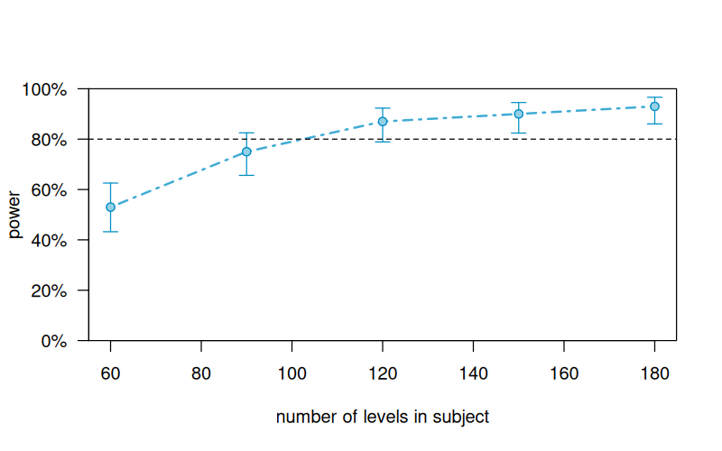



```{r setup, include=FALSE}
library(tidyverse)
library(lme4)
library(simr)
library(pwr)
library(here)
```

## Slides {.dark-bg background-color="#C2002F"}

Scan the QR code or visit the URL to open the interactive slides on your device:

::: {layout-ncol=2}
{width="280" height="280" style="background: white; padding: 10px; border-radius: 8px; border: 3px solid #1F497D;"}

<div style="font-size: 0.85em; display: flex; flex-direction: column; justify-content: center; height: 280px; text-align: left; padding-left: 20px;">
<p>**Interactive Features:**</p>
<ul style="margin-top: 5px; margin-bottom: 20px;">
  <li>Embeds webR for interactive R scripting (please allow time to load)</li>
  <li>Power Simulations</li>
</ul>

<p>**Direct Link:**</p>
<a href="https://bernhardangele.github.io/nebrija-statistical-power-workshop/presentations/session-2-simulation-power.html" target="_blank" style="color: #EEECE1; font-weight: bold; text-decoration: underline; font-size: 0.9em; word-break: break-all;">https://bernhardangele.github.io/nebrija-statistical-power-workshop/presentations/session-2-simulation-power.html</a>
</div>
:::


## Workshop plan

Welcome back. In Session 1, we covered Open Science principles, preregistration, and statistical power fundamentals.

- **Session 1 (June 26th)**
  - **Part 1-2:** Open Science, the Replication Crisis, and Preregistration
  - **Part 3:** Statistical Power Fundamentals

- **Session 2 (today, July 10th)**
  - **Part 1:** Closed-Form Power for *t*-tests
  - **Part 2:** Simulation-Based Power for *t*-tests, ANOVA and OLS Regression
  - **Part 3:** Why mixed-model power usually needs simulation
  - **Part 4:** Introducing `simr`
  - **Part 5:** Case Study: Designing a 3 * 2 Lexical Decision Task
  - **Part 6:** Exercises, Evaluation, & Conclusions

## Justifying sample size in preregistration

* A **CRUCIAL** component of preregistration.
* **It's not enough to say:** "We will use *N* = 30 per group because it's common in the field" or "because it's what we can get."
* A **justification based on the study's ability to answer the research question** is required.
* This usually involves an ***a priori* power analysis**:
    * Estimate the expected effect size (based on literature, pilots, or the smallest effect size of interest).
    * Determine the N needed to achieve a desired power (e.g., 80% or 90%) to detect that effect with the chosen alpha.
* Other justifications (less common for confirmatory research): precision analysis, resource limitations (must be transparent and their implications for inference discussed).

## Part 1: Closed-form power for *t*-tests {.dark-bg background-color="#C2002F"}

## Effect size for a two-group comparison

For comparing two means, we use Cohen's $d$ (standardized mean difference):

$$
d = \frac{\bar{X}_1 - \bar{X}_2}{s_{\text{pooled}}}
$$

Common benchmarks (@cohen1988statistical):

- Small: $d = 0.2$
- Medium: $d = 0.5$
- Large: $d = 0.8$

## Calculating effect size in R

We can calculate Cohen's $d$ manually. Here is an example for two independent groups:

```{webr}
#| echo: true
group1 <- c(23, 25, 28, 24, 26)
group2 <- c(20, 22, 21, 19, 23)

mean_diff <- mean(group1) - mean(group2)
pooled_sd <- sqrt((var(group1) + var(group2)) / 2)
cohens_d <- mean_diff / pooled_sd

cat("Manual Cohen's d =", round(cohens_d, 3))
```

. . .

Or use the `effectsize` package:

```{webr}
#| echo: true
library(effectsize)
cohens_d(group1, group2)
```

## Example study

Suppose we want to detect a **medium effect** in a balanced two-sample design:

- Expected effect size: $d = 0.5$
- Alpha: $0.05$
- Sample size: $n = 64$ per group ($N = 128$ total)

What power does this design achieve?

## Interactive *t*-test power (closed-form)

Adjust the sliders to see how the Central ($H_0$) and Non-Central ($H_1$) distributions overlap, shifting critical boundaries and statistical power:

```{=html}
<div id="ttest-power-widget-container" style="background: rgba(31, 73, 125, 0.95); color: white; padding: 15px 25px; border-radius: 12px; font-family: 'Arial', sans-serif; box-shadow: 0 8px 32px rgba(0,0,0,0.3); font-size: 0.85em; line-height: 1.3em; display: flex; flex-direction: row; justify-content: space-between; gap: 20px; align-items: center; max-width: 900px; margin: 0 auto;">
  <!-- Left column: Controls and Live Stats -->
  <div style="flex: 1; min-width: 250px; display: flex; flex-direction: column; gap: 8px;">
    
    <!-- Control: Cohen's d -->
    <div style="display: flex; flex-direction: column; gap: 2px;">
      <div style="display: flex; justify-content: space-between; font-weight: bold; color: #EEECE1;">
        <span>Effect Size (Cohen's d):</span>
        <span id="ttest-power-label-d" style="color: #FFFFFF; font-weight: bold; background: rgba(255, 255, 255, 0.15); padding: 1px 6px; border-radius: 4px; font-size: 0.9em; width: 60px; text-align: center; display: inline-block; box-sizing: border-box;">0.50</span>
      </div>
      <input type="range" id="ttest-power-slider-d" class="power-slider" min="0" max="1.5" step="0.05" value="0.5">
    </div>

    <!-- Control: Sample Size per Group -->
    <div style="display: flex; flex-direction: column; gap: 2px;">
      <div style="display: flex; justify-content: space-between; font-weight: bold; color: #EEECE1;">
        <span>Sample Size per Group (n):</span>
        <span id="ttest-power-label-n" style="color: #FFFFFF; font-weight: bold; background: rgba(255, 255, 255, 0.15); padding: 1px 6px; border-radius: 4px; font-size: 0.9em; width: 45px; text-align: center; display: inline-block; box-sizing: border-box;">64</span>
      </div>
      <input type="range" id="ttest-power-slider-n" class="power-slider" min="5" max="150" step="1" value="64">
    </div>

    <!-- Control: Alpha -->
    <div style="display: flex; flex-direction: column; gap: 2px;">
      <div style="display: flex; justify-content: space-between; font-weight: bold; color: #EEECE1;">
        <span>Alpha (α):</span>
        <span id="ttest-power-label-alpha" style="color: #FFFFFF; font-weight: bold; background: rgba(255, 255, 255, 0.15); padding: 1px 6px; border-radius: 4px; font-size: 0.9em; width: 60px; text-align: center; display: inline-block; box-sizing: border-box;">0.050</span>
      </div>
      <input type="range" id="ttest-power-slider-alpha" class="power-slider" min="0.005" max="0.20" step="0.005" value="0.05">
    </div>

    <!-- Live Statistics Panel -->
    <div style="background: rgba(238, 236, 225, 0.1); border-radius: 8px; padding: 8px; display: flex; flex-direction: column; gap: 4px; border: 1px solid rgba(238, 236, 225, 0.2); font-size: 0.9em; margin-top: 4px;">
      <div style="display: flex; justify-content: space-between;">
        <span>Degrees of Freedom (df):</span>
        <strong id="ttest-power-val-df" style="color: white;">126</strong>
      </div>
      <div style="display: flex; justify-content: space-between;">
        <span>Non-centrality Param (λ):</span>
        <strong id="ttest-power-val-ncp" style="color: white;">2.828</strong>
      </div>
      <div style="display: flex; justify-content: space-between;">
        <span>Critical t-value:</span>
        <strong id="ttest-power-val-tcrit" style="color: white;">± 1.979</strong>
      </div>
      <div style="display: flex; justify-content: space-between; border-top: 1px solid rgba(255,255,255,0.15); padding-top: 4px; margin-top: 2px;">
        <span>Theoretical Power (1-β):</span>
        <strong id="ttest-power-val-power" style="color: #FF8095; font-size: 1.1em;">80.1%</strong>
      </div>
    </div>
  </div>

  <!-- Right column: Canvas Chart -->
  <div style="flex: 1.3; display: flex; align-items: center; justify-content: center; background: rgba(0, 0, 0, 0.25); border-radius: 8px; padding: 10px; border: 1px solid rgba(255,255,255,0.05); align-self: stretch;">
    <canvas id="ttest-power-canvas" width="500" height="360" style="display: block; width: 100%; height: auto; overflow: visible;"></canvas>
  </div>
</div>

<script>
(function() {
  function init() {
    var sliderD = document.getElementById("ttest-power-slider-d");
    var sliderN = document.getElementById("ttest-power-slider-n");
    var sliderAlpha = document.getElementById("ttest-power-slider-alpha");
    
    if (!sliderD || !sliderN || !sliderAlpha) {
      setTimeout(init, 100);
      return;
    }
    
    var labelD = document.getElementById("ttest-power-label-d");
    var labelN = document.getElementById("ttest-power-label-n");
    var labelAlpha = document.getElementById("ttest-power-label-alpha");
    
    var valDF = document.getElementById("ttest-power-val-df");
    var valNCP = document.getElementById("ttest-power-val-ncp");
    var valTCrit = document.getElementById("ttest-power-val-tcrit");
    var valPower = document.getElementById("ttest-power-val-power");
    
    var canvas = document.getElementById("ttest-power-canvas");
    var ctx = canvas.getContext("2d");
    
    var xMin = -4;
    var xMax = 8;
    var margin = { left: 45, right: 35, top: 40, bottom: 60 };
    var graphWidth = canvas.width - margin.left - margin.right;
    var yBaseline = 300;
    
    function valToPx(val) {
      return margin.left + ((val - xMin) / (xMax - xMin)) * graphWidth;
    }
    
    function getInvNormalCDF(p) {
      var a = 0.147;
      var logterm = Math.log(4 * p * (1 - p));
      var term1 = 2 / (Math.PI * a) + logterm / 2;
      var inner = term1 * term1 - logterm / a;
      var sign = (p < 0.5) ? -1 : 1;
      var erf_inv = sign * Math.sqrt(Math.sqrt(inner) - term1);
      return erf_inv * Math.sqrt(2);
    }
    
    function normalCDF(x) {
      var a1 =  0.254829592; var a2 = -0.284496736; var a3 =  1.421413741;
      var a4 = -1.453152027; var a5 =  1.061405429; var p  =  0.3275911;
      var sign = (x < 0) ? -1 : 1;
      x = Math.abs(x) / Math.sqrt(2.0);
      var t = 1.0 / (1.0 + p * x);
      var y = 1.0 - (((((a5 * t + a4) * t) + a3) * t + a2) * t + a1) * t * Math.exp(-x * x);
      return 0.5 * (1.0 + sign * y);
    }
    
    function draw() {
      ctx.clearRect(0, 0, canvas.width, canvas.height);
      
      var d = parseFloat(sliderD.value);
      var n = parseInt(sliderN.value);
      var alpha = parseFloat(sliderAlpha.value);
      
      var df = 2 * n - 2;
      var ncp = d * Math.sqrt(n / 2);
      
      var zCrit = getInvNormalCDF(1 - alpha / 2);
      var t_crit = zCrit * (1 + (zCrit * zCrit + 1) / (4 * df));
      
      var sd_h0 = 1;
      var sd_h1 = Math.sqrt(1 + (ncp * ncp) / (2 * df));
      
      var zUpper = (t_crit - ncp) / sd_h1;
      var zLower = (-t_crit - ncp) / sd_h1;
      var theoPower = (1 - normalCDF(zUpper)) + normalCDF(zLower);
      
      // Update DOM values
      labelD.textContent = d.toFixed(2);
      labelN.textContent = n;
      labelAlpha.textContent = alpha.toFixed(3);
      
      valDF.textContent = df;
      valNCP.textContent = ncp.toFixed(3);
      valTCrit.textContent = "± " + t_crit.toFixed(3);
      valPower.textContent = (theoPower * 100).toFixed(1) + "%";
      
      var scaleHeight = 130;
      
      // 1. Draw Baseline Axis
      ctx.strokeStyle = '#EEECE1';
      ctx.lineWidth = 1.5;
      ctx.beginPath();
      ctx.moveTo(valToPx(xMin), yBaseline);
      ctx.lineTo(valToPx(xMax), yBaseline);
      ctx.stroke();
      
      // Axis labels
      var ticks = [-3, -2, -1, 0, 1, 2, 3, 4, 5, 6, 7];
      ctx.fillStyle = '#EEECE1';
      ctx.font = '10px Arial';
      ctx.textAlign = 'center';
      ticks.forEach(function(tVal) {
        var tx = valToPx(tVal);
        ctx.beginPath();
        ctx.moveTo(tx, yBaseline);
        ctx.lineTo(tx, yBaseline + 5);
        ctx.stroke();
        ctx.fillText(tVal.toString(), tx, yBaseline + 18);
      });
      
      ctx.font = 'bold 11px Arial';
      ctx.fillText('t-statistic scale', canvas.width / 2, yBaseline + 40);
      
      // 2. Shade H1 Rejection Region (Theoretical Power)
      ctx.fillStyle = 'rgba(255, 128, 149, 0.4)'; // Coral-pink
      ctx.beginPath();
      var started = false;
      for (var px = margin.left; px <= canvas.width - margin.right; px++) {
        var valX = xMin + ((px - margin.left) / graphWidth) * (xMax - xMin);
        if (valX >= t_crit || valX <= -t_crit) {
          var z = (valX - ncp) / sd_h1;
          var density = Math.exp(-0.5 * z * z);
          var py = yBaseline - (scaleHeight / sd_h1) * density;
          if (!started) {
            ctx.moveTo(px, yBaseline);
            ctx.lineTo(px, py);
            started = true;
          } else {
            ctx.lineTo(px, py);
          }
        } else {
          if (started) {
            ctx.lineTo(px - 1, yBaseline);
            ctx.closePath();
            ctx.fill();
            started = false;
          }
        }
      }
      if (started) {
        ctx.lineTo(canvas.width - margin.right, yBaseline);
        ctx.closePath();
        ctx.fill();
      }
      
      // 3. Shade H1 Type II Error Region (Beta)
      ctx.fillStyle = 'rgba(238, 236, 225, 0.12)'; // Soft grey
      ctx.beginPath();
      started = false;
      for (var px = margin.left; px <= canvas.width - margin.right; px++) {
        var valX = xMin + ((px - margin.left) / graphWidth) * (xMax - xMin);
        if (valX > -t_crit && valX < t_crit) {
          var z = (valX - ncp) / sd_h1;
          var density = Math.exp(-0.5 * z * z);
          var py = yBaseline - (scaleHeight / sd_h1) * density;
          if (!started) {
            ctx.moveTo(px, yBaseline);
            ctx.lineTo(px, py);
            started = true;
          } else {
            ctx.lineTo(px, py);
          }
        }
      }
      if (started) {
        var endPx = valToPx(t_crit);
        ctx.lineTo(endPx, yBaseline);
        ctx.closePath();
        ctx.fill();
      }
      
      // 4. Draw H0 Distribution Curve
      ctx.strokeStyle = 'rgba(238, 236, 225, 0.4)';
      ctx.lineWidth = 1.5;
      ctx.beginPath();
      for (var px = margin.left; px <= canvas.width - margin.right; px++) {
        var valX = xMin + ((px - margin.left) / graphWidth) * (xMax - xMin);
        var z = valX / sd_h0;
        var density = Math.exp(-0.5 * z * z);
        var py = yBaseline - (scaleHeight / sd_h0) * density;
        if (px === margin.left) ctx.moveTo(px, py);
        else ctx.lineTo(px, py);
      }
      ctx.stroke();
      
      // 5. Draw H1 Distribution Curve
      ctx.strokeStyle = '#EEECE1';
      ctx.lineWidth = 2.5;
      ctx.beginPath();
      for (var px = margin.left; px <= canvas.width - margin.right; px++) {
        var valX = xMin + ((px - margin.left) / graphWidth) * (xMax - xMin);
        var z = (valX - ncp) / sd_h1;
        var density = Math.exp(-0.5 * z * z);
        var py = yBaseline - (scaleHeight / sd_h1) * density;
        if (px === margin.left) ctx.moveTo(px, py);
        else ctx.lineTo(px, py);
      }
      ctx.stroke();
      
      // 6. Draw Critical Boundaries (Dashed Lines)
      ctx.strokeStyle = 'rgba(238, 236, 225, 0.6)';
      ctx.setLineDash([4, 4]);
      ctx.lineWidth = 1.2;
      
      var pxCritL = valToPx(-t_crit);
      ctx.beginPath();
      ctx.moveTo(pxCritL, margin.top);
      ctx.lineTo(pxCritL, yBaseline);
      ctx.stroke();
      
      var pxCritR = valToPx(t_crit);
      ctx.beginPath();
      ctx.moveTo(pxCritR, margin.top);
      ctx.lineTo(pxCritR, yBaseline);
      ctx.stroke();
      
      ctx.setLineDash([]);
      
      // Labels for distributions and lines
      ctx.fillStyle = '#EEECE1';
      ctx.font = '9px Arial';
      ctx.fillText('-t_crit', pxCritL, margin.top - 5);
      ctx.fillText('+t_crit', pxCritR, margin.top - 5);
      
      ctx.fillStyle = 'rgba(238, 236, 225, 0.6)';
      ctx.font = 'bold 10px Arial';
      ctx.fillText('H₀', valToPx(0), yBaseline - scaleHeight - 8);
      
      ctx.fillStyle = '#EEECE1';
      ctx.font = 'bold 11px Arial';
      ctx.fillText('H₁ (λ=' + ncp.toFixed(1) + ')', valToPx(ncp), yBaseline - (scaleHeight / sd_h1) - 8);
      
      // Labels for shaded regions
      ctx.fillStyle = '#FF8095';
      ctx.font = 'bold 10px Arial';
      ctx.textAlign = 'right';
      ctx.fillText('Power: ' + (theoPower * 100).toFixed(0) + '%', valToPx(7.5), yBaseline - 60);
      
      ctx.fillStyle = 'rgba(238, 236, 225, 0.7)';
      ctx.textAlign = 'center';
      ctx.fillText('Type II Error (β)', valToPx(Math.max(-0.5, t_crit - 1.2)), yBaseline - 15);
    }
    
    sliderD.addEventListener("input", draw);
    sliderN.addEventListener("input", draw);
    sliderAlpha.addEventListener("input", draw);
    
    draw();
  }
  
  if (document.readyState === "loading") {
    document.addEventListener("DOMContentLoaded", init);
  } else {
    init();
  }
})();
</script>
```

## Manual *t*-test power in R

```{webr}
#| echo: true
#| results: "markup"

d <- 0.5
n_per_group <- 64
alpha <- 0.05

df <- 2 * n_per_group - 2
ncp <- d * sqrt(n_per_group / 2)
critical_t <- qt(1 - alpha / 2, df = df)

power_t <- 1 -
  pt(critical_t, df = df, ncp = ncp) +
  pt(-critical_t, df = df, ncp = ncp)

round(power_t, 4)
```

## Same idea with the built-in helper

```{webr}
#| echo: true

power.t.test(
  n = n_per_group,
  delta = 0.5,
  sd = 1,
  sig.level = alpha,
  type = "two.sample",
  alternative = "two.sided"
)
```

## Paired *t*-test by hand

For a paired *t*-test, the non-centrality parameter is $\lambda = d \sqrt{n}$, where $n$ is the number of pairs.

Let's calculate power for a paired *t*-test with $d = 0.5$, $\alpha = 0.05$, and $n = 32$ pairs:

```{webr}
#| echo: true
d_paired <- 0.5
n_paired <- 32
alpha_paired <- 0.05

df_paired <- n_paired - 1
ncp_paired <- d_paired * sqrt(n_paired)
critical_t_paired <- qt(1 - alpha_paired / 2, df = df_paired)

power_paired <- 1 -
  pt(critical_t_paired, df = df_paired, ncp = ncp_paired) +
  pt(-critical_t_paired, df = df_paired, ncp = ncp_paired)

round(power_paired, 4)
```

## Paired *t*-test using the pwr package

We can also use the `pwr` package for simple designs:

```{webr}
#| echo: true
library(pwr)

pwr.t.test(
  n = 32,
  d = 0.5,
  sig.level = 0.05,
  type = "paired",
  alternative = "two.sided"
)
```

## Solving for required sample size

Reverse the question for independent samples:

- Target power: $0.80$
- Effect size: $d = 0.5$
- Alpha: $0.05$

How many participants do we need per group?

```{webr}
#| echo: true
library(pwr)

pwr.t.test(
  power = 0.80,
  d = 0.5,
  sig.level = 0.05,
  type = "two.sample"
)
```

## Power curves for different effect sizes

```{r}
#| fig-width: 8
#| fig-height: 5
#| echo: false

library(ggplot2)
library(pwr)

sample_sizes <- seq(10, 200, by = 5)
effect_sizes <- c(0.2, 0.5, 0.8)
effect_labels <- c("small (d = 0.2)", "medium (d = 0.5)", "large (d = 0.8)")

curves_data <- expand.grid(n = sample_sizes, d = effect_sizes)
curves_data$power <- mapply(function(n, d) {
  pwr.t.test(n = n, d = d, sig.level = 0.05, type = "two.sample")$power
}, curves_data$n, curves_data$d)
curves_data$Effect <- factor(effect_labels[match(curves_data$d, effect_sizes)], levels = effect_labels)

ggplot(curves_data, aes(x = n, y = power, color = Effect)) +
  geom_line(linewidth = 1.1) +
  geom_hline(yintercept = 0.80, linetype = "dashed", color = "gray40") +
  scale_color_manual(values = c("#999999", "#1F497D", "#C2002F")) +
  labs(
    title = "Power curves for different Cohen's d values",
    x = "Sample size (per group)",
    y = "Power",
    color = "Effect Size"
  ) +
  coord_cartesian(ylim = c(0, 1)) +
  theme_minimal(base_family = "sans")
```

## Interpretation

- With the same effect size and alpha, **larger samples** increase power.
- With the same sample size and alpha, **larger effects** increase power.
- With the same effect size and sample size, **smaller alpha** reduces power.


## Part 2: Simulation-based power for *t*-tests, ANOVA and Regression {.dark-bg background-color="#C2002F"}

## Why simulation?

Closed-form solutions are great, but:

- Real designs are often too complex for simple formulas.
- Mixed-effects models do not have closed-form solutions.
- Simulation forces you to be explicit about the data-generating process.
- It provides a direct, intuitive understanding of power.

## Basic simulation approach

The process is always the same:

1. **Define** the "true" population parameters (means, SDs, effect sizes).
2. **Generate** a synthetic dataset from this population.
3. **Analyze** the dataset using your target statistical test.
4. **Determine** if the test is statistically significant ($p < \alpha$).
5. **Repeat** steps 2-4 many times (e.g., 1,000 times).
6. **Calculate** the proportion of significant results. This is your estimated power.

## Simulating a *t*-test in R

Let's write a simple R function to estimate power for an independent samples *t*-test:

```{webr}
#| echo: true
set.seed(123)

simulate_power_t <- function(n_per_group, effect_size, n_sims = 200) {
  significant <- replicate(n_sims, {
    # Generate data
    group1 <- rnorm(n_per_group, mean = 0, sd = 1)
    group2 <- rnorm(n_per_group, mean = effect_size, sd = 1)

    # Run test
    p_value <- t.test(group1, group2)$p.value

    # Check significance
    p_value < 0.05
  })
  
  mean(significant)
}

# Run the simulation for n = 64 per group and d = 0.5
simulate_power_t(n_per_group = 64, effect_size = 0.5)
```

## Comparing simulation to closed-form

Let's compare the simulated power value with our closed-form calculation:

```{webr}
#| echo: true
library(pwr)

# Closed-form
closed_form_power <- pwr.t.test(n = 64, d = 0.5, sig.level = 0.05)$power

# Simulation
set.seed(42)
simulated_power <- simulate_power_t(n_per_group = 64, effect_size = 0.5, n_sims = 1000)

cat("Closed-form power:", round(closed_form_power, 4), "\n")
cat("Simulated power:  ", round(simulated_power, 4))
```

## Power curve via simulation

```{r}
#| fig-width: 8
#| fig-height: 5
#| echo: false

library(ggplot2)
library(pwr)

# Define simulate_power_t locally to make the slide self-contained
simulate_power_t <- function(n_per_group, effect_size, n_sims = 200) {
  significant <- replicate(n_sims, {
    group1 <- rnorm(n_per_group, mean = 0, sd = 1)
    group2 <- rnorm(n_per_group, mean = effect_size, sd = 1)
    p_value <- t.test(group1, group2)$p.value
    p_value < 0.05
  })
  mean(significant)
}

sim_sample_sizes <- seq(20, 100, by = 20)
set.seed(123)
sim_powers <- sapply(sim_sample_sizes, function(n) {
  simulate_power_t(n_per_group = n, effect_size = 0.5, n_sims = 200)
})

# Use base R data.frame instead of tibble to avoid extra dependencies
df_sim <- data.frame(n = sim_sample_sizes, power = sim_powers)

df_theory <- data.frame(n = seq(20, 100, by = 1))
df_theory$power <- sapply(df_theory$n, function(x) pwr::pwr.t.test(n = x, d = 0.5, sig.level = 0.05, type = "two.sample")$power)

ggplot() +
  geom_line(data = df_theory, aes(x = n, y = power, color = "Theoretical (Exact)"), linewidth = 1.2) +
  geom_line(data = df_sim, aes(x = n, y = power, color = "Simulated (200 runs)"), linetype = "dashed", linewidth = 0.9) +
  geom_point(data = df_sim, aes(x = n, y = power, color = "Simulated (200 runs)"), size = 3.5) +
  scale_color_manual(values = c("Theoretical (Exact)" = "#1F497D", "Simulated (200 runs)" = "#C2002F")) +
  geom_hline(yintercept = 0.80, linetype = "dashed", color = "gray40") +
  labs(
    title = "Power Curve via Simulation vs. Theoretical Curve (d = 0.5)",
    x = "Sample size (per group)",
    y = "Power",
    color = "Curve Type"
  ) +
  coord_cartesian(ylim = c(0, 1)) +
  theme_minimal(base_family = "sans") +
  theme(legend.position = "bottom")
```

## Why simulation for simple designs?

Although closed-form formulas exist for ANOVA and OLS regression, the simulation approach is more general and scales directly to complex mixed-effects models.

* **Generalizability**: The exact same simulation logic applies to *t*-tests, ANOVA, OLS regression, logistic regression, and mixed-effects models.
* **Intuitive**: You directly inspect the data-generating process and check if a significance criterion is met.
* **Customizable**: You can easily build in non-normal distributions, missing data, and unbalanced designs.

## Simulating ANOVA in R

We can easily simulate a one-way ANOVA in R to estimate power. This simulation-based approach generates group data, runs the ANOVA using `aov()`, checks for significance, and repeats:

```{webr}
#| echo: true
sim_anova <- function(n, mu1, mu2, mu3, sd) {
  g1 <- rnorm(n, mu1, sd)
  g2 <- rnorm(n, mu2, sd)
  g3 <- rnorm(n, mu3, sd)
  df <- data.frame(
    y = c(g1, g2, g3),
    group = factor(rep(c("A", "B", "C"), each = n))
  )
  fit <- aov(y ~ group, data = df)
  p_val <- summary(fit)[[1]][["Pr(>F)"]][1]
  return(p_val < 0.05)
}

# Estimate power by running 1,000 simulations
set.seed(123)
rejections <- replicate(1000, sim_anova(25, 0, 10, 25, 50))
mean(rejections) # Estimated power ({webr} 0.32)
```


## Interactive ANOVA power simulation

```{=html}
<div id="anova-sim-widget-container" style="background: rgba(31, 73, 125, 0.95); color: white; padding: 15px 25px; border-radius: 12px; font-family: 'Arial', sans-serif; box-shadow: 0 8px 32px rgba(0,0,0,0.3); font-size: 0.85em; line-height: 1.3em; display: flex; flex-direction: row; justify-content: space-between; gap: 20px; align-items: center; max-width: 1000px; margin: 0 auto;">
  <!-- Left column: Controls, Playback, and Live Stats -->
  <div style="flex: 1; max-width: 420px; display: flex; flex-direction: column; gap: 8px;">
    
    <!-- Sliders Grid -->
    <div style="display: flex; flex-direction: column; gap: 8px;">
      <!-- Row 1: Mean 1, Mean 2, Mean 3 -->
      <div style="display: flex; gap: 12px;">
        <!-- Control: Mean 1 -->
        <div style="flex: 1; display: flex; flex-direction: column; gap: 2px;">
          <div style="display: flex; justify-content: space-between; font-weight: bold; color: #EEECE1; font-size: 0.9em;">
            <span>Mean 1 (μ1):</span>
            <span id="anova-sim-label-mu1" style="color: #FFFFFF; font-weight: bold; background: rgba(255, 255, 255, 0.15); padding: 1px 4px; border-radius: 4px; font-size: 0.85em; width: 45px; text-align: center;">0 ms</span>
          </div>
          <input type="range" id="anova-sim-slider-mu1" class="power-slider" min="-50" max="50" step="1" value="0">
        </div>
        <!-- Control: Mean 2 -->
        <div style="flex: 1; display: flex; flex-direction: column; gap: 2px;">
          <div style="display: flex; justify-content: space-between; font-weight: bold; color: #EEECE1; font-size: 0.9em;">
            <span>Mean 2 (μ2):</span>
            <span id="anova-sim-label-mu2" style="color: #FFFFFF; font-weight: bold; background: rgba(255, 255, 255, 0.15); padding: 1px 4px; border-radius: 4px; font-size: 0.85em; width: 45px; text-align: center;">10 ms</span>
          </div>
          <input type="range" id="anova-sim-slider-mu2" class="power-slider" min="-50" max="50" step="1" value="10">
        </div>
        <!-- Control: Mean 3 -->
        <div style="flex: 1; display: flex; flex-direction: column; gap: 2px;">
          <div style="display: flex; justify-content: space-between; font-weight: bold; color: #EEECE1; font-size: 0.9em;">
            <span>Mean 3 (μ3):</span>
            <span id="anova-sim-label-mu3" style="color: #FFFFFF; font-weight: bold; background: rgba(255, 255, 255, 0.15); padding: 1px 4px; border-radius: 4px; font-size: 0.85em; width: 45px; text-align: center;">25 ms</span>
          </div>
          <input type="range" id="anova-sim-slider-mu3" class="power-slider" min="-50" max="50" step="1" value="25">
        </div>
      </div>

      <!-- Row 2: SD, n, Speed -->
      <div style="display: flex; gap: 12px;">
        <!-- Control: SD -->
        <div style="flex: 1; display: flex; flex-direction: column; gap: 2px;">
          <div style="display: flex; justify-content: space-between; font-weight: bold; color: #EEECE1; font-size: 0.9em;">
            <span>Error (sd):</span>
            <span id="anova-sim-label-sd" style="color: #FFFFFF; font-weight: bold; background: rgba(255, 255, 255, 0.15); padding: 1px 4px; border-radius: 4px; font-size: 0.85em; width: 50px; text-align: center;">50 ms</span>
          </div>
          <input type="range" id="anova-sim-slider-sd" class="power-slider" min="20" max="100" step="1" value="50">
        </div>
        <!-- Control: Sample Size per Group -->
        <div style="flex: 1; display: flex; flex-direction: column; gap: 2px;">
          <div style="display: flex; justify-content: space-between; font-weight: bold; color: #EEECE1; font-size: 0.9em;">
            <span>Group (n):</span>
            <span id="anova-sim-label-n" style="color: #FFFFFF; font-weight: bold; background: rgba(255, 255, 255, 0.15); padding: 1px 4px; border-radius: 4px; font-size: 0.85em; width: 35px; text-align: center;">25</span>
          </div>
          <input type="range" id="anova-sim-slider-n" class="power-slider" min="5" max="80" step="1" value="25">
        </div>
        <!-- Control: Speed -->
        <div style="flex: 1; display: flex; flex-direction: column; gap: 2px;">
          <div style="display: flex; justify-content: space-between; font-weight: bold; color: #EEECE1; font-size: 0.9em;">
            <span>Speed:</span>
            <span id="anova-sim-label-speed" style="color: #FFFFFF; font-weight: bold; background: rgba(255, 255, 255, 0.15); padding: 1px 4px; border-radius: 4px; font-size: 0.85em; width: 65px; text-align: center;">Medium</span>
          </div>
          <input type="range" id="anova-sim-slider-speed" class="power-slider" min="1" max="5" step="1" value="3">
        </div>
      </div>
    </div>

    <!-- Buttons -->
    <div style="display: flex; gap: 6px; margin-top: 2px;">
      <button id="anova-sim-btn-play" class="power-btn" style="flex: 1.2;">Play</button>
      <button id="anova-sim-btn-step" class="power-btn-secondary" style="flex: 0.9;">Step</button>
      <button id="anova-sim-btn-reset" class="power-btn-secondary" style="flex: 0.9;">Reset</button>
    </div>

    <!-- Live Statistics Panel -->
    <div style="background: rgba(238, 236, 225, 0.08); border-radius: 8px; padding: 8px; border: 1px solid rgba(238, 236, 225, 0.15); font-size: 0.85em; margin-top: 4px; display: grid; grid-template-columns: 1fr 1fr; gap: 8px 16px;">
      <div style="display: flex; flex-direction: column;">
        <span style="color: #EEECE1; font-size: 0.85em;">Simulations:</span>
        <strong id="anova-sim-val-count" style="color: white; font-size: 1.1em;">0</strong>
      </div>
      <div style="display: flex; flex-direction: column;">
        <span style="color: #EEECE1; font-size: 0.85em;">Empirical Power:</span>
        <strong id="anova-sim-val-emppower" style="color: #FF8095; font-size: 1.1em;">0.0%</strong>
      </div>
      <div style="display: flex; flex-direction: column;">
        <span style="color: #EEECE1; font-size: 0.85em;">Rejections:</span>
        <strong id="anova-sim-val-reject" style="color: #FF8095; font-size: 1.1em;">0 (0.0%)</strong>
      </div>
      <div style="display: flex; flex-direction: column;">
        <span style="color: #EEECE1; font-size: 0.85em;">Theoretical f:</span>
        <strong id="anova-sim-val-cohenf" style="color: white; font-size: 1.1em;">0.250</strong>
      </div>
      <div style="display: flex; flex-direction: column;">
        <span style="color: #EEECE1; font-size: 0.85em;">Avg F (Rejected):</span>
        <strong id="anova-sim-val-avg-reject" style="color: #FF8095; font-size: 1.1em;">-</strong>
      </div>
      <div style="display: flex; flex-direction: column;">
        <span style="color: #EEECE1; font-size: 0.85em;">Avg F (Not Rejected):</span>
        <strong id="anova-sim-val-avg-noreject" style="color: white; font-size: 1.1em;">-</strong>
      </div>
    </div>
  </div>

  <!-- Right column: Canvas Chart -->
  <div style="flex: 1.4; display: flex; align-items: center; justify-content: center; background: rgba(0, 0, 0, 0.25); border-radius: 8px; padding: 10px; border: 1px solid rgba(255,255,255,0.05); align-self: stretch;">
    <canvas id="anova-sim-canvas" width="560" height="260" style="display: block; width: 100%; height: auto; overflow: visible;"></canvas>
  </div>
</div>

<script>
(function() {
  function logGamma(z) {
    var g = 7;
    var p = [
      0.99999999999980993,
      676.5203681218851,
      -1259.1392167224028,
      771.32342877765313,
      -176.61502916214059,
      12.507381424447087,
      -0.13857109526572012,
      9.9843695780195716e-6,
      1.5056327351493116e-7
    ];
    if (z < 0.5) return Math.log(Math.PI) - Math.log(Math.sin(Math.PI * z)) - logGamma(1 - z);
    z -= 1;
    var x = p[0];
    for (var i = 1; i < p.length; i++) x += p[i] / (z + i);
    var t = z + g + 0.5;
    return 0.5 * Math.log(2 * Math.PI) + (z + 0.5) * Math.log(t) - t + Math.log(x);
  }

  function beta(x, y) {
    return Math.exp(logGamma(x) + logGamma(y) - logGamma(x + y));
  }

  function centralF(x, df1, df2) {
    if (x < 0) return 0;
    var num = Math.pow(df1 / df2, df1 / 2) * Math.pow(x, df1 / 2 - 1);
    var den = beta(df1 / 2, df2 / 2) * Math.pow(1 + (df1 / df2) * x, (df1 + df2) / 2);
    return num / den;
  }

  function nonCentralF(x, df1, df2, lambda) {
    if (lambda === 0) return centralF(x, df1, df2);
    var sum = 0;
    var maxK = 50;
    var logL = -lambda / 2;
    for (var k = 0; k < maxK; k++) {
      var logWeight = logL + k * Math.log(lambda / 2) - logGamma(k + 1);
      var weight = Math.exp(logWeight);
      if (weight < 1e-6 && k > lambda / 2) break;
      var scale = df1 / (df1 + 2 * k);
      sum += weight * scale * centralF(x * scale, df1 + 2 * k, df2);
    }
    return sum;
  }

  function init() {
    var sliderMu1 = document.getElementById("anova-sim-slider-mu1");
    var sliderMu2 = document.getElementById("anova-sim-slider-mu2");
    var sliderMu3 = document.getElementById("anova-sim-slider-mu3");
    var sliderSD = document.getElementById("anova-sim-slider-sd");
    var sliderN = document.getElementById("anova-sim-slider-n");
    var sliderSpeed = document.getElementById("anova-sim-slider-speed");
    
    var btnPlay = document.getElementById("anova-sim-btn-play");
    var btnStep = document.getElementById("anova-sim-btn-step");
    var btnReset = document.getElementById("anova-sim-btn-reset");
    
    if (!sliderMu1 || !sliderMu2 || !sliderMu3 || !sliderSD || !sliderN || !sliderSpeed || !btnPlay || !btnStep || !btnReset) {
      setTimeout(init, 100);
      return;
    }
    
    var labelMu1 = document.getElementById("anova-sim-label-mu1");
    var labelMu2 = document.getElementById("anova-sim-label-mu2");
    var labelMu3 = document.getElementById("anova-sim-label-mu3");
    var labelSD = document.getElementById("anova-sim-label-sd");
    var labelN = document.getElementById("anova-sim-label-n");
    var labelSpeed = document.getElementById("anova-sim-label-speed");
    
    var valCount = document.getElementById("anova-sim-val-count");
    var valReject = document.getElementById("anova-sim-val-reject");
    var valCohenF = document.getElementById("anova-sim-val-cohenf");
    var valEmpPower = document.getElementById("anova-sim-val-emppower");
    var valAvgReject = document.getElementById("anova-sim-val-avg-reject");
    var valAvgNoReject = document.getElementById("anova-sim-val-avg-noreject");
    
    var canvas = document.getElementById("anova-sim-canvas");
    var ctx = canvas.getContext("2d");
    
    // Sim state
    var isPlaying = false;
    var totalSims = 0;
    var totalRejections = 0;
    var sumRejectionEffect = 0;
    var sumNonRejectionEffect = 0;
    var numBins = 40;
    var bins = new Array(numBins).fill(0);
    var maxBinCount = 0;
    var lastSimulatedVal = null;
    
    var xMin = 0;
    var xMax = 12;
    var margin = { left: 45, right: 35, top: 30, bottom: 40 };
    var graphWidth = canvas.width - margin.left - margin.right;
    var yBaseline = 210;
    var maxHeight = 160;
    
    var speedVal = parseInt(sliderSpeed.value);
    
    function valToPx(val) {
      return margin.left + ((val - xMin) / (xMax - xMin)) * graphWidth;
    }
    
    function randomNormal() {
      var u = 0, v = 0;
      while(u === 0) u = Math.random();
      while(v === 0) v = Math.random();
      return Math.sqrt(-2.0 * Math.log(u)) * Math.cos(2.0 * Math.PI * v);
    }
    
    function resetSimulation() {
      totalSims = 0;
      totalRejections = 0;
      sumRejectionEffect = 0;
      sumNonRejectionEffect = 0;
      bins.fill(0);
      maxBinCount = 0;
      lastSimulatedVal = null;
      updateStats();
      draw();
    }
    
    function updateLabels() {
      labelMu1.textContent = sliderMu1.value + " ms";
      labelMu2.textContent = sliderMu2.value + " ms";
      labelMu3.textContent = sliderMu3.value + " ms";
      labelSD.textContent = sliderSD.value + " ms";
      labelN.textContent = sliderN.value;
      
      var speeds = ["Very Slow", "Slow", "Medium", "Fast", "Instant"];
      labelSpeed.textContent = speeds[speedVal - 1];
    }
    
    function updateStats() {
      valCount.textContent = totalSims.toLocaleString();
      var pct = totalSims > 0 ? (totalRejections / totalSims * 100) : 0;
      valReject.textContent = totalRejections.toLocaleString() + " (" + pct.toFixed(1) + "%)";
      valEmpPower.textContent = pct.toFixed(1) + "%";
      
      // Calculate Theoretical Cohen's f
      var mu1 = parseFloat(sliderMu1.value);
      var mu2 = parseFloat(sliderMu2.value);
      var mu3 = parseFloat(sliderMu3.value);
      var sd = parseFloat(sliderSD.value);
      var mean = (mu1 + mu2 + mu3) / 3;
      var meanVar = ((mu1 - mean)*(mu1 - mean) + (mu2 - mean)*(mu2 - mean) + (mu3 - mean)*(mu3 - mean)) / 3;
      var cohenF = Math.sqrt(meanVar) / sd;
      valCohenF.textContent = cohenF.toFixed(3);
      
      // Averages
      var avgReject = totalRejections > 0 ? (sumRejectionEffect / totalRejections) : null;
      var totalNoReject = totalSims - totalRejections;
      var avgNoReject = totalNoReject > 0 ? (sumNonRejectionEffect / totalNoReject) : null;
      
      valAvgReject.textContent = avgReject !== null ? avgReject.toFixed(2) : "-";
      valAvgNoReject.textContent = avgNoReject !== null ? avgNoReject.toFixed(2) : "-";
    }
    
    function generatePoints(count) {
      var mu1 = parseFloat(sliderMu1.value);
      var mu2 = parseFloat(sliderMu2.value);
      var mu3 = parseFloat(sliderMu3.value);
      var sd = parseFloat(sliderSD.value);
      var n = parseInt(sliderN.value);
      
      var df1 = 2;
      var df2 = 3 * n - 3;
      var F_crit = (df2 / 2) * (Math.pow(0.05, -2 / df2) - 1);
      var binWidth = (xMax - xMin) / numBins;
      
      for (var i = 0; i < count; i++) {
        var sum1 = 0, sumSq1 = 0;
        var sum2 = 0, sumSq2 = 0;
        var sum3 = 0, sumSq3 = 0;
        
        for (var j = 0; j < n; j++) {
          var val1 = mu1 + randomNormal() * sd;
          sum1 += val1;
          sumSq1 += val1 * val1;
          
          var val2 = mu2 + randomNormal() * sd;
          sum2 += val2;
          sumSq2 += val2 * val2;
          
          var val3 = mu3 + randomNormal() * sd;
          sum3 += val3;
          sumSq3 += val3 * val3;
        }
        
        var mean1 = sum1 / n;
        var mean2 = sum2 / n;
        var mean3 = sum3 / n;
        var overallMean = (mean1 + mean2 + mean3) / 3;
        
        var ssb = n * ((mean1 - overallMean)*(mean1 - overallMean) + 
                       (mean2 - overallMean)*(mean2 - overallMean) + 
                       (mean3 - overallMean)*(mean3 - overallMean));
        var msb = ssb / df1;
        
        var var1 = (sumSq1 - sum1 * sum1 / n) / (n - 1);
        var var2 = (sumSq2 - sum2 * sum2 / n) / (n - 1);
        var var3 = (sumSq3 - sum3 * sum3 / n) / (n - 1);
        
        var ssw = (n - 1) * (var1 + var2 + var3);
        var msw = ssw / df2;
        
        var F = msb / msw;
        
        totalSims++;
        if (F > F_crit) {
          totalRejections++;
          sumRejectionEffect += F;
        } else {
          sumNonRejectionEffect += F;
        }
        
        lastSimulatedVal = F;
        
        var binIdx = Math.floor((F - xMin) / binWidth);
        if (binIdx >= 0 && binIdx < numBins) {
          bins[binIdx]++;
          if (bins[binIdx] > maxBinCount) {
            maxBinCount = bins[binIdx];
          }
        }
      }
      
      updateStats();
      draw();
    }
    
    function draw() {
      ctx.clearRect(0, 0, canvas.width, canvas.height);
      
      var n = parseInt(sliderN.value);
      var df2 = 3 * n - 3;
      var F_crit = (df2 / 2) * (Math.pow(0.05, -2 / df2) - 1);
      
      // 1. Baseline Axis
      ctx.strokeStyle = '#EEECE1';
      ctx.lineWidth = 1.5;
      ctx.beginPath();
      ctx.moveTo(valToPx(xMin), yBaseline);
      ctx.lineTo(valToPx(xMax), yBaseline);
      ctx.stroke();
      
      // Ticks and labels
      var ticks = [0, 2, 4, 6, 8, 10, 12];
      ctx.fillStyle = '#EEECE1';
      ctx.font = '10px Arial';
      ctx.textAlign = 'center';
      ticks.forEach(function(tVal) {
        var tx = valToPx(tVal);
        ctx.beginPath();
        ctx.moveTo(tx, yBaseline);
        ctx.lineTo(tx, yBaseline + 5);
        ctx.stroke();
        ctx.fillText(tVal.toString(), tx, yBaseline + 18);
      });
      
      ctx.font = 'bold 11px Arial';
      ctx.fillText('F-statistic scale', canvas.width / 2, yBaseline + 40);
      
      var peakHeight = 125;
      
      // 2. Draw Critical Boundary (F_crit)
      ctx.strokeStyle = 'rgba(238, 236, 225, 0.6)';
      ctx.setLineDash([4, 4]);
      ctx.lineWidth = 1.2;
      
      var pxCrit = valToPx(F_crit);
      ctx.beginPath();
      ctx.moveTo(pxCrit, margin.top);
      ctx.lineTo(pxCrit, yBaseline);
      ctx.stroke();
      ctx.setLineDash([]);
      
      ctx.fillStyle = '#EEECE1';
      ctx.font = '9px Arial';
      ctx.fillText('F_crit = ' + F_crit.toFixed(2), pxCrit, margin.top - 15);
      ctx.fillText('(α = 0.05)', pxCrit, margin.top - 5);
      
      // 3. Shade Rejection Region under H0 curve
      ctx.fillStyle = 'rgba(194, 0, 47, 0.15)'; // Soft red overlay for Null Rejection region
      ctx.beginPath();
      var started = false;
      for (var px = margin.left; px <= canvas.width - margin.right; px++) {
        var valX = xMin + ((px - margin.left) / graphWidth) * (xMax - xMin);
        if (valX >= F_crit) {
          // Central F(2, df2) density
          var density = Math.pow(1 + (2 / df2) * valX, -(df2 + 2) / 2);
          var py = yBaseline - peakHeight * density;
          if (!started) {
            ctx.moveTo(px, yBaseline);
            ctx.lineTo(px, py);
            started = true;
          } else {
            ctx.lineTo(px, py);
          }
        }
      }
      if (started) {
        ctx.lineTo(valToPx(xMax), yBaseline);
        ctx.closePath();
        ctx.fill();
      }
      
      // 4. Draw Theoretical Central F-Distribution Curve (H0)
      ctx.strokeStyle = 'rgba(238, 236, 225, 0.4)';
      ctx.setLineDash([2, 2]);
      ctx.lineWidth = 1.5;
      ctx.beginPath();
      for (var px = margin.left; px <= canvas.width - margin.right; px++) {
        var valX = xMin + ((px - margin.left) / graphWidth) * (xMax - xMin);
        var density = Math.pow(1 + (2 / df2) * valX, -(df2 + 2) / 2);
        var py = yBaseline - peakHeight * density;
        if (px === margin.left) ctx.moveTo(px, py);
        else ctx.lineTo(px, py);
      }
      ctx.stroke();
      ctx.setLineDash([]);
      
      ctx.fillStyle = 'rgba(238, 236, 225, 0.5)';
      ctx.font = 'italic 9px Arial';
      ctx.fillText('Central F (H₀)', valToPx(1.2), yBaseline - peakHeight * Math.pow(1 + (2 / df2) * 1.2, -(df2 + 2) / 2) - 8);

      // 4b. Draw Theoretical Non-Central F-Distribution Curve (H1)
      var mu1 = parseFloat(sliderMu1.value);
      var mu2 = parseFloat(sliderMu2.value);
      var mu3 = parseFloat(sliderMu3.value);
      var sd = parseFloat(sliderSD.value);
      var mean = (mu1 + mu2 + mu3) / 3;
      var meanVar = ((mu1 - mean)*(mu1 - mean) + (mu2 - mean)*(mu2 - mean) + (mu3 - mean)*(mu3 - mean)) / 3;
      var cohenF = Math.sqrt(meanVar) / sd;
      var lambda = 3 * n * cohenF * cohenF;

      if (lambda > 0.01 && lambda < 30) {
        ctx.strokeStyle = '#FF8095';
        ctx.lineWidth = 2.0;
        ctx.beginPath();
        for (var px = margin.left; px <= canvas.width - margin.right; px++) {
          var valX = xMin + ((px - margin.left) / graphWidth) * (xMax - xMin);
          var density = nonCentralF(valX, 2, df2, lambda);
          var py = yBaseline - peakHeight * density;
          if (px === margin.left) ctx.moveTo(px, py);
          else ctx.lineTo(px, py);
        }
        ctx.stroke();

        ctx.fillStyle = '#FF8095';
        ctx.font = 'bold 9px Arial';
        var labelX = valToPx(Math.max(1.5, Math.min(8, 1 + lambda / 2)));
        var labelY = yBaseline - peakHeight * nonCentralF(Math.max(1.5, Math.min(8, 1 + lambda / 2)), 2, df2, lambda) - 8;
        ctx.fillText('Theoretical F (H₁)', labelX, labelY);
      }
      
      // 5. Draw Simulated Histogram
      var binWidth = (xMax - xMin) / numBins;
      var binWidthPx = graphWidth / numBins;
      var drawAsDots = (maxBinCount <= 20 && totalSims <= 150);
      
      for (var i = 0; i < numBins; i++) {
        var count = bins[i];
        if (count === 0) continue;
        
        var binCenterVal = xMin + (i + 0.5) * binWidth;
        var isRejected = binCenterVal > F_crit;
        
        ctx.fillStyle = isRejected ? 'rgba(255, 128, 149, 0.85)' : 'rgba(238, 236, 225, 0.35)';
        ctx.strokeStyle = isRejected ? '#FF8095' : 'rgba(238, 236, 225, 0.6)';
        
        // Probability density scaling for central F scale matching
        var h = Math.min(maxHeight, peakHeight * (count / totalSims) / binWidth);
        
        if (drawAsDots) {
          var dotRadius = Math.max(2, Math.min(4, binWidthPx / 2 - 0.5));
          var cx = valToPx(binCenterVal);
          for (var j = 0; j < count; j++) {
            var cy = yBaseline - dotRadius - j * (dotRadius * 2 + 1);
            if (cy > margin.top) {
              ctx.beginPath();
              ctx.arc(cx, cy, dotRadius, 0, 2 * Math.PI);
              ctx.fill();
            }
          }
        } else {
          var barWidth = binWidthPx - 1;
          var bx = valToPx(xMin + i * binWidth) + 0.5;
          var by = yBaseline - h;
          
          ctx.beginPath();
          ctx.rect(bx, by, barWidth, h);
          ctx.fill();
          if (barWidth > 3) {
            ctx.lineWidth = 0.5;
            ctx.stroke();
          }
        }
      }
      
      // 6. Draw Live Last Simulated F
      if (lastSimulatedVal !== null) {
        var liveX = valToPx(lastSimulatedVal);
        if (liveX >= margin.left && liveX <= canvas.width - margin.right) {
          ctx.strokeStyle = '#C2002F';
          ctx.lineWidth = 1.5;
          ctx.beginPath();
          ctx.moveTo(liveX, margin.top);
          ctx.lineTo(liveX, yBaseline);
          ctx.stroke();
          
          ctx.fillStyle = '#C2002F';
          ctx.font = 'bold 9px Arial';
          ctx.fillText('Last F: ' + lastSimulatedVal.toFixed(2), liveX, margin.top - 5);
        }
      }
    }
    
    var frameCount = 0;
    function loop() {
      if (!isPlaying) return;
      frameCount++;
      var pointsToGenerate = 0;
      if (speedVal === 1) {
        if (frameCount % 15 === 0) pointsToGenerate = 1;
      } else if (speedVal === 2) {
        if (frameCount % 3 === 0) pointsToGenerate = 1;
      } else if (speedVal === 3) {
        pointsToGenerate = 1;
      } else if (speedVal === 4) {
        pointsToGenerate = 10;
      } else if (speedVal === 5) {
        pointsToGenerate = 100;
      }
      
      if (pointsToGenerate > 0) {
        generatePoints(pointsToGenerate);
      }
      requestAnimationFrame(loop);
    }
    
    function togglePlay() {
      isPlaying = !isPlaying;
      if (isPlaying) {
        btnPlay.textContent = "Pause";
        btnPlay.style.background = "#A0A0A0";
        loop();
      } else {
        btnPlay.textContent = "Play";
        btnPlay.style.background = "#C2002F";
      }
    }
    
    function onParameterChange() {
      resetSimulation();
      updateLabels();
    }
    
    sliderMu1.addEventListener("input", onParameterChange);
    sliderMu2.addEventListener("input", onParameterChange);
    sliderMu3.addEventListener("input", onParameterChange);
    sliderSD.addEventListener("input", onParameterChange);
    sliderN.addEventListener("input", onParameterChange);
    
    sliderSpeed.addEventListener("input", function() {
      speedVal = parseInt(sliderSpeed.value);
      updateLabels();
    });
    
    btnPlay.addEventListener("click", togglePlay);
    btnStep.addEventListener("click", function() {
      if (isPlaying) togglePlay();
      generatePoints(1);
    });
    btnReset.addEventListener("click", function() {
      if (isPlaying) togglePlay();
      resetSimulation();
    });
    
    updateLabels();
    resetSimulation();
  }
  
  if (document.readyState === "loading") {
    document.addEventListener("DOMContentLoaded", init);
  } else {
    init();
  }
})();
</script>
```


## Simulating OLS Regression in R

We can easily simulate a simple linear regression in R to estimate power. This simulation-based approach generates $X$ and $Y$ data, runs the regression using `lm()`, checks the slope *p*-value, and repeats:

```{webr}
#| echo: true
sim_regression <- function(N, beta1, sigma) {
  x <- rnorm(N, 0, 1)
  y <- beta1 * x + rnorm(N, 0, sigma)
  fit <- lm(y ~ x)
  p_val <- summary(fit)$coefficients["x", "Pr(>|t|)"]
  return(p_val < 0.05)
}

# Estimate power by running 1,000 simulations
set.seed(123)
rejections <- replicate(1000, sim_regression(40, 0.5, 1.0))
mean(rejections) # Estimated power (should be around 0.85)
```


## Interactive regression power simulation

Adjust the population slope ($\beta_1$) and residual standard deviation ($\sigma$) to see how the sample slope estimates $\hat{\beta}_1$ pile up under the Alternative Hypothesis ($H_1$). Watch the empirical power converge to the theoretical power:

```{=html}
<div id="reg-sim-widget-container" style="background: rgba(31, 73, 125, 0.95); color: white; padding: 15px 25px; border-radius: 12px; font-family: 'Arial', sans-serif; box-shadow: 0 8px 32px rgba(0,0,0,0.3); font-size: 0.85em; line-height: 1.3em; display: flex; flex-direction: row; justify-content: space-between; gap: 20px; align-items: center; max-width: 900px; margin: 0 auto;">
  <!-- Left column: Controls, Playback, and Live Stats -->
  <div style="flex: 1; min-width: 250px; display: flex; flex-direction: column; gap: 8px;">
    
    <!-- Control: True Slope -->
    <div style="display: flex; flex-direction: column; gap: 2px;">
      <div style="display: flex; justify-content: space-between; font-weight: bold; color: #EEECE1;">
        <span>True Slope (β1):</span>
        <span id="reg-sim-label-slope" style="color: #FFFFFF; font-weight: bold; background: rgba(255, 255, 255, 0.15); padding: 1px 6px; border-radius: 4px; font-size: 0.9em; width: 60px; text-align: center; display: inline-block; box-sizing: border-box;">0.50</span>
      </div>
      <input type="range" id="reg-sim-slider-slope" class="power-slider" min="-1.5" max="1.5" step="0.1" value="0.5">
    </div>

    <!-- Control: Residual SD -->
    <div style="display: flex; flex-direction: column; gap: 2px;">
      <div style="display: flex; justify-content: space-between; font-weight: bold; color: #EEECE1;">
        <span>Residual SD (σ):</span>
        <span id="reg-sim-label-sd" style="color: #FFFFFF; font-weight: bold; background: rgba(255, 255, 255, 0.15); padding: 1px 6px; border-radius: 4px; font-size: 0.9em; width: 60px; text-align: center; display: inline-block; box-sizing: border-box;">1.0</span>
      </div>
      <input type="range" id="reg-sim-slider-sd" class="power-slider" min="0.5" max="3.0" step="0.1" value="1.0">
    </div>

    <!-- Control: Sample Size -->
    <div style="display: flex; flex-direction: column; gap: 2px;">
      <div style="display: flex; justify-content: space-between; font-weight: bold; color: #EEECE1;">
        <span>Sample Size (N):</span>
        <span id="reg-sim-label-n" style="color: #FFFFFF; font-weight: bold; background: rgba(255, 255, 255, 0.15); padding: 1px 6px; border-radius: 4px; font-size: 0.9em; width: 35px; text-align: center; display: inline-block; box-sizing: border-box;">40</span>
      </div>
      <input type="range" id="reg-sim-slider-n" class="power-slider" min="10" max="150" step="5" value="40">
    </div>

    <!-- Control: Speed -->
    <div style="display: flex; flex-direction: column; gap: 2px;">
      <div style="display: flex; justify-content: space-between; font-weight: bold; color: #EEECE1;">
        <span>Sim Speed:</span>
        <span id="reg-sim-label-speed" style="color: #FFFFFF; font-weight: bold; background: rgba(255, 255, 255, 0.15); padding: 1px 6px; border-radius: 4px; font-size: 0.9em; width: 90px; text-align: center; display: inline-block; box-sizing: border-box;">Medium</span>
      </div>
      <input type="range" id="reg-sim-slider-speed" class="power-slider" min="1" max="5" step="1" value="3">
    </div>

    <!-- Buttons -->
    <div style="display: flex; gap: 6px; margin-top: 2px;">
      <button id="reg-sim-btn-play" class="power-btn" style="flex: 1.2;">Play</button>
      <button id="reg-sim-btn-step" class="power-btn-secondary" style="flex: 0.9;">Step</button>
      <button id="reg-sim-btn-reset" class="power-btn-secondary" style="flex: 0.9;">Reset</button>
    </div>

    <!-- Live Statistics Panel -->
    <div style="background: rgba(238, 236, 225, 0.1); border-radius: 8px; padding: 8px; display: flex; flex-direction: column; gap: 4px; border: 1px solid rgba(238, 236, 225, 0.2); font-size: 0.9em; margin-top: 4px;">
      <div style="display: flex; justify-content: space-between;">
        <span>Simulations:</span>
        <strong id="reg-sim-val-count" style="color: white;">0</strong>
      </div>
      <div style="display: flex; justify-content: space-between;">
        <span>Rejections (p &lt; 0.05):</span>
        <strong id="reg-sim-val-reject" style="color: #FF8095;">0 (0.0%)</strong>
      </div>
      <div style="display: flex; justify-content: space-between; border-top: 1px solid rgba(255,255,255,0.15); padding-top: 4px; margin-top: 2px;">
        <span>Empirical Power:</span>
        <strong id="reg-sim-val-emppower" style="color: #FF8095; font-size: 1.05em;">0.0%</strong>
      </div>
      <div style="display: flex; justify-content: space-between;">
        <span>Theoretical Power:</span>
        <strong id="reg-sim-val-theopower" style="color: #EEECE1; font-size: 1.05em;">89.0%</strong>
      </div>
      <div style="display: flex; justify-content: space-between; border-top: 1px solid rgba(255,255,255,0.15); padding-top: 4px; margin-top: 2px;">
        <span>Avg Slope (Rejected):</span>
        <strong id="reg-sim-val-avg-reject" style="color: #FF8095;">-</strong>
      </div>
      <div style="display: flex; justify-content: space-between;">
        <span>Avg Slope (Not Rejected):</span>
        <strong id="reg-sim-val-avg-noreject" style="color: #EEECE1;">-</strong>
      </div>
    </div>
  </div>

  <!-- Right column: Canvas Chart -->
  <div style="flex: 1.3; display: flex; align-items: center; justify-content: center; background: rgba(0, 0, 0, 0.25); border-radius: 8px; padding: 10px; border: 1px solid rgba(255,255,255,0.05); align-self: stretch;">
    <canvas id="reg-sim-canvas" width="500" height="360" style="display: block; width: 100%; height: auto; overflow: visible;"></canvas>
  </div>
</div>

<script>
(function() {
  function init() {
    var sliderSlope = document.getElementById("reg-sim-slider-slope");
    var sliderSD = document.getElementById("reg-sim-slider-sd");
    var sliderN = document.getElementById("reg-sim-slider-n");
    var sliderSpeed = document.getElementById("reg-sim-slider-speed");
    
    var btnPlay = document.getElementById("reg-sim-btn-play");
    var btnStep = document.getElementById("reg-sim-btn-step");
    var btnReset = document.getElementById("reg-sim-btn-reset");
    
    if (!sliderSlope || !sliderSD || !sliderN || !sliderSpeed || !btnPlay || !btnStep || !btnReset) {
      setTimeout(init, 100);
      return;
    }
    
    var labelSlope = document.getElementById("reg-sim-label-slope");
    var labelSD = document.getElementById("reg-sim-label-sd");
    var labelN = document.getElementById("reg-sim-label-n");
    var labelSpeed = document.getElementById("reg-sim-label-speed");
    
    var valCount = document.getElementById("reg-sim-val-count");
    var valReject = document.getElementById("reg-sim-val-reject");
    var valEmpPower = document.getElementById("reg-sim-val-emppower");
    var valTheoPower = document.getElementById("reg-sim-val-theopower");
    var valAvgReject = document.getElementById("reg-sim-val-avg-reject");
    var valAvgNoReject = document.getElementById("reg-sim-val-avg-noreject");
    
    var canvas = document.getElementById("reg-sim-canvas");
    var ctx = canvas.getContext("2d");
    
    // Sim state
    var isPlaying = false;
    var totalSims = 0;
    var totalRejections = 0;
    var sumRejectionEffect = 0;
    var sumNonRejectionEffect = 0;
    var numBins = 40;
    var bins = new Array(numBins).fill(0);
    var maxBinCount = 0;
    var lastSimulatedVal = null;
    
    var xMin = -1.0;
    var xMax = 2.0;
    var margin = { left: 45, right: 35, top: 40, bottom: 60 };
    var graphWidth = canvas.width - margin.left - margin.right;
    var yBaseline = 300;
    var maxHeight = 220;
    
    var speedVal = parseInt(sliderSpeed.value);
    
    function valToPx(val) {
      return margin.left + ((val - xMin) / (xMax - xMin)) * graphWidth;
    }
    
    function getInvNormalCDF(p) {
      var a = 0.147;
      var logterm = Math.log(4 * p * (1 - p));
      var term1 = 2 / (Math.PI * a) + logterm / 2;
      var inner = term1 * term1 - logterm / a;
      var sign = (p < 0.5) ? -1 : 1;
      var erf_inv = sign * Math.sqrt(Math.sqrt(inner) - term1);
      return erf_inv * Math.sqrt(2);
    }
    
    function normalCDF(x) {
      var a1 =  0.254829592; var a2 = -0.284496736; var a3 =  1.421413741;
      var a4 = -1.453152027; var a5 =  1.061405429; var p  =  0.3275911;
      var sign = (x < 0) ? -1 : 1;
      x = Math.abs(x) / Math.sqrt(2.0);
      var t = 1.0 / (1.0 + p * x);
      var y = 1.0 - (((((a5 * t + a4) * t) + a3) * t + a2) * t + a1) * t * Math.exp(-x * x);
      return 0.5 * (1.0 + sign * y);
    }

    function tCDF(t, df) {
      var sign = (t < 0) ? -1 : 1;
      t = Math.abs(t);
      var z = t * (1 - 1 / (4 * df)) / Math.sqrt(1 + (t * t) / (2 * df));
      return 0.5 * (1 + sign * (2 * normalCDF(z) - 1));
    }
    
    function randomNormal() {
      var u = 0, v = 0;
      while(u === 0) u = Math.random();
      while(v === 0) v = Math.random();
      return Math.sqrt(-2.0 * Math.log(u)) * Math.cos(2.0 * Math.PI * v);
    }
    
    function resetSimulation() {
      totalSims = 0;
      totalRejections = 0;
      sumRejectionEffect = 0;
      sumNonRejectionEffect = 0;
      bins.fill(0);
      maxBinCount = 0;
      lastSimulatedVal = null;
      updateStats();
      draw();
    }
    
    function updateLabels() {
      labelSlope.textContent = sliderSlope.value;
      labelSD.textContent = sliderSD.value;
      labelN.textContent = sliderN.value;
      
      var speeds = ["Very Slow", "Slow", "Medium", "Fast", "Instant"];
      labelSpeed.textContent = speeds[speedVal - 1];
    }
    
    function updateStats() {
      valCount.textContent = totalSims.toLocaleString();
      var pct = totalSims > 0 ? (totalRejections / totalSims * 100) : 0;
      valReject.textContent = totalRejections.toLocaleString() + " (" + pct.toFixed(1) + "%)";
      valEmpPower.textContent = pct.toFixed(1) + "%";
      
      // Calculate simple regression theoretical power
      var beta1 = parseFloat(sliderSlope.value);
      var sigma = parseFloat(sliderSD.value);
      var n = parseInt(sliderN.value);
      
      var se = sigma / Math.sqrt(n - 1);
      
      var df = n - 2;
      var zCrit = getInvNormalCDF(0.975);
      var t_crit = zCrit * (1 + (zCrit * zCrit + 1) / (4 * df));
      
      var ncp = beta1 / se;
      var zUpper = t_crit - ncp;
      var zLower = -t_crit - ncp;
      
      var theoPower = (1 - tCDF(zUpper, df)) + tCDF(zLower, df);
      valTheoPower.textContent = (theoPower * 100).toFixed(1) + "%";
      
      // Averages
      var avgReject = totalRejections > 0 ? (sumRejectionEffect / totalRejections) : null;
      var totalNoReject = totalSims - totalRejections;
      var avgNoReject = totalNoReject > 0 ? (sumNonRejectionEffect / totalNoReject) : null;
      
      valAvgReject.textContent = avgReject !== null ? avgReject.toFixed(2) : "-";
      valAvgNoReject.textContent = avgNoReject !== null ? avgNoReject.toFixed(2) : "-";
    }
    
    function generatePoints(count) {
      var beta1 = parseFloat(sliderSlope.value);
      var sigma = parseFloat(sliderSD.value);
      var n = parseInt(sliderN.value);
      
      var df = n - 2;
      var zCrit = getInvNormalCDF(0.975);
      var t_crit = zCrit * (1 + (zCrit * zCrit + 1) / (4 * df));
      var binWidth = (xMax - xMin) / numBins;
      
      for (var i = 0; i < count; i++) {
        var sumX = 0, sumY = 0;
        var sumXX = 0, sumXY = 0;
        var xVals = [];
        var yVals = [];
        
        for (var j = 0; j < n; j++) {
          var x = randomNormal();
          var y = beta1 * x + randomNormal() * sigma;
          sumX += x;
          sumY += y;
          sumXX += x * x;
          sumXY += x * y;
          xVals.push(x);
          yVals.push(y);
        }
        
        var meanX = sumX / n;
        var meanY = sumY / n;
        var sXX = sumXX - n * meanX * meanX;
        var sXY = sumXY - n * meanX * meanY;
        
        var b1_est = sXX > 0 ? (sXY / sXX) : 0;
        var b0_est = meanY - b1_est * meanX;
        
        var rss = 0;
        for (var j = 0; j < n; j++) {
          var resid = yVals[j] - (b0_est + b1_est * xVals[j]);
          rss += resid * resid;
        }
        
        var s2 = rss / (n - 2);
        var se_b1 = sXX > 0 ? Math.sqrt(s2 / sXX) : 0.001;
        var t = se_b1 > 0 ? (b1_est / se_b1) : 0;
        
        totalSims++;
        if (Math.abs(t) > t_crit) {
          totalRejections++;
          sumRejectionEffect += b1_est;
        } else {
          sumNonRejectionEffect += b1_est;
        }
        
        lastSimulatedVal = b1_est;
        
        var binIdx = Math.floor((b1_est - xMin) / binWidth);
        if (binIdx >= 0 && binIdx < numBins) {
          bins[binIdx]++;
          if (bins[binIdx] > maxBinCount) {
            maxBinCount = bins[binIdx];
          }
        }
      }
      
      updateStats();
      draw();
    }
    
    function draw() {
      ctx.clearRect(0, 0, canvas.width, canvas.height);
      
      var beta1 = parseFloat(sliderSlope.value);
      var sigma = parseFloat(sliderSD.value);
      var n = parseInt(sliderN.value);
      var se = sigma / Math.sqrt(n);
      
      var df = n - 2;
      var zCrit = getInvNormalCDF(0.975);
      var t_crit = zCrit * (1 + (zCrit * zCrit + 1) / (4 * df));
      var slopeCritL = -t_crit * se;
      var slopeCritR = t_crit * se;
      
      // 1. Baseline Axis
      ctx.strokeStyle = '#EEECE1';
      ctx.lineWidth = 1.5;
      ctx.beginPath();
      ctx.moveTo(valToPx(xMin), yBaseline);
      ctx.lineTo(valToPx(xMax), yBaseline);
      ctx.stroke();
      
      // Ticks and labels
      var ticks = [-1.0, -0.5, 0, 0.5, 1.0, 1.5, 2.0];
      ctx.fillStyle = '#EEECE1';
      ctx.font = '10px Arial';
      ctx.textAlign = 'center';
      ticks.forEach(function(tVal) {
        var tx = valToPx(tVal);
        ctx.beginPath();
        ctx.moveTo(tx, yBaseline);
        ctx.lineTo(tx, yBaseline + 5);
        ctx.stroke();
        ctx.fillText(tVal.toFixed(1), tx, yBaseline + 18);
      });
      
      ctx.font = 'bold 11px Arial';
      ctx.fillText('Estimated Slope (b1) scale', canvas.width / 2, yBaseline + 40);
      
      // 2. Draw Critical Boundaries
      ctx.strokeStyle = 'rgba(238, 236, 225, 0.6)';
      ctx.setLineDash([4, 4]);
      ctx.lineWidth = 1.2;
      
      var pxCritL = valToPx(slopeCritL);
      ctx.beginPath();
      ctx.moveTo(pxCritL, margin.top);
      ctx.lineTo(pxCritL, yBaseline);
      ctx.stroke();
      
      var pxCritR = valToPx(slopeCritR);
      ctx.beginPath();
      ctx.moveTo(pxCritR, margin.top);
      ctx.lineTo(pxCritR, yBaseline);
      ctx.stroke();
      ctx.setLineDash([]);
      
      ctx.fillStyle = '#EEECE1';
      ctx.font = '9px Arial';
      ctx.fillText('-b_crit', pxCritL, margin.top - 15);
      ctx.fillText('+b_crit', pxCritR, margin.top - 15);
      
      // 3. Shade Theoretical Power under H1 Curve
      var peakHeight = Math.min(maxHeight - 10, Math.max(50, 15 / se));
      ctx.fillStyle = 'rgba(194, 0, 47, 0.25)';
      
      // Right rejection region
      ctx.beginPath();
      var started = false;
      for (var px = margin.left; px <= canvas.width - margin.right; px++) {
        var valX = xMin + ((px - margin.left) / graphWidth) * (xMax - xMin);
        if (valX >= slopeCritR) {
          var z = (valX - beta1) / se;
          var density = Math.exp(-0.5 * z * z);
          var py = yBaseline - peakHeight * density;
          if (!started) {
            ctx.moveTo(px, yBaseline);
            ctx.lineTo(px, py);
            started = true;
          } else {
            ctx.lineTo(px, py);
          }
        }
      }
      if (started) {
        ctx.lineTo(valToPx(xMax), yBaseline);
        ctx.closePath();
        ctx.fill();
      }
      
      // Left rejection region
      ctx.beginPath();
      started = false;
      for (var px = margin.left; px <= canvas.width - margin.right; px++) {
        var valX = xMin + ((px - margin.left) / graphWidth) * (xMax - xMin);
        if (valX <= slopeCritL) {
          var z = (valX - beta1) / se;
          var density = Math.exp(-0.5 * z * z);
          var py = yBaseline - peakHeight * density;
          if (!started) {
            ctx.moveTo(px, yBaseline);
            ctx.lineTo(px, py);
            started = true;
          } else {
            ctx.lineTo(px, py);
          }
        }
      }
      if (started) {
        ctx.lineTo(valToPx(slopeCritL), yBaseline);
        ctx.closePath();
        ctx.fill();
      }
      
      // 4. Draw Theoretical Curve (H1)
      ctx.strokeStyle = '#EEECE1';
      ctx.lineWidth = 2.5;
      ctx.beginPath();
      for (var px = margin.left; px <= canvas.width - margin.right; px++) {
        var valX = xMin + ((px - margin.left) / graphWidth) * (xMax - xMin);
        var z = (valX - beta1) / se;
        var density = Math.exp(-0.5 * z * z);
        var py = yBaseline - peakHeight * density;
        if (px === margin.left) ctx.moveTo(px, py);
        else ctx.lineTo(px, py);
      }
      ctx.stroke();
      
      // Label for true slope line
      var betaPx = valToPx(beta1);
      ctx.strokeStyle = 'rgba(238, 236, 225, 0.4)';
      ctx.lineWidth = 1;
      ctx.beginPath();
      ctx.moveTo(betaPx, yBaseline);
      ctx.lineTo(betaPx, yBaseline - peakHeight - 5);
      ctx.stroke();
      ctx.fillStyle = '#EEECE1';
      ctx.font = 'italic 9px Arial';
      ctx.fillText('True β₁', betaPx, yBaseline - peakHeight - 10);
      
      // 5. Draw Simulated Histogram
      var binWidth = (xMax - xMin) / numBins;
      var binWidthPx = graphWidth / numBins;
      var drawAsDots = (maxBinCount <= 20 && totalSims <= 150);
      
      for (var i = 0; i < numBins; i++) {
        var count = bins[i];
        if (count === 0) continue;
        
        var binCenterVal = xMin + (i + 0.5) * binWidth;
        var isRejected = binCenterVal > slopeCritR || binCenterVal < slopeCritL;
        
        ctx.fillStyle = isRejected ? 'rgba(255, 128, 149, 0.85)' : 'rgba(238, 236, 225, 0.35)';
        ctx.strokeStyle = isRejected ? '#FF8095' : 'rgba(238, 236, 225, 0.6)';
        
        // Probability density scaling for slope scale matching
        var scaleFactor = (se * Math.sqrt(2 * Math.PI)) / binWidth;
        var h = Math.min(maxHeight, peakHeight * (count / totalSims) * scaleFactor);
        
        if (drawAsDots) {
          var dotRadius = Math.max(2, Math.min(4, binWidthPx / 2 - 0.5));
          var cx = valToPx(binCenterVal);
          for (var j = 0; j < count; j++) {
            var cy = yBaseline - dotRadius - j * (dotRadius * 2 + 1);
            if (cy > margin.top) {
              ctx.beginPath();
              ctx.arc(cx, cy, dotRadius, 0, 2 * Math.PI);
              ctx.fill();
            }
          }
        } else {
          var barWidth = binWidthPx - 1;
          var bx = valToPx(xMin + i * binWidth) + 0.5;
          var by = yBaseline - h;
          
          ctx.beginPath();
          ctx.rect(bx, by, barWidth, h);
          ctx.fill();
          if (barWidth > 3) {
            ctx.lineWidth = 0.5;
            ctx.stroke();
          }
        }
      }
      
      // 6. Draw Live Last Simulated Slope Estimate
      if (lastSimulatedVal !== null) {
        var liveX = valToPx(lastSimulatedVal);
        if (liveX >= margin.left && liveX <= canvas.width - margin.right) {
          ctx.strokeStyle = '#C2002F';
          ctx.lineWidth = 1.5;
          ctx.beginPath();
          ctx.moveTo(liveX, margin.top);
          ctx.lineTo(liveX, yBaseline);
          ctx.stroke();
          
          ctx.fillStyle = '#C2002F';
          ctx.font = 'bold 9px Arial';
          ctx.fillText('Last b1: ' + lastSimulatedVal.toFixed(2), liveX, margin.top - 5);
        }
      }
    }
    
    var frameCount = 0;
    function loop() {
      if (!isPlaying) return;
      frameCount++;
      var pointsToGenerate = 0;
      if (speedVal === 1) {
        if (frameCount % 15 === 0) pointsToGenerate = 1;
      } else if (speedVal === 2) {
        if (frameCount % 3 === 0) pointsToGenerate = 1;
      } else if (speedVal === 3) {
        pointsToGenerate = 1;
      } else if (speedVal === 4) {
        pointsToGenerate = 10;
      } else if (speedVal === 5) {
        pointsToGenerate = 100;
      }
      
      if (pointsToGenerate > 0) {
        generatePoints(pointsToGenerate);
      }
      requestAnimationFrame(loop);
    }
    
    function togglePlay() {
      isPlaying = !isPlaying;
      if (isPlaying) {
        btnPlay.textContent = "Pause";
        btnPlay.style.background = "#A0A0A0";
        loop();
      } else {
        btnPlay.textContent = "Play";
        btnPlay.style.background = "#C2002F";
      }
    }
    
    function onParameterChange() {
      resetSimulation();
      updateLabels();
    }
    
    sliderSlope.addEventListener("input", onParameterChange);
    sliderSD.addEventListener("input", onParameterChange);
    sliderN.addEventListener("input", onParameterChange);
    
    sliderSpeed.addEventListener("input", function() {
      speedVal = parseInt(sliderSpeed.value);
      updateLabels();
    });
    
    btnPlay.addEventListener("click", togglePlay);
    btnStep.addEventListener("click", function() {
      if (isPlaying) togglePlay();
      generatePoints(1);
    });
    btnReset.addEventListener("click", function() {
      if (isPlaying) togglePlay();
      resetSimulation();
    });
    
    updateLabels();
    resetSimulation();
  }
  
  if (document.readyState === "loading") {
    document.addEventListener("DOMContentLoaded", init);
  } else {
    init();
  }
})();
</script>
```

## Sensitivity analysis

We should never plan a study around a single, optimistic effect size. A **sensitivity analysis** estimates power across a range of plausible effect sizes:

```{webr}
#| echo: true
library(pwr)

effect_sizes <- seq(0.2, 0.8, by = 0.1)
n_fixed <- 50  # Fixed sample size per group

powers_sensitivity <- sapply(effect_sizes, function(d) {
  pwr.t.test(n = n_fixed, d = d, sig.level = 0.05)$power
})

data.frame(effect_size = effect_sizes, power = round(powers_sensitivity, 3))
```

## Choosing an effect size

How do we decide what effect size to plug into our power analysis?

1. **Literature review**: What have previous studies in this area found? (Be aware of publication bias inflating these values!)
2. **Pilot data**: Run a small pilot study to estimate effect sizes and standard deviations.
3. **Smallest effect of interest (SESOI)**: What is the smallest effect size that would be theoretically or practically meaningful?
4. **Expert judgment**: Use domain expertise to construct plausible outcomes.

::: {.accent-box .fragment}
### Warning
Avoid using the same dataset to estimate your effect size and then run your main hypothesis test (often called "double dipping").
:::

## Why mixed-effects models?

Data in cognitive psychology, education, and linguistics often feature a **hierarchical structure**:

- Multiple trials/observations per participant (repeated measures)
- Multiple items or stimuli (crossed random effects)

. . .

> Traditional approaches like repeated-measures ANOVA assume **sphericity** and fail to generalize simultaneously to both new subjects and new items.

## Crossed random effects

In psycholinguistics and eye-tracking:

- **Subjects** are a random sample from the population of participants.
- **Items** (sentences, words) are a random sample from the population of language materials.

. . .

We want to generalize our findings to *both* new subjects and new items. Linear mixed-effects models (LMMs) allow us to do this by including crossed random intercepts and slopes [@barr2013].

## Model specification in `lme4`

```r
library(lme4)

# Model syntax:
model <- lmer(DV ~ fixed_effects + (random_slopes | random_factor), data)

# 1. Random intercepts only:
lmer(gzd_n1 ~ condition + (1 | subject) + (1 | item), data)

# 2. Random intercepts and slopes:
lmer(gzd_n1 ~ condition + (condition | subject) + (condition | item), data)
```

## Case study: @serrano-carot2026lcn

We use response time (RT) data from a word flanker paradigm experiment (Experiment 1 from Serrano-Carot & Angele, 2026):

- **Task**: Grammatical gender decision on a central Spanish noun.
- **Conditions**:
  1. `Control (CON)`: Noun presented alone (no flankers), e.g., `  mesa  `
  2. `Concordant (AGR)`: Noun flanked by gender-agreeing articles, e.g., `la mesa la`
  3. `Discordant (DIS)`: Noun flanked by gender-disagreeing articles, e.g., `el mesa el`

## Reading the data

```{r}
#| label: setup-lmm
#| echo: true
library(dplyr)
library(readr)
library(lme4)
library(lmerTest)
library(ggrain)
library(here)

stopifnot(file.exists(here("data/exp1_data_for_analysis.csv")))
exp1 <- read_csv(here("data/exp1_data_for_analysis.csv"), show_col_types = FALSE) |>
  filter(corr == 1, rt > 0.25, rt < 1.8) |>
  mutate(
    Condition = factor(Condition, levels = c("CON", "AGR", "DIS")),
    StimulusType = factor(StimulusType, levels = c("MAS", "FEM")),
    subject = factor(subject),
    Target = factor(Target)
  )
```

## Data overview (ggrain)

```{r}
#| label: data-overview-ggrain
#| echo: true
#| fig-width: 8
#| fig-height: 5
#| warning: false

ref_mean <- mean(exp1$rt[exp1$Condition == "CON"] * 1000, na.rm = TRUE)

ggplot(exp1, aes(x = Condition, y = rt * 1000, fill = Condition, color = Condition)) + 
  geom_rain(alpha = 0.6, rain.side = "r") +
  stat_summary(fun = mean, geom = "point", shape = 18, size = 4, color = "red") +
  stat_summary(fun = mean, geom = "text", aes(label = round(..y.., 0)), 
               vjust = -2.5, color = "red", fontface = "bold") +
  geom_hline(yintercept = ref_mean, linetype = "dashed", color = "gray", linewidth = 0.8) +
  labs(title = "Response Time on Target by Flanker Condition",
       y = "Response Time (ms)",
       x = "Flanker Condition") +
  theme_classic() +
  guides(fill = "none", color = "none")
```

## Treatment contrasts (default)

By default, R uses treatment contrasts. Let's see the default summary with `CON` as reference:

```{r}
#| echo: true
#| output-location: slide

exp1$Condition <- relevel(exp1$Condition, ref = "CON")
model_treatment <- lmer(rt ~ Condition + (1 | subject) + (1 | Target), data = exp1)
summary(model_treatment)$coefficients
```

## Log-transforming the DV

Response times are skewed. Log-transforming helps satisfy normality assumptions:

```{r}
#| echo: true

exp1$log_rt <- log(exp1$rt)
model_log <- lmer(log_rt ~ Condition + (1 | subject) + (1 | Target), data = exp1)
summary(model_log)$coefficients
```

## Custom contrasts

Instead of comparing everything to the reference, we can test specific hypothesis-driven contrasts:

1. **AGR vs. DIS** (Concordance / grammatical gender match vs. mismatch effect)
2. **CON vs. Flankers** (Control vs. Presence of any article flanker)

## Setting up custom contrasts in R

We define a hypothesis matrix and calculate the contrast matrix:

```{r}
#| echo: true
# Rows: CON, AGR, DIS
hypothesis_matrix <- matrix(c(
   0, -0.5, 0.5,   # AGR vs DIS
  -1,  0.5, 0.5    # CON vs Others (Flankers present)
), ncol = 2)

# Transpose and generalized inverse using MASS
contrast_matrix <- t(MASS::ginv(hypothesis_matrix))
colnames(contrast_matrix) <- c("AGR_vs_DIS", "CON_vs_Others")
rownames(contrast_matrix) <- c("CON", "AGR", "DIS")
```

## Checking contrast properties

The sum of weights in each contrast must be zero:

```{r}
#| echo: true
colSums(hypothesis_matrix)
```

. . .

We also check if our contrasts are orthogonal (uncorrelated):

```{r}
#| echo: true
dot_products <- t(hypothesis_matrix) %*% hypothesis_matrix
diag(dot_products) <- NA
dot_products %>% zapsmall()
```

## Fit model with custom contrasts

```{r}
#| echo: true
#| output-location: slide

contrasts(exp1$Condition) <- contrast_matrix

model_custom <- lmer(log_rt ~ Condition + (1 | subject) + (1 | Target), data = exp1)
summary(model_custom)$coefficients
```

## Simulating reaction time data

Let's generate a synthetic LMM dataset to see how simulation-based design works:

```{r}
#| echo: true
set.seed(42)
n_subjects <- 30
n_items <- 24
effect_size <- 50  # ms difference between conditions

# Create design matrix
data <- expand.grid(subject = 1:n_subjects, item = 1:n_items)
data$condition <- ifelse(data$item <= n_items / 2, "control", "experimental")

# Random effects parameters
subject_intercepts <- rnorm(n_subjects, 0, 100)
item_intercepts <- rnorm(n_items, 0, 50)
subject_slopes <- rnorm(n_subjects, 0, 50)

# Generate dependent variable (RT in ms)
data$rt_ms <- 500 + 
  subject_intercepts[data$subject] + 
  item_intercepts[data$item] + 
  ifelse(data$condition == "experimental", effect_size, 0) + 
  subject_slopes[data$subject] * (data$condition == "experimental") + 
  rnorm(nrow(data), 0, 100)
```

## Visualizing simulated data

```{r}
#| label: visualize-sim-data-ggrain
#| echo: false
#| fig-width: 8
#| fig-height: 5

data$condition <- as.factor(data$condition)
ggplot(data, aes(x = condition, y = rt_ms, fill = condition, color = condition)) + 
  geom_rain(alpha = 0.6, rain.side = "r") +
  stat_summary(fun = mean, geom = "point", shape = 18, size = 4, color = "red") +
  stat_summary(fun = mean, geom = "text", aes(label = round(..y.., 0)), 
               vjust = -2.5, color = "red", fontface = "bold") +
  labs(title = "Simulated Response Time by Condition",
       y = "Response Time (ms)",
       x = "Condition") +
  theme_classic() +
  guides(fill = "none", color = "none")
```

## Fitting the model to simulated data

We fit a model with a maximal random effects structure:

```{r}
#| echo: true
#| output-location: slide

model_sim <- lmer(rt_ms ~ condition + (1 + condition | subject) + (1 | item), data = data)
summary(model_sim)
```

## Variance components

```{r}
#| echo: true
VarCorr(model_sim)
```

## Random effects structure

@barr2013 strongly recommend using the **maximal** random-effects structure justified by the design:

- **Minimal model**: Random intercepts only (assumes no subject-by-condition slope variation).
- **Maximal model**: Includes random intercepts and random slopes for all within-unit factors.

::: {.accent-box .fragment}
### Keep it Maximal
Failing to include random slopes inflates Type I error rates (false positives). However, maximal models are more prone to convergence issues and require larger datasets.
:::


## Part 3: Why mixed-model power usually needs simulation {.dark-bg background-color="#C2002F"}

## The problem

Closed-form power is attractive because it is fast and transparent.

But many real datasets in psychology, linguistics, and education are not simple:

- repeated measures
- multiple observations per participant
- multiple items or stimuli
- crossed random effects
- missing or unbalanced observations

## Why mixed models matter

Linear mixed models let us model:

- **subject variability**
- **item variability**
- sometimes **random slopes** as well

That improves the match between the statistical model and the experimental design [@barr2013].

## Why power becomes harder

For mixed models, power depends on more than one sample-size number:

- number of subjects
- number of items
- observations per cell
- residual variance
- random-effect variances
- the exact fixed effect we want to test

::: {.accent-box .fragment}
Once the design becomes hierarchical, simulation is often the most practical frequentist solution [@matuschek2017balancing].
:::

## Our workshop example

We will use a reaction-time example based on Serrano-Carot & Angele (2026):

- Experiment 1 from Serrano-Carot & Angele (2026)
- word flanker paradigm
- flanker condition manipulation during gender decision

To keep the example simple for power analysis, we focus on just two conditions:

- `AGR` (Concordant)
- `DIS` (Discordant)
- source file: `data/exp1_data_for_analysis.csv`

## What does the design look like?

- each **subject** contributes multiple observations
- each **item** (Target word) appears across subjects
- the flanker effect is tested while accounting for both sources of variation

This is exactly the kind of situation where *t*-test or ANOVA power formulas are no longer enough.

## Load and simplify the dataset

```{r}
#| echo: true

library(dplyr)
library(readr)
library(tibble)
library(lme4)
library(simr)
library(here)

stopifnot(file.exists(here("data/exp1_data_for_analysis.csv")))
exp1 <- read_csv(here("data/exp1_data_for_analysis.csv"), show_col_types = FALSE)

simplified_exp1 <- exp1 %>%
  filter(corr == 1, rt > 0.25, rt < 1.8) %>%
  filter(Condition %in% c("AGR", "DIS")) %>%
  mutate(
    Condition = factor(Condition, levels = c("AGR", "DIS")),
    subject = factor(subject),
    Target = factor(Target),
    rt_ms = rt * 1000
  )
```

## Quick design summary

```{r}
#| echo: true

tibble(
  subjects = n_distinct(simplified_exp1$subject),
  items = n_distinct(simplified_exp1$Target),
  observations = nrow(simplified_exp1)
)
```

## Fit the analysis model

For teaching purposes, we use a simple random-intercepts model:

```{r}
#| echo: true

analysis_model <- lmer(
  rt_ms ~ Condition + (1 | subject) + (1 | Target),
  data = simplified_exp1,
  REML = FALSE
)

fixef(analysis_model)
```

## Turn the fitted model into a planning model

For power analysis, we need a model that encodes the effect size we want to detect.

Here we ask:

> What if the Discordant condition differs from the Concordant condition by **20 ms**?

```{r}
#| echo: true

planning_model <- analysis_model
fixef(planning_model)["ConditionDIS"] <- 20
fixef(planning_model)
```

## The simulation logic

For each simulated experiment:

1. generate a new outcome from the planning model
2. refit the full model
3. refit the null model without the flanker condition effect
4. compare the models
5. record whether the effect was significant

Power is the proportion of simulated experiments that detect the effect.

## One manual simulation

```{r}
#| echo: true

sim_data <- model.frame(planning_model)
sim_data$rt_ms <- as.numeric(simulate(planning_model, nsim = 1)[[1]])

full_fit <- lmer(rt_ms ~ Condition + (1 | subject) + (1 | Target), data = sim_data, REML = FALSE)
null_fit <- lmer(rt_ms ~ 1 + (1 | subject) + (1 | Target), data = sim_data, REML = FALSE)

anova(null_fit, full_fit)
```

## Wrap the logic in a function

```{r}
#| echo: true

simulate_lmm_power <- function(model, nsim = 30, alpha = 0.05) {
  detections <- replicate(nsim, {
    sim_data <- model.frame(model)
    sim_data$rt_ms <- as.numeric(simulate(model, nsim = 1)[[1]])

    full_fit <- suppressWarnings(
      lmer(rt_ms ~ Condition + (1 | subject) + (1 | Target), data = sim_data, REML = FALSE)
    )
    null_fit <- suppressWarnings(
      lmer(rt_ms ~ 1 + (1 | subject) + (1 | Target), data = sim_data, REML = FALSE)
    )

    anova(null_fit, full_fit)$`Pr(>Chisq)`[2] < alpha
  })

  mean(detections)
}
```

## Estimate power for the current design

```{r}
#| echo: true
#| cache: true

set.seed(2026)
manual_power <- simulate_lmm_power(planning_model, nsim = 30)
manual_power
```

## What did we just do?

- We used the **same model we plan to analyze**.
- We respected the hierarchical structure of the design.
- We got a direct estimate of how often that model detects the target effect.

## What are the limitations of writing your own simulation?

- More opportunities to make mistakes
- Harder for more complex designs
- More diffcult to communicate in papers

Build on the work of others!


## Part 4: Introducing simr {.dark-bg background-color="#C2002F"}

## What is simr?

`simr` is a frequentist package built around `lme4` models for simulation-based power analysis.

It helps with three common tasks:

1. estimate power for a fitted mixed model
2. extend the design to more subjects or items
3. draw power curves across sample sizes

## Typical simr workflow

1. fit or construct an `lmer()` model
2. set the effect size you care about
3. run `powerSim()`
4. extend the design with `extend()`
5. summarize results with `powerCurve()`

## Minimal simr example

```{r}
#| eval: false

library(simr)

powerSim(
  planning_model,
  test = fixed("Condition", method = "lr"),
  nsim = 100
)
```

## Extending the number of subjects

```{r}
#| eval: false

model_more_subjects <- extend(planning_model, along = "subject", n = 150)

powerCurve(
  model_more_subjects,
  test = fixed("Condition", method = "lr"),
  along = "subject",
  breaks = c(40, 80, 120, 150),
  nsim = 100
)
```

## Extending the number of items

```{r}
#| eval: false

model_more_items <- extend(planning_model, along = "Target", n = 600)

powerCurve(
  model_more_items,
  test = fixed("Condition", method = "lr"),
  along = "Target",
  breaks = c(150, 300, 450, 600),
  nsim = 100
)
```

## How should we report simulation-based power?

- state the analysis model
- state the assumed effect size
- state the assumed variance structure
- report the number of simulations
- report the estimated power and confidence interval
- justify why the design values are plausible

## Practical advice

- Use prior literature, pilot data, or the **smallest effect of interest** to set the target effect.
- Avoid planning around a single optimistic number.
- Run sensitivity analyses across several plausible effect sizes.
- For reading-time data, it can help to think in terms of both **subjects** and **items**, not only participants [@brysbaert2019].


## Part 5: Case Study: Designing a 3 * 2 Lexical Decision Task {.dark-bg background-color="#C2002F"}

## Case Study: Research Scenario

Imagine you are planning a **3 (Background: Control (white), Grey, Color) × 2 (Frequency: Low, High)** Lexical Decision Task (LDT):
- **Predictors**: Both factors are crossed, within-subject or within-item.
- **Analysis**: Linear mixed-effects model (LMM) with crossed random effects.
- **Pilot Data**: Experiment 1 from @serrano-carot2026lcn serves as our reference.

## Step 1 & 2: Align Pilot Data & Fit Baseline Models

We load the data from @serrano-carot2026lcn, clean it, assign our **orthogonal contrasts**, and fit both the interaction and additive baseline models:

```{r}
#| label: ldt-case-study-baseline
#| echo: true
library(dplyr)
library(readr)
library(lme4)
library(here)

exp1_data <- read_csv(here("data/exp1_data_for_analysis.csv"), show_col_types = FALSE) |>
  filter(corr == 1, rt > 0.25, rt < 1.8) |>
  mutate(
    Condition = factor(Condition, levels = c("CON", "AGR", "DIS")), # maps to Control, Grey, Color
    StimulusType = factor(StimulusType, levels = c("MAS", "FEM")), # maps to High, Low Frequency
    subject = factor(subject),
    Target = factor(Target),
    rt_ms = rt * 1000
  )

# Define and assign orthogonal contrasts
contrast_matrix <- matrix(c(
  -2/3,    0,   # CON vs Others
   1/3, -1/2,   # AGR vs DIS
   1/3,  1/2    # DIS vs AGR
), ncol = 2, byrow = TRUE)
colnames(contrast_matrix) <- c("CON_vs_Others", "AGR_vs_DIS")
rownames(contrast_matrix) <- c("CON", "AGR", "DIS")
contrasts(exp1_data$Condition) <- contrast_matrix

# 1. Interaction model (for interaction test)
pilot_model_int_ldt <- lmer(
  rt_ms ~ Condition * StimulusType + (1 | subject) + (1 | Target),
  data = exp1_data,
  REML = FALSE
)

# 2. Additive model (for main effects tests)
pilot_model_add_ldt <- lmer(
  rt_ms ~ Condition + StimulusType + (1 | subject) + (1 | Target),
  data = exp1_data,
  REML = FALSE
)
```

## Step 3: Define Target Effect Sizes (SESOI)

We modify the fixed effects coefficients in both planning models to represent our **Smallest Effect Size of Interest (SESOI)** in ms:

```{r}
#| label: ldt-case-study-effects
#| echo: true
planning_model_int_ldt <- pilot_model_int_ldt
planning_model_add_ldt <- pilot_model_add_ldt

# Set target effects in interaction model (reduced to ensure power < 0.8 at baseline)
fixef(planning_model_int_ldt)["(Intercept)"] <- 550
fixef(planning_model_int_ldt)["ConditionCON_vs_Others"] <- 15                 # CON vs. Others (15 ms)
fixef(planning_model_int_ldt)["ConditionAGR_vs_DIS"] <- 20                    # AGR vs. DIS (20 ms)
fixef(planning_model_int_ldt)["StimulusTypeFEM"] <- 15                        # Low vs. High Freq (15 ms)
fixef(planning_model_int_ldt)["ConditionCON_vs_Others:StimulusTypeFEM"] <- 6  # Interaction (6 ms)
fixef(planning_model_int_ldt)["ConditionAGR_vs_DIS:StimulusTypeFEM"] <- 8     # Interaction (8 ms)

# Set target effects in additive model
fixef(planning_model_add_ldt)["(Intercept)"] <- 550
fixef(planning_model_add_ldt)["ConditionCON_vs_Others"] <- 15
fixef(planning_model_add_ldt)["ConditionAGR_vs_DIS"] <- 20
fixef(planning_model_add_ldt)["StimulusTypeFEM"] <- 15
```

## Step 4: Define Likelihood Ratio Tests

For multi-level factors (like 3-level Condition) and interactions, we specify Likelihood Ratio Tests (LRT):

```{r}
#| label: ldt-case-study-tests
#| echo: true
library(simr)

test_condition_ldt   <- fixed("Condition", method = "lr")
test_frequency_ldt   <- fixed("StimulusType", method = "lr")
test_interaction_ldt <- fixed("Condition:StimulusType", method = "lr")
```

## Step 5: High-Resolution Simulation Results

Because these LMM simulations are computationally intensive, we ran a high-resolution simulation (`nsim = 200` per effect) in the background. Let's load and print the results:

```{r}
#| label: ldt-case-study-results
#| echo: true
library(qs2)

results_path <- here("presentations/ldt_power_sim_results.qs2")
if (file.exists(results_path)) {
  ldt_results <- qs2::qs_read(results_path)
  
  print(ldt_results$power_condition)
  print(ldt_results$power_frequency)
  print(ldt_results$power_interaction)
} else {
  cat("Simulation results not yet available. Run the background simulation first.\n")
}
```

## Step 6: Power Curve & Scaling Sample Size

To guarantee that *all* tests achieve $\ge 0.80$ power, you must size your study around the **interaction effect** (the bottleneck). 

If the interaction power at the baseline sample size ($N = 109$) is $< 0.80$, we use `extend()` and `powerCurve()` to scale the subjects and items.

{fig-align="center" width="80%"}


## Standalone Simulation Script: `run_ldt_simulation.R`

To run the high-resolution simulation in the background (avoiding slide compilation slowdowns), we write the code to a standalone script and save the output with `qs2`:

```r
# Code saved in presentations/run_ldt_simulation.R
library(dplyr)
library(readr)
library(lme4)
library(simr)
library(qs2)

# 1. Load data
exp1 <- read_csv("data/exp1_data_for_analysis.csv") |>
  filter(corr == 1, rt > 0.25, rt < 1.8) |>
  mutate(Condition = factor(Condition, levels = c("CON", "AGR", "DIS")),
         StimulusType = factor(StimulusType, levels = c("MAS", "FEM")),
         subject = factor(subject), Target = factor(Target), rt_ms = rt * 1000)

# 2. Fit baseline models
m_int <- lmer(rt_ms ~ Condition * StimulusType + (1|subject) + (1|Target), data = exp1, REML = FALSE)
m_add <- lmer(rt_ms ~ Condition + StimulusType + (1|subject) + (1|Target), data = exp1, REML = FALSE)

# 3. Set target effects (SESOI)
planning_model_int <- m_int
fixef(planning_model_int)["(Intercept)"] <- 550
fixef(planning_model_int)["ConditionAGR"] <- 15
fixef(planning_model_int)["ConditionDIS"] <- 30
fixef(planning_model_int)["StimulusTypeFEM"] <- 20
fixef(planning_model_int)["ConditionAGR:StimulusTypeFEM"] <- 10
fixef(planning_model_int)["ConditionDIS:StimulusTypeFEM"] <- 15

planning_model_add <- m_add
fixef(planning_model_add)["(Intercept)"] <- 550
fixef(planning_model_add)["ConditionAGR"] <- 15
fixef(planning_model_add)["ConditionDIS"] <- 30
fixef(planning_model_add)["StimulusTypeFEM"] <- 20

# 4. Run simulations (nsim = 200)
power_cond <- powerSim(planning_model_add, test = fixed("Condition", method = "lr"), nsim = 200)
power_freq <- powerSim(planning_model_add, test = fixed("StimulusType", method = "lr"), nsim = 200)
power_int <- powerSim(planning_model_int, test = fixed("Condition:StimulusType", method = "lr"), nsim = 200)

# 5. Save results
results_list <- list(power_condition = power_cond, power_frequency = power_freq,
                      power_interaction = power_int, nsim = 200)
qs2::qs_save(results_list, "presentations/ldt_power_sim_results.qs2")
```


## Part 6: Exercises, Evaluation, & Conclusions {.dark-bg background-color="#C2002F"}

## Question 1

- Let’s assume you perform 40 statistical tests with $\alpha = .05$. 
  - What is the Type I error rate for each individual test? 
  - Assuming that the null hypotheses of all these tests are actually true, what is the probability that at least one of the 40 tests will give you a false positive result? 

## Answer 1

- For each individual test, the Type I error rate is exactly $\alpha = .05$.
- For all tests together, we first calculate the probability of having *zero* false positives:
  - For 1 test: $P(\text{no FP}) = 1 - 0.05 = 0.95$
  - For 40 tests: $P(\text{no FP}) = 0.95^{40} \approx 0.1285$
- The probability of at least one false positive (familywise error rate) is:
  $$
  P(\text{at least one FP}) = 1 - 0.95^{40} \approx 0.8715 \text{ (87.2%)}
  $$

## Question 2

- Miller and Jones publish an experiment comparing a new prejudice-reduction method against a control, with 30 participants per group. 
- They find a significant difference between groups, $p = .04$ (two-tailed).
- You decide to replicate their study. You want to have an **80% chance** of detecting the effect if it exists. How many participants should you test?
- *First, guess a number, then calculate it.* (Adapted from @dienes2008understanding).

## Question 2: Hints

- We can convert the reported *p*-value into a *t*-value and then into Cohen's *d*:
  $$
  d = \frac{2t}{\sqrt{df}}
  $$
  where $df = n_1 + n_2 - 2 = 58$.
- You can find the critical *t*-value corresponding to $p = .04$ using:
  ```{webr}
  qt(0.02, df = 58, lower.tail = FALSE)
  ```
- Use `pwr.t.test()` with the calculated $d$ and `power = 0.80`.

## Answer 2: calculation

First, get the $t$-value and Cohen's $d$:

```{webr}
#| echo: true
df_rep <- 58
t_val <- qt(0.02, df = df_rep, lower.tail = FALSE)
d_rep <- (2 * t_val) / sqrt(df_rep)

cat("Calculated Cohen's d =", round(d_rep, 4))
```

. . .

Now calculate the required sample size for 80% power:

```{webr}
#| echo: true
library(pwr)

pwr.t.test(
  d = d_rep,
  sig.level = 0.05,
  power = 0.80,
  type = "two.sample"
)
```

> You need **53 participants per group** (total $N = 106$), almost double the original sample size!

## Question 3

- Presume that you ran 30 participants in each group. You obtain a non-significant result in the same direction, $t = 1.24, p = .22$. Should you:
  1. Try to find a theoretical explanation for the difference between the two studies?
  2. Regard the original result as thrown into doubt, reducing your confidence in the method?
  3. Do another study with more participants?

## Answer 3

- **Option 3 is correct**: Run another study with more participants.
- A non-significant replication with $N = 60$ is highly expected because the design is severely underpowered ($\text{power} \approx 50\%$).
- You *cannot* accept the null hypothesis from a non-significant result in an underpowered study.
- A Bayes Factor could help quantify whether the data support the null, the alternative, or are simply insensitive.

## Question 4

- You read a review of studies examining if meditation reduces depression.
- Out of 100 studies, 50 are significant in the right direction and 50 are non-significant.
  - What should you conclude?
  - If the null hypothesis were true, how many studies would be significant? How many in the right direction?

## Answer 4

- **Conclusion**: Meditation likely works. If the true power of these studies is 50%, finding exactly 50 significant out of 100 is the expected outcome.
- If the null hypothesis were true, only **5 studies** (5%) would be significant due to Type I error.
- Of those 5, only **2.5** (on average) would be in the right (hypothesized) direction. 
- Having 50 studies significant in the correct direction is overwhelming evidence against the null hypothesis.

## Summary of Session 1

- Power is the probability of detecting a real effect ($1-\beta$).
- Underpowered studies lead to false negatives, but also exaggerate significant effects (Type M error) and can yield incorrect signs (Type S error).
- For simple designs (*t*-tests, ANOVA, regression), power can be calculated in **closed-form** using NCPs and standard helpers.
- Complex and hierarchical designs require moving to **simulation-based methods**.

## Next steps and task for Session 2

### Prior Readings (Reminder):

* @chambers2019what
* @nosek2018preregistration
* @osfguides (explore the website).

### For Session 2 (July 10th):

* **Deep dive into power analysis:** How to estimate effect sizes, using software (G*Power, R simulations), considerations for complex designs (e.g., mixed models).
* **Detailed walkthrough of the OSF preregistration form:** Practical examples for each section, discussion of common challenges.
* **Practical work:** Start drafting the preregistration for a research project (your own or hypothetical).

## Evaluation task

### (To be submitted after Session 2)

* Preparation of a **complete preregistration draft** for a future research project, using the standard OSF form.
* Must include detailed answers to all relevant fields, with special emphasis on a **robust sample size justification (power analysis).**
* More details on submission and evaluation criteria will be provided.

## Conclusion (Session 1 & 2)

* The **replication crisis** has highlighted the need for more robust and transparent scientific practices.
* **Open science** offers a framework to improve research quality and credibility.
* **Preregistration** is a powerful tool to:
    * Distinguish confirmatory from exploratory research.
    * Reduce QRPs like p-hacking and HARKing.
    * Increase confidence in findings.
* **Power analysis** is essential for designing informative studies.
* Adopting these practices requires a mindset shift and initial effort, but the benefits for science and for researchers themselves are significant.

## Questions?

<div style="text-align: center; margin: 30px 0;">
  <span style="display: inline-block; width: 120px; height: 120px; line-height: 120px; border-radius: 50%; background: #EEECE1; border: 4px solid #C2002F; font-size: 4em; color: #1F497D; font-weight: bold; box-shadow: 0 4px 8px rgba(0,0,0,0.1);">?</span>
</div>

**Open discussion**

## Key bibliography mentioned (Session 1)

* @bem2011feeling
* @chambers2019what
* @cohen1992power
* @datacolada64
* @munafo2017manifesto
* @nosek2018preregistration
* @nosek2012scientific
* @osfguides
* @psychologicalscience101
* @soderberg2024preregistration
* @van2016pre

## Further reading (recommended)

* @brysbaert2018power
* @lakens2013calculating
* @lakens2022improving
* @simmons2011false
* @wagenmakers2012agenda
* @ioannidis2005why


## References

::: {#refs}
:::
